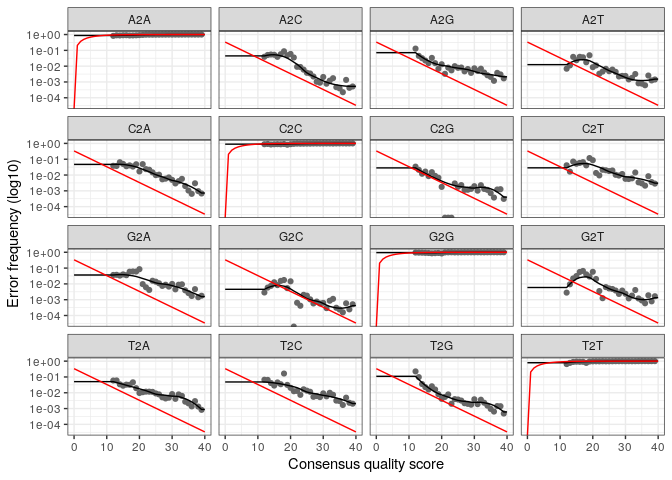

Analyse des données avec DADA2
==============================

    library(Rcpp)
    library(dada2)

Définition du chemin
--------------------

    path <- "~/ecog2_cc2/Data" # CHANGE ME to the directory containing the fastq files after unzipping.
    list.files(path)

    ##  [1] "filtered"                            "Station5_Fond1_10sept14_R1.fastq"   
    ##  [3] "Station5_Fond1_10sept14_R2.fastq"    "Station5_Fond1_11mars15_R1.fastq"   
    ##  [5] "Station5_Fond1_11mars15_R2.fastq"    "Station5_Fond2_10sept14_R1.fastq"   
    ##  [7] "Station5_Fond2_10sept14_R2.fastq"    "Station5_Fond2_11mars15_R1.fastq"   
    ##  [9] "Station5_Fond2_11mars15_R2.fastq"    "Station5_Fond3_10sept14_R1.fastq"   
    ## [11] "Station5_Fond3_10sept14_R2.fastq"    "Station5_Median1_10sept14_R1.fastq" 
    ## [13] "Station5_Median1_10sept14_R2.fastq"  "Station5_Median2_10sept14_R1.fastq" 
    ## [15] "Station5_Median2_10sept14_R2.fastq"  "Station5_Surface1_10sept14_R1.fastq"
    ## [17] "Station5_Surface1_10sept14_R2.fastq" "Station5_Surface1_11mars15_R1.fastq"
    ## [19] "Station5_Surface1_11mars15_R2.fastq" "Station5_Surface2_10sept14_R1.fastq"
    ## [21] "Station5_Surface2_10sept14_R2.fastq" "Station5_Surface2_11mars15_R1.fastq"
    ## [23] "Station5_Surface2_11mars15_R2.fastq"

Lecture des fichiers fastq et obtention des listes pour les reads forward et reverse
------------------------------------------------------------------------------------

    # Forward and reverse fastq filenames have format: SAMPLENAME_R1.fastq and SAMPLENAME_R2.fastq
    fnFs <- sort(list.files(path, pattern="_R1.fastq", full.names = TRUE))
    fnRs <- sort(list.files(path, pattern="_R2.fastq", full.names = TRUE))
    # Extract sample names, assuming filenames have format: SAMPLENAME_XXX.fastq
    sample.names <- sapply(strsplit(basename(fnRs), "R"), '[', 1)

Inspection des profils qualité des reads forward et reverse
-----------------------------------------------------------

    plotQualityProfile(fnFs[1:2])

    plotQualityProfile(fnRs[1:2])

On peut observer que les reads reverse présentent un score de qualité
qui diminue plus fortement en fonction du nombre de cycles comparé aux
reads forward. En effet, les reads reverse ont un Qscore d’environ 38 à
50 cycles et un Qscore de 28 à 250 cycles par exemple pour la Station 5
en septembre. Les reads reverse ont un Qscore qui se maintien égal ou
supérieur à 30 en fonction du nombre de cycles.

Filtrer et couper
-----------------

On attribue des noms aux fichiers fastq filtrés.

    # Place filtered files in filtered/ subdirectory
    filtFs <- file.path(path, "filtered", paste0(sample.names, "_F_filt.fastq.gz"))
    filtRs <- file.path(path, "filtered", paste0(sample.names, "_R_filt.fastq.gz"))
    names(filtFs) <- sample.names
    names(filtRs) <- sample.names

Nous avons utilisé des paramètres pour filtrer les données. Le paramètre
trimLeft = 21 de la fonction FilterAndTrim pour éliminer automatiquement
les primers des reads forward et reverse par exemple. Les amorces des
reads forward et reverse ont été tronquées aux nucléotides 240 et 200
respectivement avec le paramètre truncLen=c(240,200).

    out <- filterAndTrim(fnFs, filtFs, fnRs, filtRs,trimLeft = 21,truncLen=c(240,200), 
                  maxN=0, maxEE=c(2,2), truncQ=2, rm.phix=TRUE,
                  compress=TRUE, multithread=TRUE) # On Windows set multithread=FALSE
    head(out)

    ##                                    reads.in reads.out
    ## Station5_Fond1_10sept14_R1.fastq     159971    145448
    ## Station5_Fond1_11mars15_R1.fastq     175993    160423
    ## Station5_Fond2_10sept14_R1.fastq     197039    177018
    ## Station5_Fond2_11mars15_R1.fastq      87585     79989
    ## Station5_Fond3_10sept14_R1.fastq     117140    106150
    ## Station5_Median1_10sept14_R1.fastq   116519    106745

Apprentissage des erreurs
-------------------------

Dada2 va calculer un modèle d’erreur à partir des données de séquençage.
On applique cette méthode sur les read forward puis reverse

    errF <- learnErrors(filtFs, multithread=TRUE)

    ## 105752691 total bases in 482889 reads from 3 samples will be used for learning the error rates.

    errR <- learnErrors(filtRs, multithread=TRUE)

    ## 100755162 total bases in 562878 reads from 4 samples will be used for learning the error rates.

Pour ce modèle d’erreur 3 et 4 échantillons ont été utilisés pour les
reads forward et reverse, respectivement.

    plotErrors(errF, nominalQ=TRUE)

    ## Warning: Transformation introduced infinite values in continuous y-axis

    ## Warning: Transformation introduced infinite values in continuous y-axis

La probabilité d’une erreur de séquençage en fonction du Qscore de la
position considérée est représentée (via la fonction plotErrors()). La
probabilité est maximale pour la position A2A par exemple. Quand on a un
trait qui est représenté pour un score de qualité élevé, cela signifie
qu’il y a une faible probabilité que un A donne un C. Quand on a un
score de qualité plutôt faible (Q10 par exemple) la probabilité qu’un A
donne un C est plus élevée.

Inférence d’échantillon
-----------------------

On crée deux nouvelles variables dadaFs et dadaRs qui recoivent le
résultat de dada, c’est-à-dire le modèle d’erreur pour corriger les
données.

    dadaFs <- dada(filtFs, err=errF, multithread=TRUE)

    ## Sample 1 - 145448 reads in 37907 unique sequences.
    ## Sample 2 - 160423 reads in 35863 unique sequences.
    ## Sample 3 - 177018 reads in 47212 unique sequences.
    ## Sample 4 - 79989 reads in 20356 unique sequences.
    ## Sample 5 - 106150 reads in 30255 unique sequences.
    ## Sample 6 - 106745 reads in 28836 unique sequences.
    ## Sample 7 - 98823 reads in 25824 unique sequences.
    ## Sample 8 - 107427 reads in 26733 unique sequences.
    ## Sample 9 - 71082 reads in 17976 unique sequences.
    ## Sample 10 - 78645 reads in 20422 unique sequences.
    ## Sample 11 - 91534 reads in 24487 unique sequences.

    dadaRs <- dada(filtRs, err=errR, multithread=TRUE)

    ## Sample 1 - 145448 reads in 45486 unique sequences.
    ## Sample 2 - 160423 reads in 41638 unique sequences.
    ## Sample 3 - 177018 reads in 55554 unique sequences.
    ## Sample 4 - 79989 reads in 23239 unique sequences.
    ## Sample 5 - 106150 reads in 34625 unique sequences.
    ## Sample 6 - 106745 reads in 31673 unique sequences.
    ## Sample 7 - 98823 reads in 29093 unique sequences.
    ## Sample 8 - 107427 reads in 28947 unique sequences.
    ## Sample 9 - 71082 reads in 21426 unique sequences.
    ## Sample 10 - 78645 reads in 22051 unique sequences.
    ## Sample 11 - 91534 reads in 28266 unique sequences.

    dadaFs[[1]]

    ## dada-class: object describing DADA2 denoising results
    ## 1019 sequence variants were inferred from 37907 input unique sequences.
    ## Key parameters: OMEGA_A = 1e-40, OMEGA_C = 1e-40, BAND_SIZE = 16

On peut constater qu’il y a eu 1019 variantes de séquences qui ont été
déduites à partir de 37907 séquences dans le premier échantillon du read
forward.

Alignement des Read1 et des Read2 en un contig
----------------------------------------------

On a un amplicon de la partie V4 de l’ARN 16S avec des primers et on
obtient des fragments de 250 paires de bases. Le Read 1 fait 240 paires
de bases et le Read 2 fait 160 paires de bases. Donc, il y a un
chevauchement entre les deux séquences. On peut ainsi aligner les deux
Read et former un contig.

    mergers <- mergePairs(dadaFs, filtFs, dadaRs, filtRs, verbose=TRUE)

    ## 117203 paired-reads (in 5262 unique pairings) successfully merged out of 140345 (in 21221 pairings) input.

    ## 138620 paired-reads (in 4300 unique pairings) successfully merged out of 155850 (in 15527 pairings) input.

    ## 142387 paired-reads (in 7090 unique pairings) successfully merged out of 171074 (in 26888 pairings) input.

    ## 67299 paired-reads (in 2706 unique pairings) successfully merged out of 77307 (in 9453 pairings) input.

    ## 83747 paired-reads (in 3554 unique pairings) successfully merged out of 101964 (in 16168 pairings) input.

    ## 86471 paired-reads (in 3443 unique pairings) successfully merged out of 103302 (in 14205 pairings) input.

    ## 80674 paired-reads (in 2771 unique pairings) successfully merged out of 95612 (in 12200 pairings) input.

    ## 89403 paired-reads (in 3153 unique pairings) successfully merged out of 104001 (in 12101 pairings) input.

    ## 59759 paired-reads (in 1978 unique pairings) successfully merged out of 68546 (in 7874 pairings) input.

    ## 66136 paired-reads (in 1804 unique pairings) successfully merged out of 76462 (in 8230 pairings) input.

    ## 74838 paired-reads (in 3187 unique pairings) successfully merged out of 88039 (in 11891 pairings) input.

    # Inspect the merger data.frame from the first sample
    head(mergers[[1]])

    ##                                                                                                                                                                                                                                                                                                                                                                                   sequence
    ## 1        TACGAAGGGACCTAGCGTAGTTCGGAATTACTGGGCTTAAAGAGTTCGTAGGTGGTTGAAAAAGTTAGTGGTGAAATCCCAGAGCTTAACTCTGGAACTGCCATTAAAACTTTTCAGCTAGAGTATGATAGAGGAAAGCAGAATTTCTAGTGTAGAGGTGAAATTCGTAGATATTAGAAAGAATACCAATTGCGAAGGCAGCTTTCTGGATCATTACTGACACTGAGGAACGAAAGCATGGGTAGCGAAGAGGATTAGATACCCTCGTAGTCCATGCCGTAAACGATGTGTGTTAGACGTTGGAAATTTATTTTCAGTGTCGCAGGGAAACCGATAAACACACCGCCTGGGGAGTACGACCGCAAGGTT
    ## 2        TACGAAGGGACCTAGCGTAGTTCGGAATTACTGGGCTTAAAGAGTTCGTAGGTGGTTGAAAAAGTTGGTGGTGAAATCCCAGAGCTTAACTCTGGAACTGCCATCAAAACTTTTCAGCTAGAGTATGATAGAGGAAAGCAGAATTTCTAGTGTAGAGGTGAAATTCGTAGATATTAGAAAGAATACCAATTGCGAAGGCAGCTTTCTGGATCATTACTGACACTGAGGAACGAAAGCATGGGTAGCGAAGAGGATTAGATACCCTCGTAGTCCATGCCGTAAACGATGTGTGTTAGACGTTGGAAATTTATTTTCAGTGTCGCAGCGAAAGCGATAAACACACCGCCTGGGGAGTACGACCGCAAGGTT
    ## 3        TACGAAGGGACCTAGCGTAGTTCGGAATTACTGGGCTTAAAGAGTTCGTAGGTGGTTGAAAAAGTTGGTGGTGAAATCCCAGAGCTTAACTCTGGAACTGCCATCAAAACTTTTCAGCTAGAGTTTGATAGAGGAAAGCAGAATTTCTAGTGTAGAGGTGAAATTCGTAGATATTAGAAAGAATACCAATTGCGAAGGCAGCTTTCTGGATCATTACTGACACTGAGGAACGAAAGCATGGGTAGCGAAGAGGATTAGATACCCTCGTAGTCCATGCCGTAAACGATGTGTGTTAGACGTTGGAAATTTATTTTCAGTGTCGCAGCGAAAGCGATAAACACACCGCCTGGGGAGTACGACCGCAAGGTT
    ## 4        TACGAAGGGACCTAGCGTAGTTCGGAATTACTGGGCTTAAAGAGTTCGTAGGTGGTTGAAAAAGTTAGTGGTGAAATCCCAGAGCTTAACTCTGGAACTGCCATTAAAACTTTTCAGCTAGAGTATGATAGAGGAAAGCAGAATTTCTAGTGTAGAGGTGAAATTCGTAGATATTAGAAAGAATACCAATTGCGAAGGCAGCTTTCTGGATCATTACTGACACTGAGGAACGAAAGCATGGGTAGCGAAGAGGATTAGATACCCTCGTAGTCCATGCCGTAAACGATGTGTGTTAGACGTTGGAAATTTATTTTCAGTGTCGCAGCGAAAGCGATAAACACACCGCCTGGGGAGTACGACCGCAAGGTT
    ## 5        TACGAAGGGACCTAGCGTAGTTCGGAATTACTGGGCTTAAAGAGTTCGTAGGTGGTTGAAAAAGTTGGTGGTGAAATCCCAGAGCTTAACTCTGGAACTGCCATCAAAACTTTTCAGCTAGAGTATGATAGAGGAAAGCAGAATTTCTAGTGTAGAGGTGAAATTCGTAGATATTAGAAAGAATACCAATTGCGAAGGCAGCTTTCTGGATCATTACTGACACTGAGGAACGAAAGCATGGGTAGCGAAGAGGATTAGATACCCTCGTAGTCCATGCCGTAAACGATGTGTGTTAGACGTTGGAAATTTATTTTCAGTGTCGCAGGGAAACCGATAAACACACCGCCTGGGGAGTACGACCGCAAGGTT
    ## 6 TACATAGGGGTCAAGCGTTGTCCGGATTTATTGGGCGTAAAGAGCTCGTAGGCGGTTCAACAAGTCGGTCGTAAAAGTTTAGGGCTCAACCCTAAAATGTCGATCGATACTGTTGTGACTAGGATACGGTAGAGGTGAATGGAATTCCGAGTGTAGCGGTGAAATGCGTAGATATTCGGAGGAACACCAATTGCGAAGGCAGTTCACTGGACCGTGATCGACGCTGAGGAGCGAAAGCTAGGGGAGCAAACAGGATTAGATACCCTGGTAGTCCTAGCTGTAAACGATGGATACTAGATGTAGGAACTGGATTGACGGTTTCTGTATCGTAGCTAACGCGTTAAGTATCCCGCCTGGGGAGTACGGTCGCAAGACT
    ##   abundance forward reverse nmatch nmismatch nindel prefer accept
    ## 1      5181       1       2     29         0      0      2   TRUE
    ## 2      4125       2       1     29         0      0      2   TRUE
    ## 3      3754       3       1     29         0      0      2   TRUE
    ## 4      2484       1       1     29         0      0      2   TRUE
    ## 5      2185       2       2     29         0      0      2   TRUE
    ## 6      2140      11       5     22         0      0      2   TRUE

Construction d’une table d’observation
--------------------------------------

En partant de l’abondance de chacune des séquences dans chacun des
échantillons, on va construire une table d’observation et on crée un
objet seqtab avec en ligne le nom des échantillons et en colonne les
séquences. A l’intérieur on aura le nombre de fois où l’on observe
l’échantillon.

    seqtab <- makeSequenceTable(mergers)
    dim(seqtab)

    ## [1]    11 19943

Ensuite, on va regarder la distribution des longueurs de séquences

    # Inspect distribution of sequence lengths
    table(nchar(getSequences(seqtab)))

    ## 
    ##  352  353  362  363  364  365  366  367  368  369  370  371  372  373  374  375 
    ##    2    1    1    1    4  195   28  166  185 5645 3648 2420 2689 2840  134 1883 
    ##  376  377  378  382  386 
    ##   91    6    1    1    2

On peut voir qu’il y a beaucoup de séquences entre 369 et 373
nucléotides et constater que la taille de ces séquences est assez
homogène.

Eliminer les chimères
---------------------

Au cours de l’amplification de l’ADN il y a eu formation de chimères qui
doivent être suprimées.

    seqtab.nochim <- removeBimeraDenovo(seqtab, method="consensus", multithread=TRUE, verbose=TRUE)

    ## Identified 18365 bimeras out of 19943 input sequences.

On peut constater qu’il y a un grand nombre de chimères présentes. Sur
les 19943 séquences uniques, il a été identifié 18365 chimères, soit
4/5. Chaque séquence unique peut tout de même être présente en plusieurs
fois.

    dim(seqtab.nochim)

    ## [1]   11 1578

On peut calculer le ratio entre le nombre de chimères et l’ensemble des
abondances relatives des séquences dans les échantillons :

    sum(seqtab.nochim)/sum(seqtab)

    ## [1] 0.7759258

    1-sum(seqtab.nochim)/sum(seqtab)

    ## [1] 0.2240742

On regarde ici le pourcentage de séquences de chimères qui ont été
enlevées. On voit qu’il y a 22 % des échantillons de notre jeu de
données qui étaient considérées comme des chimères et qui ont été
supprimées.

Il faut faire attention que les séquences utilisées ne contiennent plus
les primers car ces derniers pourront être considérés comme chimères.

Suivre les reads dans le pipeline (résumé des filtres qualité)
--------------------------------------------------------------

La variable getN prend la forme d’une fonction. La fonction cbind permet
la concaténation.

    getN <- function(x) sum(getUniques(x))
    track <- cbind(out, sapply(dadaFs, getN), sapply(dadaRs, getN), sapply(mergers, getN), rowSums(seqtab.nochim))
    # If processing a single sample, remove the sapply calls: e.g. replace sapply(dadaFs, getN) with getN(dadaFs)
    colnames(track) <- c("input", "filtered", "denoisedF", "denoisedR", "merged", "nonchim")
    rownames(track) <- sample.names
    head(track)

    ##                             input filtered denoisedF denoisedR merged nonchim
    ## Station5_Fond1_10sept14_   159971   145448    142472    143069 117203   87707
    ## Station5_Fond1_11mars15_   175993   160423    157734    158234 138620  111407
    ## Station5_Fond2_10sept14_   197039   177018    173300    174528 142387  103582
    ## Station5_Fond2_11mars15_    87585    79989     78373     78698  67299   54499
    ## Station5_Fond3_10sept14_   117140   106150    103703    104172  83747   64257
    ## Station5_Median1_10sept14_ 116519   106745    104773    105078  86471   65620

On peut voir l’évolution du nombre de séquences à chaque itération. Par
exemple pour la Station 5 (Fond 1, 10 septembre 2014) on part de 159971
paires de read à 117203 paires de contigs.

Assignation d’une taxonomie
---------------------------

Il faut réaliser un algorithme d’assignation et utiliser une base de
données de référence (Silva).

    wget https://zenodo.org/record/3986799/files/silva_nr99_v138_train_set.fa.gz

    ## --2020-12-17 22:30:06--  https://zenodo.org/record/3986799/files/silva_nr99_v138_train_set.fa.gz
    ## Resolving zenodo.org (zenodo.org)... 137.138.76.77
    ## Connecting to zenodo.org (zenodo.org)|137.138.76.77|:443... connected.
    ## HTTP request sent, awaiting response... 200 OK
    ## Length: 137973851 (132M) [application/octet-stream]
    ## Saving to: ‘silva_nr99_v138_train_set.fa.gz.3’
    ## 
    ##      0K .......... .......... .......... .......... ..........  0% 7.00M 19s
    ##     50K .......... .......... .......... .......... ..........  0% 13.0M 14s
    ##    100K .......... .......... .......... .......... ..........  0% 11.1M 14s
    ##    150K .......... .......... .......... .......... ..........  0% 21.6M 12s
    ##    200K .......... .......... .......... .......... ..........  0% 19.6M 11s
    ##    250K .......... .......... .......... .......... ..........  0% 83.0M 9s
    ##    300K .......... .......... .......... .......... ..........  0% 20.6M 9s
    ##    350K .......... .......... .......... .......... ..........  0% 41.2M 8s
    ##    400K .......... .......... .......... .......... ..........  0% 61.1M 7s
    ##    450K .......... .......... .......... .......... ..........  0% 19.0M 7s
    ##    500K .......... .......... .......... .......... ..........  0% 55.8M 7s
    ##    550K .......... .......... .......... .......... ..........  0% 74.4M 6s
    ##    600K .......... .......... .......... .......... ..........  0% 17.4M 7s
    ##    650K .......... .......... .......... .......... ..........  0% 81.4M 6s
    ##    700K .......... .......... .......... .......... ..........  0% 24.0M 6s
    ##    750K .......... .......... .......... .......... ..........  0% 23.3M 6s
    ##    800K .......... .......... .......... .......... ..........  0% 27.8M 6s
    ##    850K .......... .......... .......... .......... ..........  0% 22.8M 6s
    ##    900K .......... .......... .......... .......... ..........  0% 81.6M 6s
    ##    950K .......... .......... .......... .......... ..........  0% 39.6M 6s
    ##   1000K .......... .......... .......... .......... ..........  0% 19.8M 6s
    ##   1050K .......... .......... .......... .......... ..........  0% 61.9M 6s
    ##   1100K .......... .......... .......... .......... ..........  0% 31.6M 5s
    ##   1150K .......... .......... .......... .......... ..........  0% 16.7M 6s
    ##   1200K .......... .......... .......... .......... ..........  0% 81.2M 5s
    ##   1250K .......... .......... .......... .......... ..........  0% 20.6M 5s
    ##   1300K .......... .......... .......... .......... ..........  1% 42.5M 5s
    ##   1350K .......... .......... .......... .......... ..........  1% 79.3M 5s
    ##   1400K .......... .......... .......... .......... ..........  1% 13.7M 5s
    ##   1450K .......... .......... .......... .......... ..........  1% 88.6M 5s
    ##   1500K .......... .......... .......... .......... ..........  1% 15.4M 5s
    ##   1550K .......... .......... .......... .......... ..........  1% 81.3M 5s
    ##   1600K .......... .......... .......... .......... ..........  1% 72.2M 5s
    ##   1650K .......... .......... .......... .......... ..........  1% 18.3M 5s
    ##   1700K .......... .......... .......... .......... ..........  1% 71.9M 5s
    ##   1750K .......... .......... .......... .......... ..........  1% 17.7M 5s
    ##   1800K .......... .......... .......... .......... ..........  1% 45.2M 5s
    ##   1850K .......... .......... .......... .......... ..........  1% 83.8M 5s
    ##   1900K .......... .......... .......... .......... ..........  1% 14.6M 5s
    ##   1950K .......... .......... .......... .......... ..........  1% 93.3M 5s
    ##   2000K .......... .......... .......... .......... ..........  1% 82.7M 5s
    ##   2050K .......... .......... .......... .......... ..........  1% 8.82M 5s
    ##   2100K .......... .......... .......... .......... ..........  1% 84.4M 5s
    ##   2150K .......... .......... .......... .......... ..........  1% 15.0M 5s
    ##   2200K .......... .......... .......... .......... ..........  1% 37.7M 5s
    ##   2250K .......... .......... .......... .......... ..........  1% 93.3M 5s
    ##   2300K .......... .......... .......... .......... ..........  1% 74.3M 5s
    ##   2350K .......... .......... .......... .......... ..........  1% 5.27M 5s
    ##   2400K .......... .......... .......... .......... ..........  1% 53.2M 5s
    ##   2450K .......... .......... .......... .......... ..........  1% 17.1M 5s
    ##   2500K .......... .......... .......... .......... ..........  1% 47.7M 5s
    ##   2550K .......... .......... .......... .......... ..........  1% 98.6M 5s
    ##   2600K .......... .......... .......... .......... ..........  1% 5.24M 6s
    ##   2650K .......... .......... .......... .......... ..........  2% 92.9M 5s
    ##   2700K .......... .......... .......... .......... ..........  2% 22.8M 5s
    ##   2750K .......... .......... .......... .......... ..........  2% 56.0M 5s
    ##   2800K .......... .......... .......... .......... ..........  2% 43.2M 5s
    ##   2850K .......... .......... .......... .......... ..........  2% 18.4M 5s
    ##   2900K .......... .......... .......... .......... ..........  2% 27.9M 5s
    ##   2950K .......... .......... .......... .......... ..........  2% 26.6M 5s
    ##   3000K .......... .......... .......... .......... ..........  2% 72.2M 5s
    ##   3050K .......... .......... .......... .......... ..........  2% 18.9M 5s
    ##   3100K .......... .......... .......... .......... ..........  2% 44.2M 5s
    ##   3150K .......... .......... .......... .......... ..........  2% 17.6M 5s
    ##   3200K .......... .......... .......... .......... ..........  2% 45.6M 5s
    ##   3250K .......... .......... .......... .......... ..........  2% 83.4M 5s
    ##   3300K .......... .......... .......... .......... ..........  2% 17.2M 5s
    ##   3350K .......... .......... .......... .......... ..........  2% 53.5M 5s
    ##   3400K .......... .......... .......... .......... ..........  2% 20.2M 5s
    ##   3450K .......... .......... .......... .......... ..........  2% 38.6M 5s
    ##   3500K .......... .......... .......... .......... ..........  2% 81.0M 5s
    ##   3550K .......... .......... .......... .......... ..........  2% 14.1M 5s
    ##   3600K .......... .......... .......... .......... ..........  2% 54.9M 5s
    ##   3650K .......... .......... .......... .......... ..........  2% 99.9M 5s
    ##   3700K .......... .......... .......... .......... ..........  2% 12.5M 5s
    ##   3750K .......... .......... .......... .......... ..........  2% 27.8M 5s
    ##   3800K .......... .......... .......... .......... ..........  2% 65.0M 5s
    ##   3850K .......... .......... .......... .......... ..........  2% 78.3M 5s
    ##   3900K .......... .......... .......... .......... ..........  2% 55.6M 5s
    ##   3950K .......... .......... .......... .......... ..........  2% 94.5M 5s
    ##   4000K .......... .......... .......... .......... ..........  3% 21.0M 5s
    ##   4050K .......... .......... .......... .......... ..........  3% 13.5M 5s
    ##   4100K .......... .......... .......... .......... ..........  3% 47.1M 5s
    ##   4150K .......... .......... .......... .......... ..........  3% 42.8M 5s
    ##   4200K .......... .......... .......... .......... ..........  3% 65.6M 5s
    ##   4250K .......... .......... .......... .......... ..........  3% 72.3M 5s
    ##   4300K .......... .......... .......... .......... ..........  3% 23.2M 5s
    ##   4350K .......... .......... .......... .......... ..........  3% 18.1M 5s
    ##   4400K .......... .......... .......... .......... ..........  3% 14.6M 5s
    ##   4450K .......... .......... .......... .......... ..........  3% 15.8M 5s
    ##   4500K .......... .......... .......... .......... ..........  3% 18.4M 5s
    ##   4550K .......... .......... .......... .......... ..........  3% 23.8M 5s
    ##   4600K .......... .......... .......... .......... ..........  3% 22.0M 5s
    ##   4650K .......... .......... .......... .......... ..........  3% 26.1M 5s
    ##   4700K .......... .......... .......... .......... ..........  3% 23.4M 5s
    ##   4750K .......... .......... .......... .......... ..........  3% 19.1M 5s
    ##   4800K .......... .......... .......... .......... ..........  3% 19.1M 5s
    ##   4850K .......... .......... .......... .......... ..........  3% 20.2M 5s
    ##   4900K .......... .......... .......... .......... ..........  3% 25.6M 5s
    ##   4950K .......... .......... .......... .......... ..........  3% 15.8M 5s
    ##   5000K .......... .......... .......... .......... ..........  3% 24.8M 5s
    ##   5050K .......... .......... .......... .......... ..........  3% 16.4M 5s
    ##   5100K .......... .......... .......... .......... ..........  3% 18.0M 5s
    ##   5150K .......... .......... .......... .......... ..........  3% 24.3M 5s
    ##   5200K .......... .......... .......... .......... ..........  3% 25.8M 5s
    ##   5250K .......... .......... .......... .......... ..........  3% 21.2M 5s
    ##   5300K .......... .......... .......... .......... ..........  3% 26.5M 5s
    ##   5350K .......... .......... .......... .......... ..........  4% 22.8M 5s
    ##   5400K .......... .......... .......... .......... ..........  4% 29.0M 5s
    ##   5450K .......... .......... .......... .......... ..........  4% 23.2M 5s
    ##   5500K .......... .......... .......... .......... ..........  4% 28.5M 5s
    ##   5550K .......... .......... .......... .......... ..........  4% 23.3M 5s
    ##   5600K .......... .......... .......... .......... ..........  4% 27.9M 5s
    ##   5650K .......... .......... .......... .......... ..........  4% 26.5M 5s
    ##   5700K .......... .......... .......... .......... ..........  4% 29.1M 5s
    ##   5750K .......... .......... .......... .......... ..........  4% 26.2M 5s
    ##   5800K .......... .......... .......... .......... ..........  4% 28.5M 5s
    ##   5850K .......... .......... .......... .......... ..........  4% 35.2M 5s
    ##   5900K .......... .......... .......... .......... ..........  4% 88.4M 5s
    ##   5950K .......... .......... .......... .......... ..........  4% 71.9M 5s
    ##   6000K .......... .......... .......... .......... ..........  4% 80.2M 5s
    ##   6050K .......... .......... .......... .......... ..........  4%  101M 5s
    ##   6100K .......... .......... .......... .......... ..........  4% 97.4M 5s
    ##   6150K .......... .......... .......... .......... ..........  4% 77.6M 5s
    ##   6200K .......... .......... .......... .......... ..........  4% 70.5M 5s
    ##   6250K .......... .......... .......... .......... ..........  4%  109M 5s
    ##   6300K .......... .......... .......... .......... ..........  4% 90.7M 5s
    ##   6350K .......... .......... .......... .......... ..........  4%  105M 5s
    ##   6400K .......... .......... .......... .......... ..........  4% 91.2M 5s
    ##   6450K .......... .......... .......... .......... ..........  4% 80.3M 5s
    ##   6500K .......... .......... .......... .......... ..........  4% 78.6M 5s
    ##   6550K .......... .......... .......... .......... ..........  4% 96.6M 5s
    ##   6600K .......... .......... .......... .......... ..........  4% 78.5M 5s
    ##   6650K .......... .......... .......... .......... ..........  4% 96.1M 5s
    ##   6700K .......... .......... .......... .......... ..........  5% 42.1M 5s
    ##   6750K .......... .......... .......... .......... ..........  5% 69.1M 5s
    ##   6800K .......... .......... .......... .......... ..........  5% 41.2M 5s
    ##   6850K .......... .......... .......... .......... ..........  5% 22.6M 5s
    ##   6900K .......... .......... .......... .......... ..........  5% 62.5M 5s
    ##   6950K .......... .......... .......... .......... ..........  5% 80.4M 5s
    ##   7000K .......... .......... .......... .......... ..........  5% 35.0M 5s
    ##   7050K .......... .......... .......... .......... ..........  5% 29.0M 5s
    ##   7100K .......... .......... .......... .......... ..........  5% 64.3M 4s
    ##   7150K .......... .......... .......... .......... ..........  5% 72.5M 4s
    ##   7200K .......... .......... .......... .......... ..........  5% 24.7M 4s
    ##   7250K .......... .......... .......... .......... ..........  5% 82.4M 4s
    ##   7300K .......... .......... .......... .......... ..........  5% 51.2M 4s
    ##   7350K .......... .......... .......... .......... ..........  5% 57.8M 4s
    ##   7400K .......... .......... .......... .......... ..........  5%  102M 4s
    ##   7450K .......... .......... .......... .......... ..........  5% 42.1M 4s
    ##   7500K .......... .......... .......... .......... ..........  5% 29.3M 4s
    ##   7550K .......... .......... .......... .......... ..........  5% 27.1M 4s
    ##   7600K .......... .......... .......... .......... ..........  5% 13.7M 4s
    ##   7650K .......... .......... .......... .......... ..........  5% 27.6M 4s
    ##   7700K .......... .......... .......... .......... ..........  5% 48.3M 4s
    ##   7750K .......... .......... .......... .......... ..........  5% 81.9M 4s
    ##   7800K .......... .......... .......... .......... ..........  5% 62.3M 4s
    ##   7850K .......... .......... .......... .......... ..........  5% 30.1M 4s
    ##   7900K .......... .......... .......... .......... ..........  5% 20.9M 4s
    ##   7950K .......... .......... .......... .......... ..........  5% 82.5M 4s
    ##   8000K .......... .......... .......... .......... ..........  5% 58.0M 4s
    ##   8050K .......... .......... .......... .......... ..........  6% 54.3M 4s
    ##   8100K .......... .......... .......... .......... ..........  6% 90.8M 4s
    ##   8150K .......... .......... .......... .......... ..........  6%  109M 4s
    ##   8200K .......... .......... .......... .......... ..........  6% 52.4M 4s
    ##   8250K .......... .......... .......... .......... ..........  6% 30.3M 4s
    ##   8300K .......... .......... .......... .......... ..........  6% 52.8M 4s
    ##   8350K .......... .......... .......... .......... ..........  6% 30.2M 4s
    ##   8400K .......... .......... .......... .......... ..........  6% 86.8M 4s
    ##   8450K .......... .......... .......... .......... ..........  6%  105M 4s
    ##   8500K .......... .......... .......... .......... ..........  6% 76.6M 4s
    ##   8550K .......... .......... .......... .......... ..........  6% 9.51M 4s
    ##   8600K .......... .......... .......... .......... ..........  6% 42.6M 4s
    ##   8650K .......... .......... .......... .......... ..........  6% 55.7M 4s
    ##   8700K .......... .......... .......... .......... ..........  6% 74.0M 4s
    ##   8750K .......... .......... .......... .......... ..........  6% 86.7M 4s
    ##   8800K .......... .......... .......... .......... ..........  6% 9.37M 4s
    ##   8850K .......... .......... .......... .......... ..........  6% 84.9M 4s
    ##   8900K .......... .......... .......... .......... ..........  6% 89.3M 4s
    ##   8950K .......... .......... .......... .......... ..........  6% 94.7M 4s
    ##   9000K .......... .......... .......... .......... ..........  6% 97.0M 4s
    ##   9050K .......... .......... .......... .......... ..........  6% 85.9M 4s
    ##   9100K .......... .......... .......... .......... ..........  6% 18.8M 4s
    ##   9150K .......... .......... .......... .......... ..........  6% 63.1M 4s
    ##   9200K .......... .......... .......... .......... ..........  6% 60.5M 4s
    ##   9250K .......... .......... .......... .......... ..........  6% 33.2M 4s
    ##   9300K .......... .......... .......... .......... ..........  6% 6.49M 4s
    ##   9350K .......... .......... .......... .......... ..........  6% 83.8M 4s
    ##   9400K .......... .......... .......... .......... ..........  7% 92.5M 4s
    ##   9450K .......... .......... .......... .......... ..........  7%  104M 4s
    ##   9500K .......... .......... .......... .......... ..........  7%  100M 4s
    ##   9550K .......... .......... .......... .......... ..........  7% 68.2M 4s
    ##   9600K .......... .......... .......... .......... ..........  7% 49.1M 4s
    ##   9650K .......... .......... .......... .......... ..........  7% 71.3M 4s
    ##   9700K .......... .......... .......... .......... ..........  7% 55.4M 4s
    ##   9750K .......... .......... .......... .......... ..........  7% 93.5M 4s
    ##   9800K .......... .......... .......... .......... ..........  7% 90.0M 4s
    ##   9850K .......... .......... .......... .......... ..........  7% 42.1M 4s
    ##   9900K .......... .......... .......... .......... ..........  7% 29.6M 4s
    ##   9950K .......... .......... .......... .......... ..........  7% 76.2M 4s
    ##  10000K .......... .......... .......... .......... ..........  7% 74.7M 4s
    ##  10050K .......... .......... .......... .......... ..........  7% 60.0M 4s
    ##  10100K .......... .......... .......... .......... ..........  7% 29.7M 4s
    ##  10150K .......... .......... .......... .......... ..........  7% 69.0M 4s
    ##  10200K .......... .......... .......... .......... ..........  7% 70.5M 4s
    ##  10250K .......... .......... .......... .......... ..........  7% 90.1M 4s
    ##  10300K .......... .......... .......... .......... ..........  7% 67.2M 4s
    ##  10350K .......... .......... .......... .......... ..........  7% 79.5M 4s
    ##  10400K .......... .......... .......... .......... ..........  7% 58.4M 4s
    ##  10450K .......... .......... .......... .......... ..........  7% 42.2M 4s
    ##  10500K .......... .......... .......... .......... ..........  7% 29.1M 4s
    ##  10550K .......... .......... .......... .......... ..........  7% 81.9M 4s
    ##  10600K .......... .......... .......... .......... ..........  7% 85.3M 4s
    ##  10650K .......... .......... .......... .......... ..........  7% 63.7M 4s
    ##  10700K .......... .......... .......... .......... ..........  7% 57.7M 4s
    ##  10750K .......... .......... .......... .......... ..........  8% 77.7M 4s
    ##  10800K .......... .......... .......... .......... ..........  8% 25.3M 4s
    ##  10850K .......... .......... .......... .......... ..........  8% 32.4M 4s
    ##  10900K .......... .......... .......... .......... ..........  8% 74.2M 4s
    ##  10950K .......... .......... .......... .......... ..........  8% 60.9M 4s
    ##  11000K .......... .......... .......... .......... ..........  8% 88.7M 4s
    ##  11050K .......... .......... .......... .......... ..........  8% 91.2M 4s
    ##  11100K .......... .......... .......... .......... ..........  8% 80.6M 4s
    ##  11150K .......... .......... .......... .......... ..........  8% 20.8M 4s
    ##  11200K .......... .......... .......... .......... ..........  8% 31.0M 4s
    ##  11250K .......... .......... .......... .......... ..........  8% 6.72M 4s
    ##  11300K .......... .......... .......... .......... ..........  8% 28.4M 4s
    ##  11350K .......... .......... .......... .......... ..........  8% 68.3M 4s
    ##  11400K .......... .......... .......... .......... ..........  8%  223K 6s
    ##  11450K .......... .......... .......... .......... ..........  8% 88.2M 6s
    ##  11500K .......... .......... .......... .......... ..........  8% 84.6M 6s
    ##  11550K .......... .......... .......... .......... ..........  8% 87.2M 6s
    ##  11600K .......... .......... .......... .......... ..........  8% 90.4M 6s
    ##  11650K .......... .......... .......... .......... ..........  8% 90.1M 6s
    ##  11700K .......... .......... .......... .......... ..........  8% 77.0M 6s
    ##  11750K .......... .......... .......... .......... ..........  8% 72.0M 6s
    ##  11800K .......... .......... .......... .......... ..........  8% 73.2M 6s
    ##  11850K .......... .......... .......... .......... ..........  8% 83.6M 6s
    ##  11900K .......... .......... .......... .......... ..........  8% 76.4M 6s
    ##  11950K .......... .......... .......... .......... ..........  8% 98.7M 6s
    ##  12000K .......... .......... .......... .......... ..........  8% 94.0M 6s
    ##  12050K .......... .......... .......... .......... ..........  8% 89.1M 6s
    ##  12100K .......... .......... .......... .......... ..........  9% 85.9M 6s
    ##  12150K .......... .......... .......... .......... ..........  9% 99.1M 6s
    ##  12200K .......... .......... .......... .......... ..........  9% 85.3M 6s
    ##  12250K .......... .......... .......... .......... ..........  9% 96.6M 6s
    ##  12300K .......... .......... .......... .......... ..........  9% 72.3M 6s
    ##  12350K .......... .......... .......... .......... ..........  9% 77.0M 6s
    ##  12400K .......... .......... .......... .......... ..........  9% 83.7M 6s
    ##  12450K .......... .......... .......... .......... ..........  9% 94.3M 6s
    ##  12500K .......... .......... .......... .......... ..........  9% 83.3M 6s
    ##  12550K .......... .......... .......... .......... ..........  9% 94.7M 6s
    ##  12600K .......... .......... .......... .......... ..........  9% 66.8M 6s
    ##  12650K .......... .......... .......... .......... ..........  9% 99.8M 6s
    ##  12700K .......... .......... .......... .......... ..........  9% 48.5M 6s
    ##  12750K .......... .......... .......... .......... ..........  9% 95.7M 6s
    ##  12800K .......... .......... .......... .......... ..........  9%  104M 6s
    ##  12850K .......... .......... .......... .......... ..........  9% 95.5M 6s
    ##  12900K .......... .......... .......... .......... ..........  9% 21.4M 6s
    ##  12950K .......... .......... .......... .......... ..........  9% 76.9M 6s
    ##  13000K .......... .......... .......... .......... ..........  9% 50.9M 6s
    ##  13050K .......... .......... .......... .......... ..........  9% 48.7M 6s
    ##  13100K .......... .......... .......... .......... ..........  9% 62.8M 6s
    ##  13150K .......... .......... .......... .......... ..........  9% 36.5M 6s
    ##  13200K .......... .......... .......... .......... ..........  9% 61.2M 6s
    ##  13250K .......... .......... .......... .......... ..........  9% 52.4M 6s
    ##  13300K .......... .......... .......... .......... ..........  9% 29.6M 6s
    ##  13350K .......... .......... .......... .......... ..........  9% 21.6M 6s
    ##  13400K .......... .......... .......... .......... ..........  9% 79.1M 6s
    ##  13450K .......... .......... .......... .......... .......... 10% 75.3M 5s
    ##  13500K .......... .......... .......... .......... .......... 10% 69.4M 5s
    ##  13550K .......... .......... .......... .......... .......... 10% 19.9M 5s
    ##  13600K .......... .......... .......... .......... .......... 10% 55.3M 5s
    ##  13650K .......... .......... .......... .......... .......... 10% 60.6M 5s
    ##  13700K .......... .......... .......... .......... .......... 10% 90.6M 5s
    ##  13750K .......... .......... .......... .......... .......... 10% 54.6M 5s
    ##  13800K .......... .......... .......... .......... .......... 10% 34.5M 5s
    ##  13850K .......... .......... .......... .......... .......... 10% 86.9M 5s
    ##  13900K .......... .......... .......... .......... .......... 10% 70.8M 5s
    ##  13950K .......... .......... .......... .......... .......... 10% 84.0M 5s
    ##  14000K .......... .......... .......... .......... .......... 10% 23.2M 5s
    ##  14050K .......... .......... .......... .......... .......... 10% 89.5M 5s
    ##  14100K .......... .......... .......... .......... .......... 10% 36.3M 5s
    ##  14150K .......... .......... .......... .......... .......... 10% 32.1M 5s
    ##  14200K .......... .......... .......... .......... .......... 10% 70.1M 5s
    ##  14250K .......... .......... .......... .......... .......... 10% 93.1M 5s
    ##  14300K .......... .......... .......... .......... .......... 10% 41.3M 5s
    ##  14350K .......... .......... .......... .......... .......... 10% 71.4M 5s
    ##  14400K .......... .......... .......... .......... .......... 10% 56.4M 5s
    ##  14450K .......... .......... .......... .......... .......... 10% 73.4M 5s
    ##  14500K .......... .......... .......... .......... .......... 10% 29.2M 5s
    ##  14550K .......... .......... .......... .......... .......... 10% 86.7M 5s
    ##  14600K .......... .......... .......... .......... .......... 10% 27.2M 5s
    ##  14650K .......... .......... .......... .......... .......... 10% 84.3M 5s
    ##  14700K .......... .......... .......... .......... .......... 10% 79.7M 5s
    ##  14750K .......... .......... .......... .......... .......... 10% 72.6M 5s
    ##  14800K .......... .......... .......... .......... .......... 11% 38.4M 5s
    ##  14850K .......... .......... .......... .......... .......... 11% 77.5M 5s
    ##  14900K .......... .......... .......... .......... .......... 11% 62.6M 5s
    ##  14950K .......... .......... .......... .......... .......... 11% 36.5M 5s
    ##  15000K .......... .......... .......... .......... .......... 11% 59.7M 5s
    ##  15050K .......... .......... .......... .......... .......... 11% 29.6M 5s
    ##  15100K .......... .......... .......... .......... .......... 11% 71.5M 5s
    ##  15150K .......... .......... .......... .......... .......... 11% 70.7M 5s
    ##  15200K .......... .......... .......... .......... .......... 11% 79.7M 5s
    ##  15250K .......... .......... .......... .......... .......... 11% 66.4M 5s
    ##  15300K .......... .......... .......... .......... .......... 11% 23.8M 5s
    ##  15350K .......... .......... .......... .......... .......... 11% 68.7M 5s
    ##  15400K .......... .......... .......... .......... .......... 11% 98.6M 5s
    ##  15450K .......... .......... .......... .......... .......... 11%  116M 5s
    ##  15500K .......... .......... .......... .......... .......... 11% 86.4M 5s
    ##  15550K .......... .......... .......... .......... .......... 11% 62.5M 5s
    ##  15600K .......... .......... .......... .......... .......... 11% 60.8M 5s
    ##  15650K .......... .......... .......... .......... .......... 11% 75.3M 5s
    ##  15700K .......... .......... .......... .......... .......... 11% 75.7M 5s
    ##  15750K .......... .......... .......... .......... .......... 11% 23.4M 5s
    ##  15800K .......... .......... .......... .......... .......... 11% 71.9M 5s
    ##  15850K .......... .......... .......... .......... .......... 11% 68.4M 5s
    ##  15900K .......... .......... .......... .......... .......... 11% 69.0M 5s
    ##  15950K .......... .......... .......... .......... .......... 11% 83.7M 5s
    ##  16000K .......... .......... .......... .......... .......... 11% 64.2M 5s
    ##  16050K .......... .......... .......... .......... .......... 11% 30.4M 5s
    ##  16100K .......... .......... .......... .......... .......... 11% 60.1M 5s
    ##  16150K .......... .......... .......... .......... .......... 12% 91.6M 5s
    ##  16200K .......... .......... .......... .......... .......... 12% 78.9M 5s
    ##  16250K .......... .......... .......... .......... .......... 12% 78.7M 5s
    ##  16300K .......... .......... .......... .......... .......... 12% 34.9M 5s
    ##  16350K .......... .......... .......... .......... .......... 12% 80.3M 5s
    ##  16400K .......... .......... .......... .......... .......... 12% 43.4M 5s
    ##  16450K .......... .......... .......... .......... .......... 12% 56.6M 5s
    ##  16500K .......... .......... .......... .......... .......... 12% 60.9M 5s
    ##  16550K .......... .......... .......... .......... .......... 12% 99.4M 5s
    ##  16600K .......... .......... .......... .......... .......... 12% 86.4M 5s
    ##  16650K .......... .......... .......... .......... .......... 12%  114M 5s
    ##  16700K .......... .......... .......... .......... .......... 12% 70.1M 5s
    ##  16750K .......... .......... .......... .......... .......... 12% 59.2M 5s
    ##  16800K .......... .......... .......... .......... .......... 12% 62.4M 5s
    ##  16850K .......... .......... .......... .......... .......... 12% 93.3M 5s
    ##  16900K .......... .......... .......... .......... .......... 12% 90.0M 5s
    ##  16950K .......... .......... .......... .......... .......... 12% 65.4M 5s
    ##  17000K .......... .......... .......... .......... .......... 12% 23.3M 5s
    ##  17050K .......... .......... .......... .......... .......... 12% 69.9M 5s
    ##  17100K .......... .......... .......... .......... .......... 12% 91.4M 5s
    ##  17150K .......... .......... .......... .......... .......... 12% 97.6M 5s
    ##  17200K .......... .......... .......... .......... .......... 12% 82.8M 5s
    ##  17250K .......... .......... .......... .......... .......... 12% 72.9M 5s
    ##  17300K .......... .......... .......... .......... .......... 12% 34.6M 5s
    ##  17350K .......... .......... .......... .......... .......... 12% 46.0M 5s
    ##  17400K .......... .......... .......... .......... .......... 12% 96.6M 5s
    ##  17450K .......... .......... .......... .......... .......... 12%  107M 5s
    ##  17500K .......... .......... .......... .......... .......... 13% 75.8M 5s
    ##  17550K .......... .......... .......... .......... .......... 13% 69.5M 5s
    ##  17600K .......... .......... .......... .......... .......... 13% 32.6M 5s
    ##  17650K .......... .......... .......... .......... .......... 13% 83.4M 5s
    ##  17700K .......... .......... .......... .......... .......... 13%  104M 5s
    ##  17750K .......... .......... .......... .......... .......... 13% 11.1M 5s
    ##  17800K .......... .......... .......... .......... .......... 13% 29.5M 5s
    ##  17850K .......... .......... .......... .......... .......... 13%  140M 5s
    ##  17900K .......... .......... .......... .......... .......... 13%  148M 5s
    ##  17950K .......... .......... .......... .......... .......... 13%  118M 4s
    ##  18000K .......... .......... .......... .......... .......... 13%  113M 4s
    ##  18050K .......... .......... .......... .......... .......... 13% 24.1M 4s
    ##  18100K .......... .......... .......... .......... .......... 13% 80.8M 4s
    ##  18150K .......... .......... .......... .......... .......... 13% 82.5M 4s
    ##  18200K .......... .......... .......... .......... .......... 13% 70.7M 4s
    ##  18250K .......... .......... .......... .......... .......... 13%  142M 4s
    ##  18300K .......... .......... .......... .......... .......... 13%  135M 4s
    ##  18350K .......... .......... .......... .......... .......... 13% 15.2M 4s
    ##  18400K .......... .......... .......... .......... .......... 13% 15.2M 4s
    ##  18450K .......... .......... .......... .......... .......... 13% 22.5M 4s
    ##  18500K .......... .......... .......... .......... .......... 13% 23.9M 4s
    ##  18550K .......... .......... .......... .......... .......... 13% 18.9M 4s
    ##  18600K .......... .......... .......... .......... .......... 13% 20.2M 4s
    ##  18650K .......... .......... .......... .......... .......... 13% 28.8M 4s
    ##  18700K .......... .......... .......... .......... .......... 13% 60.2M 4s
    ##  18750K .......... .......... .......... .......... .......... 13% 67.6M 4s
    ##  18800K .......... .......... .......... .......... .......... 13% 59.2M 4s
    ##  18850K .......... .......... .......... .......... .......... 14%  124M 4s
    ##  18900K .......... .......... .......... .......... .......... 14% 70.9M 4s
    ##  18950K .......... .......... .......... .......... .......... 14% 98.3M 4s
    ##  19000K .......... .......... .......... .......... .......... 14% 82.4M 4s
    ##  19050K .......... .......... .......... .......... .......... 14% 52.6M 4s
    ##  19100K .......... .......... .......... .......... .......... 14% 74.5M 4s
    ##  19150K .......... .......... .......... .......... .......... 14% 74.2M 4s
    ##  19200K .......... .......... .......... .......... .......... 14% 72.0M 4s
    ##  19250K .......... .......... .......... .......... .......... 14%  149M 4s
    ##  19300K .......... .......... .......... .......... .......... 14% 72.0M 4s
    ##  19350K .......... .......... .......... .......... .......... 14% 95.1M 4s
    ##  19400K .......... .......... .......... .......... .......... 14%  103M 4s
    ##  19450K .......... .......... .......... .......... .......... 14% 73.2M 4s
    ##  19500K .......... .......... .......... .......... .......... 14%  108M 4s
    ##  19550K .......... .......... .......... .......... .......... 14% 70.5M 4s
    ##  19600K .......... .......... .......... .......... .......... 14% 65.0M 4s
    ##  19650K .......... .......... .......... .......... .......... 14% 89.0M 4s
    ##  19700K .......... .......... .......... .......... .......... 14% 77.9M 4s
    ##  19750K .......... .......... .......... .......... .......... 14%  112M 4s
    ##  19800K .......... .......... .......... .......... .......... 14% 61.2M 4s
    ##  19850K .......... .......... .......... .......... .......... 14%  136M 4s
    ##  19900K .......... .......... .......... .......... .......... 14% 79.2M 4s
    ##  19950K .......... .......... .......... .......... .......... 14% 66.3M 4s
    ##  20000K .......... .......... .......... .......... .......... 14% 84.0M 4s
    ##  20050K .......... .......... .......... .......... .......... 14% 77.9M 4s
    ##  20100K .......... .......... .......... .......... .......... 14%  101M 4s
    ##  20150K .......... .......... .......... .......... .......... 14% 73.9M 4s
    ##  20200K .......... .......... .......... .......... .......... 15% 76.2M 4s
    ##  20250K .......... .......... .......... .......... .......... 15%  131M 4s
    ##  20300K .......... .......... .......... .......... .......... 15% 68.5M 4s
    ##  20350K .......... .......... .......... .......... .......... 15% 97.6M 4s
    ##  20400K .......... .......... .......... .......... .......... 15% 78.3M 4s
    ##  20450K .......... .......... .......... .......... .......... 15% 86.2M 4s
    ##  20500K .......... .......... .......... .......... .......... 15%  101M 4s
    ##  20550K .......... .......... .......... .......... .......... 15% 91.2M 4s
    ##  20600K .......... .......... .......... .......... .......... 15% 85.0M 4s
    ##  20650K .......... .......... .......... .......... .......... 15%  130M 4s
    ##  20700K .......... .......... .......... .......... .......... 15% 86.5M 4s
    ##  20750K .......... .......... .......... .......... .......... 15% 56.1M 4s
    ##  20800K .......... .......... .......... .......... .......... 15% 90.4M 4s
    ##  20850K .......... .......... .......... .......... .......... 15%  111M 4s
    ##  20900K .......... .......... .......... .......... .......... 15% 58.2M 4s
    ##  20950K .......... .......... .......... .......... .......... 15%  158M 4s
    ##  21000K .......... .......... .......... .......... .......... 15% 69.1M 4s
    ##  21050K .......... .......... .......... .......... .......... 15% 82.9M 4s
    ##  21100K .......... .......... .......... .......... .......... 15%  101M 4s
    ##  21150K .......... .......... .......... .......... .......... 15%  108M 4s
    ##  21200K .......... .......... .......... .......... .......... 15% 57.8M 4s
    ##  21250K .......... .......... .......... .......... .......... 15%  175M 4s
    ##  21300K .......... .......... .......... .......... .......... 15%  135M 4s
    ##  21350K .......... .......... .......... .......... .......... 15% 52.2M 4s
    ##  21400K .......... .......... .......... .......... .......... 15% 92.7M 4s
    ##  21450K .......... .......... .......... .......... .......... 15%  107M 4s
    ##  21500K .......... .......... .......... .......... .......... 15% 75.3M 4s
    ##  21550K .......... .......... .......... .......... .......... 16%  101M 4s
    ##  21600K .......... .......... .......... .......... .......... 16% 88.2M 4s
    ##  21650K .......... .......... .......... .......... .......... 16% 89.0M 4s
    ##  21700K .......... .......... .......... .......... .......... 16% 77.6M 4s
    ##  21750K .......... .......... .......... .......... .......... 16% 83.1M 4s
    ##  21800K .......... .......... .......... .......... .......... 16%  106M 4s
    ##  21850K .......... .......... .......... .......... .......... 16%  108M 4s
    ##  21900K .......... .......... .......... .......... .......... 16% 82.3M 4s
    ##  21950K .......... .......... .......... .......... .......... 16% 95.7M 4s
    ##  22000K .......... .......... .......... .......... .......... 16% 81.9M 4s
    ##  22050K .......... .......... .......... .......... .......... 16% 64.6M 4s
    ##  22100K .......... .......... .......... .......... .......... 16%  106M 4s
    ##  22150K .......... .......... .......... .......... .......... 16% 77.4M 4s
    ##  22200K .......... .......... .......... .......... .......... 16% 93.5M 4s
    ##  22250K .......... .......... .......... .......... .......... 16% 77.7M 4s
    ##  22300K .......... .......... .......... .......... .......... 16% 74.1M 4s
    ##  22350K .......... .......... .......... .......... .......... 16%  115M 4s
    ##  22400K .......... .......... .......... .......... .......... 16% 90.5M 4s
    ##  22450K .......... .......... .......... .......... .......... 16% 75.4M 4s
    ##  22500K .......... .......... .......... .......... .......... 16% 89.6M 4s
    ##  22550K .......... .......... .......... .......... .......... 16% 97.8M 4s
    ##  22600K .......... .......... .......... .......... .......... 16% 90.7M 4s
    ##  22650K .......... .......... .......... .......... .......... 16% 79.7M 4s
    ##  22700K .......... .......... .......... .......... .......... 16% 79.9M 4s
    ##  22750K .......... .......... .......... .......... .......... 16% 93.9M 4s
    ##  22800K .......... .......... .......... .......... .......... 16% 61.9M 4s
    ##  22850K .......... .......... .......... .......... .......... 16%  147M 4s
    ##  22900K .......... .......... .......... .......... .......... 17%  111M 4s
    ##  22950K .......... .......... .......... .......... .......... 17% 59.7M 4s
    ##  23000K .......... .......... .......... .......... .......... 17% 98.4M 4s
    ##  23050K .......... .......... .......... .......... .......... 17% 94.6M 4s
    ##  23100K .......... .......... .......... .......... .......... 17% 77.4M 4s
    ##  23150K .......... .......... .......... .......... .......... 17% 80.7M 4s
    ##  23200K .......... .......... .......... .......... .......... 17% 72.4M 4s
    ##  23250K .......... .......... .......... .......... .......... 17%  134M 4s
    ##  23300K .......... .......... .......... .......... .......... 17% 84.6M 4s
    ##  23350K .......... .......... .......... .......... .......... 17% 79.6M 4s
    ##  23400K .......... .......... .......... .......... .......... 17% 79.6M 4s
    ##  23450K .......... .......... .......... .......... .......... 17% 77.4M 4s
    ##  23500K .......... .......... .......... .......... .......... 17% 71.8M 4s
    ##  23550K .......... .......... .......... .......... .......... 17%  146M 4s
    ##  23600K .......... .......... .......... .......... .......... 17%  118M 4s
    ##  23650K .......... .......... .......... .......... .......... 17% 91.2M 4s
    ##  23700K .......... .......... .......... .......... .......... 17% 77.8M 4s
    ##  23750K .......... .......... .......... .......... .......... 17% 93.2M 4s
    ##  23800K .......... .......... .......... .......... .......... 17% 99.3M 4s
    ##  23850K .......... .......... .......... .......... .......... 17% 45.9M 4s
    ##  23900K .......... .......... .......... .......... .......... 17% 68.1M 4s
    ##  23950K .......... .......... .......... .......... .......... 17%  136M 4s
    ##  24000K .......... .......... .......... .......... .......... 17% 55.3M 4s
    ##  24050K .......... .......... .......... .......... .......... 17%  138M 4s
    ##  24100K .......... .......... .......... .......... .......... 17%  150M 4s
    ##  24150K .......... .......... .......... .......... .......... 17% 84.5M 4s
    ##  24200K .......... .......... .......... .......... .......... 17%  108M 4s
    ##  24250K .......... .......... .......... .......... .......... 18% 94.4M 4s
    ##  24300K .......... .......... .......... .......... .......... 18%  111M 4s
    ##  24350K .......... .......... .......... .......... .......... 18% 79.0M 4s
    ##  24400K .......... .......... .......... .......... .......... 18% 78.3M 4s
    ##  24450K .......... .......... .......... .......... .......... 18%  107M 4s
    ##  24500K .......... .......... .......... .......... .......... 18%  142M 4s
    ##  24550K .......... .......... .......... .......... .......... 18% 90.7M 4s
    ##  24600K .......... .......... .......... .......... .......... 18% 73.6M 4s
    ##  24650K .......... .......... .......... .......... .......... 18% 85.1M 3s
    ##  24700K .......... .......... .......... .......... .......... 18%  119M 3s
    ##  24750K .......... .......... .......... .......... .......... 18%  110M 3s
    ##  24800K .......... .......... .......... .......... .......... 18%  128M 3s
    ##  24850K .......... .......... .......... .......... .......... 18% 54.5M 3s
    ##  24900K .......... .......... .......... .......... .......... 18% 82.9M 3s
    ##  24950K .......... .......... .......... .......... .......... 18% 92.7M 3s
    ##  25000K .......... .......... .......... .......... .......... 18% 57.9M 3s
    ##  25050K .......... .......... .......... .......... .......... 18% 73.9M 3s
    ##  25100K .......... .......... .......... .......... .......... 18% 54.0M 3s
    ##  25150K .......... .......... .......... .......... .......... 18%  110M 3s
    ##  25200K .......... .......... .......... .......... .......... 18% 51.4M 3s
    ##  25250K .......... .......... .......... .......... .......... 18%  129M 3s
    ##  25300K .......... .......... .......... .......... .......... 18% 58.4M 3s
    ##  25350K .......... .......... .......... .......... .......... 18%  110M 3s
    ##  25400K .......... .......... .......... .......... .......... 18% 62.0M 3s
    ##  25450K .......... .......... .......... .......... .......... 18% 72.8M 3s
    ##  25500K .......... .......... .......... .......... .......... 18% 69.6M 3s
    ##  25550K .......... .......... .......... .......... .......... 18% 73.4M 3s
    ##  25600K .......... .......... .......... .......... .......... 19%  145M 3s
    ##  25650K .......... .......... .......... .......... .......... 19% 36.1M 3s
    ##  25700K .......... .......... .......... .......... .......... 19% 66.3M 3s
    ##  25750K .......... .......... .......... .......... .......... 19%  157M 3s
    ##  25800K .......... .......... .......... .......... .......... 19% 53.3M 3s
    ##  25850K .......... .......... .......... .......... .......... 19% 80.3M 3s
    ##  25900K .......... .......... .......... .......... .......... 19% 67.0M 3s
    ##  25950K .......... .......... .......... .......... .......... 19% 69.0M 3s
    ##  26000K .......... .......... .......... .......... .......... 19% 86.8M 3s
    ##  26050K .......... .......... .......... .......... .......... 19% 91.3M 3s
    ##  26100K .......... .......... .......... .......... .......... 19% 85.9M 3s
    ##  26150K .......... .......... .......... .......... .......... 19% 61.6M 3s
    ##  26200K .......... .......... .......... .......... .......... 19% 67.4M 3s
    ##  26250K .......... .......... .......... .......... .......... 19% 70.4M 3s
    ##  26300K .......... .......... .......... .......... .......... 19% 89.1M 3s
    ##  26350K .......... .......... .......... .......... .......... 19%  107M 3s
    ##  26400K .......... .......... .......... .......... .......... 19% 58.9M 3s
    ##  26450K .......... .......... .......... .......... .......... 19% 65.4M 3s
    ##  26500K .......... .......... .......... .......... .......... 19% 83.2M 3s
    ##  26550K .......... .......... .......... .......... .......... 19% 77.6M 3s
    ##  26600K .......... .......... .......... .......... .......... 19%  106M 3s
    ##  26650K .......... .......... .......... .......... .......... 19% 51.8M 3s
    ##  26700K .......... .......... .......... .......... .......... 19%  137M 3s
    ##  26750K .......... .......... .......... .......... .......... 19% 74.3M 3s
    ##  26800K .......... .......... .......... .......... .......... 19% 67.7M 3s
    ##  26850K .......... .......... .......... .......... .......... 19% 94.3M 3s
    ##  26900K .......... .......... .......... .......... .......... 20% 81.9M 3s
    ##  26950K .......... .......... .......... .......... .......... 20% 76.0M 3s
    ##  27000K .......... .......... .......... .......... .......... 20%  115M 3s
    ##  27050K .......... .......... .......... .......... .......... 20% 52.6M 3s
    ##  27100K .......... .......... .......... .......... .......... 20%  105M 3s
    ##  27150K .......... .......... .......... .......... .......... 20% 53.7M 3s
    ##  27200K .......... .......... .......... .......... .......... 20%  152M 3s
    ##  27250K .......... .......... .......... .......... .......... 20%  121M 3s
    ##  27300K .......... .......... .......... .......... .......... 20% 87.7M 3s
    ##  27350K .......... .......... .......... .......... .......... 20% 53.5M 3s
    ##  27400K .......... .......... .......... .......... .......... 20% 99.4M 3s
    ##  27450K .......... .......... .......... .......... .......... 20% 75.1M 3s
    ##  27500K .......... .......... .......... .......... .......... 20% 48.4M 3s
    ##  27550K .......... .......... .......... .......... .......... 20%  109M 3s
    ##  27600K .......... .......... .......... .......... .......... 20%  149M 3s
    ##  27650K .......... .......... .......... .......... .......... 20% 70.7M 3s
    ##  27700K .......... .......... .......... .......... .......... 20% 83.0M 3s
    ##  27750K .......... .......... .......... .......... .......... 20% 77.1M 3s
    ##  27800K .......... .......... .......... .......... .......... 20%  159M 3s
    ##  27850K .......... .......... .......... .......... .......... 20% 86.9M 3s
    ##  27900K .......... .......... .......... .......... .......... 20% 66.5M 3s
    ##  27950K .......... .......... .......... .......... .......... 20% 73.8M 3s
    ##  28000K .......... .......... .......... .......... .......... 20% 89.3M 3s
    ##  28050K .......... .......... .......... .......... .......... 20% 66.5M 3s
    ##  28100K .......... .......... .......... .......... .......... 20%  118M 3s
    ##  28150K .......... .......... .......... .......... .......... 20%  118M 3s
    ##  28200K .......... .......... .......... .......... .......... 20% 48.9M 3s
    ##  28250K .......... .......... .......... .......... .......... 21% 80.9M 3s
    ##  28300K .......... .......... .......... .......... .......... 21%  117M 3s
    ##  28350K .......... .......... .......... .......... .......... 21% 89.1M 3s
    ##  28400K .......... .......... .......... .......... .......... 21% 76.1M 3s
    ##  28450K .......... .......... .......... .......... .......... 21% 90.7M 3s
    ##  28500K .......... .......... .......... .......... .......... 21% 85.5M 3s
    ##  28550K .......... .......... .......... .......... .......... 21% 98.1M 3s
    ##  28600K .......... .......... .......... .......... .......... 21% 77.7M 3s
    ##  28650K .......... .......... .......... .......... .......... 21%  157M 3s
    ##  28700K .......... .......... .......... .......... .......... 21% 88.2M 3s
    ##  28750K .......... .......... .......... .......... .......... 21% 50.2M 3s
    ##  28800K .......... .......... .......... .......... .......... 21% 75.4M 3s
    ##  28850K .......... .......... .......... .......... .......... 21% 91.3M 3s
    ##  28900K .......... .......... .......... .......... .......... 21% 78.3M 3s
    ##  28950K .......... .......... .......... .......... .......... 21% 89.8M 3s
    ##  29000K .......... .......... .......... .......... .......... 21% 66.4M 3s
    ##  29050K .......... .......... .......... .......... .......... 21% 85.6M 3s
    ##  29100K .......... .......... .......... .......... .......... 21% 88.5M 3s
    ##  29150K .......... .......... .......... .......... .......... 21% 69.7M 3s
    ##  29200K .......... .......... .......... .......... .......... 21%  149M 3s
    ##  29250K .......... .......... .......... .......... .......... 21%  103M 3s
    ##  29300K .......... .......... .......... .......... .......... 21% 92.0M 3s
    ##  29350K .......... .......... .......... .......... .......... 21% 82.7M 3s
    ##  29400K .......... .......... .......... .......... .......... 21% 82.4M 3s
    ##  29450K .......... .......... .......... .......... .......... 21% 85.5M 3s
    ##  29500K .......... .......... .......... .......... .......... 21% 80.8M 3s
    ##  29550K .......... .......... .......... .......... .......... 21%  120M 3s
    ##  29600K .......... .......... .......... .......... .......... 22% 67.1M 3s
    ##  29650K .......... .......... .......... .......... .......... 22% 66.6M 3s
    ##  29700K .......... .......... .......... .......... .......... 22% 96.5M 3s
    ##  29750K .......... .......... .......... .......... .......... 22% 86.8M 3s
    ##  29800K .......... .......... .......... .......... .......... 22% 80.5M 3s
    ##  29850K .......... .......... .......... .......... .......... 22%  135M 3s
    ##  29900K .......... .......... .......... .......... .......... 22% 60.2M 3s
    ##  29950K .......... .......... .......... .......... .......... 22% 84.4M 3s
    ##  30000K .......... .......... .......... .......... .......... 22%  110M 3s
    ##  30050K .......... .......... .......... .......... .......... 22% 76.9M 3s
    ##  30100K .......... .......... .......... .......... .......... 22% 74.5M 3s
    ##  30150K .......... .......... .......... .......... .......... 22% 65.1M 3s
    ##  30200K .......... .......... .......... .......... .......... 22% 82.5M 3s
    ##  30250K .......... .......... .......... .......... .......... 22%  123M 3s
    ##  30300K .......... .......... .......... .......... .......... 22% 87.7M 3s
    ##  30350K .......... .......... .......... .......... .......... 22%  104M 3s
    ##  30400K .......... .......... .......... .......... .......... 22% 92.8M 3s
    ##  30450K .......... .......... .......... .......... .......... 22%  110M 3s
    ##  30500K .......... .......... .......... .......... .......... 22% 73.0M 3s
    ##  30550K .......... .......... .......... .......... .......... 22% 83.8M 3s
    ##  30600K .......... .......... .......... .......... .......... 22% 86.4M 3s
    ##  30650K .......... .......... .......... .......... .......... 22% 80.2M 3s
    ##  30700K .......... .......... .......... .......... .......... 22% 64.8M 3s
    ##  30750K .......... .......... .......... .......... .......... 22%  161M 3s
    ##  30800K .......... .......... .......... .......... .......... 22% 84.1M 3s
    ##  30850K .......... .......... .......... .......... .......... 22%  101M 3s
    ##  30900K .......... .......... .......... .......... .......... 22% 81.7M 3s
    ##  30950K .......... .......... .......... .......... .......... 23% 97.4M 3s
    ##  31000K .......... .......... .......... .......... .......... 23% 91.0M 3s
    ##  31050K .......... .......... .......... .......... .......... 23% 68.8M 3s
    ##  31100K .......... .......... .......... .......... .......... 23% 89.5M 3s
    ##  31150K .......... .......... .......... .......... .......... 23%  163M 3s
    ##  31200K .......... .......... .......... .......... .......... 23% 60.9M 3s
    ##  31250K .......... .......... .......... .......... .......... 23% 66.2M 3s
    ##  31300K .......... .......... .......... .......... .......... 23%  128M 3s
    ##  31350K .......... .......... .......... .......... .......... 23% 92.5M 3s
    ##  31400K .......... .......... .......... .......... .......... 23% 85.2M 3s
    ##  31450K .......... .......... .......... .......... .......... 23% 68.1M 3s
    ##  31500K .......... .......... .......... .......... .......... 23% 81.6M 3s
    ##  31550K .......... .......... .......... .......... .......... 23% 82.2M 3s
    ##  31600K .......... .......... .......... .......... .......... 23% 68.4M 3s
    ##  31650K .......... .......... .......... .......... .......... 23% 69.3M 3s
    ##  31700K .......... .......... .......... .......... .......... 23% 85.0M 3s
    ##  31750K .......... .......... .......... .......... .......... 23% 78.8M 3s
    ##  31800K .......... .......... .......... .......... .......... 23% 62.7M 3s
    ##  31850K .......... .......... .......... .......... .......... 23%  160M 3s
    ##  31900K .......... .......... .......... .......... .......... 23%  111M 3s
    ##  31950K .......... .......... .......... .......... .......... 23% 42.1M 3s
    ##  32000K .......... .......... .......... .......... .......... 23% 39.1M 3s
    ##  32050K .......... .......... .......... .......... .......... 23%  161M 3s
    ##  32100K .......... .......... .......... .......... .......... 23%  137M 3s
    ##  32150K .......... .......... .......... .......... .......... 23%  148M 3s
    ##  32200K .......... .......... .......... .......... .......... 23%  163M 3s
    ##  32250K .......... .......... .......... .......... .......... 23%  137M 3s
    ##  32300K .......... .......... .......... .......... .......... 24% 52.8M 3s
    ##  32350K .......... .......... .......... .......... .......... 24%  148M 3s
    ##  32400K .......... .......... .......... .......... .......... 24%  107M 3s
    ##  32450K .......... .......... .......... .......... .......... 24%  131M 3s
    ##  32500K .......... .......... .......... .......... .......... 24% 94.1M 3s
    ##  32550K .......... .......... .......... .......... .......... 24%  138M 3s
    ##  32600K .......... .......... .......... .......... .......... 24% 85.3M 3s
    ##  32650K .......... .......... .......... .......... .......... 24%  169M 3s
    ##  32700K .......... .......... .......... .......... .......... 24% 63.8M 3s
    ##  32750K .......... .......... .......... .......... .......... 24% 49.2M 3s
    ##  32800K .......... .......... .......... .......... .......... 24% 96.7M 3s
    ##  32850K .......... .......... .......... .......... .......... 24% 82.0M 3s
    ##  32900K .......... .......... .......... .......... .......... 24%  107M 3s
    ##  32950K .......... .......... .......... .......... .......... 24% 58.4M 3s
    ##  33000K .......... .......... .......... .......... .......... 24%  142M 3s
    ##  33050K .......... .......... .......... .......... .......... 24%  112M 3s
    ##  33100K .......... .......... .......... .......... .......... 24%  115M 3s
    ##  33150K .......... .......... .......... .......... .......... 24% 86.6M 3s
    ##  33200K .......... .......... .......... .......... .......... 24% 70.5M 3s
    ##  33250K .......... .......... .......... .......... .......... 24% 62.4M 3s
    ##  33300K .......... .......... .......... .......... .......... 24%  141M 3s
    ##  33350K .......... .......... .......... .......... .......... 24%  154M 3s
    ##  33400K .......... .......... .......... .......... .......... 24%  148M 3s
    ##  33450K .......... .......... .......... .......... .......... 24%  153M 3s
    ##  33500K .......... .......... .......... .......... .......... 24%  134M 3s
    ##  33550K .......... .......... .......... .......... .......... 24% 74.1M 3s
    ##  33600K .......... .......... .......... .......... .......... 24% 68.3M 3s
    ##  33650K .......... .......... .......... .......... .......... 25% 82.9M 3s
    ##  33700K .......... .......... .......... .......... .......... 25% 76.2M 3s
    ##  33750K .......... .......... .......... .......... .......... 25% 94.9M 3s
    ##  33800K .......... .......... .......... .......... .......... 25% 98.7M 3s
    ##  33850K .......... .......... .......... .......... .......... 25% 65.3M 3s
    ##  33900K .......... .......... .......... .......... .......... 25% 97.3M 3s
    ##  33950K .......... .......... .......... .......... .......... 25% 28.4M 3s
    ##  34000K .......... .......... .......... .......... .......... 25% 67.4M 3s
    ##  34050K .......... .......... .......... .......... .......... 25% 83.9M 3s
    ##  34100K .......... .......... .......... .......... .......... 25% 61.4M 3s
    ##  34150K .......... .......... .......... .......... .......... 25%  134M 3s
    ##  34200K .......... .......... .......... .......... .......... 25%  151M 3s
    ##  34250K .......... .......... .......... .......... .......... 25%  143M 3s
    ##  34300K .......... .......... .......... .......... .......... 25% 36.0M 3s
    ##  34350K .......... .......... .......... .......... .......... 25%  105M 3s
    ##  34400K .......... .......... .......... .......... .......... 25% 29.8M 3s
    ##  34450K .......... .......... .......... .......... .......... 25%  102M 3s
    ##  34500K .......... .......... .......... .......... .......... 25% 62.9M 3s
    ##  34550K .......... .......... .......... .......... .......... 25%  126M 3s
    ##  34600K .......... .......... .......... .......... .......... 25% 97.8M 3s
    ##  34650K .......... .......... .......... .......... .......... 25%  123M 3s
    ##  34700K .......... .......... .......... .......... .......... 25% 51.5M 3s
    ##  34750K .......... .......... .......... .......... .......... 25% 46.5M 3s
    ##  34800K .......... .......... .......... .......... .......... 25% 29.9M 3s
    ##  34850K .......... .......... .......... .......... .......... 25%  121M 3s
    ##  34900K .......... .......... .......... .......... .......... 25% 85.9M 3s
    ##  34950K .......... .......... .......... .......... .......... 25%  101M 3s
    ##  35000K .......... .......... .......... .......... .......... 26% 70.9M 3s
    ##  35050K .......... .......... .......... .......... .......... 26% 82.9M 3s
    ##  35100K .......... .......... .......... .......... .......... 26% 26.0M 3s
    ##  35150K .......... .......... .......... .......... .......... 26%  124M 3s
    ##  35200K .......... .......... .......... .......... .......... 26% 47.7M 3s
    ##  35250K .......... .......... .......... .......... .......... 26% 68.0M 3s
    ##  35300K .......... .......... .......... .......... .......... 26% 79.4M 3s
    ##  35350K .......... .......... .......... .......... .......... 26% 27.9M 3s
    ##  35400K .......... .......... .......... .......... .......... 26% 53.9M 3s
    ##  35450K .......... .......... .......... .......... .......... 26% 47.5M 3s
    ##  35500K .......... .......... .......... .......... .......... 26%  138M 3s
    ##  35550K .......... .......... .......... .......... .......... 26%  100M 3s
    ##  35600K .......... .......... .......... .......... .......... 26% 74.7M 3s
    ##  35650K .......... .......... .......... .......... .......... 26% 61.8M 3s
    ##  35700K .......... .......... .......... .......... .......... 26%  125M 3s
    ##  35750K .......... .......... .......... .......... .......... 26% 73.6M 3s
    ##  35800K .......... .......... .......... .......... .......... 26%  137M 3s
    ##  35850K .......... .......... .......... .......... .......... 26% 63.9M 3s
    ##  35900K .......... .......... .......... .......... .......... 26% 94.9M 3s
    ##  35950K .......... .......... .......... .......... .......... 26% 66.0M 3s
    ##  36000K .......... .......... .......... .......... .......... 26% 39.1M 3s
    ##  36050K .......... .......... .......... .......... .......... 26%  120M 3s
    ##  36100K .......... .......... .......... .......... .......... 26% 30.5M 3s
    ##  36150K .......... .......... .......... .......... .......... 26% 67.9M 3s
    ##  36200K .......... .......... .......... .......... .......... 26% 47.3M 3s
    ##  36250K .......... .......... .......... .......... .......... 26% 79.4M 3s
    ##  36300K .......... .......... .......... .......... .......... 26%  135M 3s
    ##  36350K .......... .......... .......... .......... .......... 27% 67.4M 3s
    ##  36400K .......... .......... .......... .......... .......... 27% 59.1M 3s
    ##  36450K .......... .......... .......... .......... .......... 27% 90.2M 3s
    ##  36500K .......... .......... .......... .......... .......... 27% 86.9M 3s
    ##  36550K .......... .......... .......... .......... .......... 27% 38.4M 3s
    ##  36600K .......... .......... .......... .......... .......... 27% 57.2M 3s
    ##  36650K .......... .......... .......... .......... .......... 27%  144M 3s
    ##  36700K .......... .......... .......... .......... .......... 27%  151M 2s
    ##  36750K .......... .......... .......... .......... .......... 27%  140M 2s
    ##  36800K .......... .......... .......... .......... .......... 27%  137M 2s
    ##  36850K .......... .......... .......... .......... .......... 27%  140M 2s
    ##  36900K .......... .......... .......... .......... .......... 27% 11.9M 2s
    ##  36950K .......... .......... .......... .......... .......... 27% 83.8M 2s
    ##  37000K .......... .......... .......... .......... .......... 27% 30.1M 2s
    ##  37050K .......... .......... .......... .......... .......... 27% 36.7M 2s
    ##  37100K .......... .......... .......... .......... .......... 27% 54.7M 2s
    ##  37150K .......... .......... .......... .......... .......... 27% 27.5M 2s
    ##  37200K .......... .......... .......... .......... .......... 27% 96.3M 2s
    ##  37250K .......... .......... .......... .......... .......... 27%  109M 2s
    ##  37300K .......... .......... .......... .......... .......... 27% 67.6M 2s
    ##  37350K .......... .......... .......... .......... .......... 27%  161M 2s
    ##  37400K .......... .......... .......... .......... .......... 27% 11.2M 2s
    ##  37450K .......... .......... .......... .......... .......... 27%  160M 2s
    ##  37500K .......... .......... .......... .......... .......... 27%  150M 2s
    ##  37550K .......... .......... .......... .......... .......... 27%  128M 2s
    ##  37600K .......... .......... .......... .......... .......... 27%  150M 2s
    ##  37650K .......... .......... .......... .......... .......... 27% 27.3M 2s
    ##  37700K .......... .......... .......... .......... .......... 28% 65.4M 2s
    ##  37750K .......... .......... .......... .......... .......... 28% 97.4M 2s
    ##  37800K .......... .......... .......... .......... .......... 28%  137M 2s
    ##  37850K .......... .......... .......... .......... .......... 28% 68.8M 2s
    ##  37900K .......... .......... .......... .......... .......... 28% 93.8M 2s
    ##  37950K .......... .......... .......... .......... .......... 28%  152M 2s
    ##  38000K .......... .......... .......... .......... .......... 28% 86.7M 2s
    ##  38050K .......... .......... .......... .......... .......... 28% 80.4M 2s
    ##  38100K .......... .......... .......... .......... .......... 28% 77.2M 2s
    ##  38150K .......... .......... .......... .......... .......... 28%  113M 2s
    ##  38200K .......... .......... .......... .......... .......... 28% 77.6M 2s
    ##  38250K .......... .......... .......... .......... .......... 28%  156M 2s
    ##  38300K .......... .......... .......... .......... .......... 28%  103M 2s
    ##  38350K .......... .......... .......... .......... .......... 28%  165M 2s
    ##  38400K .......... .......... .......... .......... .......... 28%  121M 2s
    ##  38450K .......... .......... .......... .......... .......... 28% 96.3M 2s
    ##  38500K .......... .......... .......... .......... .......... 28% 95.2M 2s
    ##  38550K .......... .......... .......... .......... .......... 28%  126M 2s
    ##  38600K .......... .......... .......... .......... .......... 28%  102M 2s
    ##  38650K .......... .......... .......... .......... .......... 28%  128M 2s
    ##  38700K .......... .......... .......... .......... .......... 28% 84.6M 2s
    ##  38750K .......... .......... .......... .......... .......... 28% 90.9M 2s
    ##  38800K .......... .......... .......... .......... .......... 28% 59.7M 2s
    ##  38850K .......... .......... .......... .......... .......... 28%  135M 2s
    ##  38900K .......... .......... .......... .......... .......... 28% 56.4M 2s
    ##  38950K .......... .......... .......... .......... .......... 28%  119M 2s
    ##  39000K .......... .......... .......... .......... .......... 28% 56.7M 2s
    ##  39050K .......... .......... .......... .......... .......... 29% 68.8M 2s
    ##  39100K .......... .......... .......... .......... .......... 29% 88.2M 2s
    ##  39150K .......... .......... .......... .......... .......... 29% 73.8M 2s
    ##  39200K .......... .......... .......... .......... .......... 29%  126M 2s
    ##  39250K .......... .......... .......... .......... .......... 29%  154M 2s
    ##  39300K .......... .......... .......... .......... .......... 29% 80.7M 2s
    ##  39350K .......... .......... .......... .......... .......... 29% 39.6M 2s
    ##  39400K .......... .......... .......... .......... .......... 29%  139M 2s
    ##  39450K .......... .......... .......... .......... .......... 29% 92.3M 2s
    ##  39500K .......... .......... .......... .......... .......... 29%  101M 2s
    ##  39550K .......... .......... .......... .......... .......... 29% 78.9M 2s
    ##  39600K .......... .......... .......... .......... .......... 29% 85.2M 2s
    ##  39650K .......... .......... .......... .......... .......... 29% 85.4M 2s
    ##  39700K .......... .......... .......... .......... .......... 29% 66.1M 2s
    ##  39750K .......... .......... .......... .......... .......... 29% 56.8M 2s
    ##  39800K .......... .......... .......... .......... .......... 29% 72.1M 2s
    ##  39850K .......... .......... .......... .......... .......... 29% 78.0M 2s
    ##  39900K .......... .......... .......... .......... .......... 29% 80.5M 2s
    ##  39950K .......... .......... .......... .......... .......... 29%  128M 2s
    ##  40000K .......... .......... .......... .......... .......... 29%  148M 2s
    ##  40050K .......... .......... .......... .......... .......... 29% 78.7M 2s
    ##  40100K .......... .......... .......... .......... .......... 29% 99.3M 2s
    ##  40150K .......... .......... .......... .......... .......... 29%  110M 2s
    ##  40200K .......... .......... .......... .......... .......... 29% 77.4M 2s
    ##  40250K .......... .......... .......... .......... .......... 29% 85.9M 2s
    ##  40300K .......... .......... .......... .......... .......... 29%  114M 2s
    ##  40350K .......... .......... .......... .......... .......... 29% 57.2M 2s
    ##  40400K .......... .......... .......... .......... .......... 30% 85.6M 2s
    ##  40450K .......... .......... .......... .......... .......... 30% 71.3M 2s
    ##  40500K .......... .......... .......... .......... .......... 30% 69.3M 2s
    ##  40550K .......... .......... .......... .......... .......... 30%  165M 2s
    ##  40600K .......... .......... .......... .......... .......... 30% 74.6M 2s
    ##  40650K .......... .......... .......... .......... .......... 30% 98.2M 2s
    ##  40700K .......... .......... .......... .......... .......... 30% 90.9M 2s
    ##  40750K .......... .......... .......... .......... .......... 30% 70.2M 2s
    ##  40800K .......... .......... .......... .......... .......... 30% 85.8M 2s
    ##  40850K .......... .......... .......... .......... .......... 30% 68.5M 2s
    ##  40900K .......... .......... .......... .......... .......... 30% 62.6M 2s
    ##  40950K .......... .......... .......... .......... .......... 30%  114M 2s
    ##  41000K .......... .......... .......... .......... .......... 30%  122M 2s
    ##  41050K .......... .......... .......... .......... .......... 30%  135M 2s
    ##  41100K .......... .......... .......... .......... .......... 30% 91.0M 2s
    ##  41150K .......... .......... .......... .......... .......... 30%  116M 2s
    ##  41200K .......... .......... .......... .......... .......... 30% 86.4M 2s
    ##  41250K .......... .......... .......... .......... .......... 30% 50.9M 2s
    ##  41300K .......... .......... .......... .......... .......... 30% 74.4M 2s
    ##  41350K .......... .......... .......... .......... .......... 30%  130M 2s
    ##  41400K .......... .......... .......... .......... .......... 30% 70.1M 2s
    ##  41450K .......... .......... .......... .......... .......... 30% 84.7M 2s
    ##  41500K .......... .......... .......... .......... .......... 30%  100M 2s
    ##  41550K .......... .......... .......... .......... .......... 30%  121M 2s
    ##  41600K .......... .......... .......... .......... .......... 30% 60.1M 2s
    ##  41650K .......... .......... .......... .......... .......... 30% 82.5M 2s
    ##  41700K .......... .......... .......... .......... .......... 30% 70.1M 2s
    ##  41750K .......... .......... .......... .......... .......... 31%  170M 2s
    ##  41800K .......... .......... .......... .......... .......... 31% 73.6M 2s
    ##  41850K .......... .......... .......... .......... .......... 31%  115M 2s
    ##  41900K .......... .......... .......... .......... .......... 31% 87.8M 2s
    ##  41950K .......... .......... .......... .......... .......... 31% 78.6M 2s
    ##  42000K .......... .......... .......... .......... .......... 31% 74.8M 2s
    ##  42050K .......... .......... .......... .......... .......... 31% 83.8M 2s
    ##  42100K .......... .......... .......... .......... .......... 31% 73.6M 2s
    ##  42150K .......... .......... .......... .......... .......... 31% 90.4M 2s
    ##  42200K .......... .......... .......... .......... .......... 31%  132M 2s
    ##  42250K .......... .......... .......... .......... .......... 31%  127M 2s
    ##  42300K .......... .......... .......... .......... .......... 31% 72.3M 2s
    ##  42350K .......... .......... .......... .......... .......... 31% 84.1M 2s
    ##  42400K .......... .......... .......... .......... .......... 31% 74.1M 2s
    ##  42450K .......... .......... .......... .......... .......... 31% 78.1M 2s
    ##  42500K .......... .......... .......... .......... .......... 31% 77.7M 2s
    ##  42550K .......... .......... .......... .......... .......... 31%  106M 2s
    ##  42600K .......... .......... .......... .......... .......... 31% 67.6M 2s
    ##  42650K .......... .......... .......... .......... .......... 31% 99.8M 2s
    ##  42700K .......... .......... .......... .......... .......... 31% 82.7M 2s
    ##  42750K .......... .......... .......... .......... .......... 31% 81.1M 2s
    ##  42800K .......... .......... .......... .......... .......... 31% 93.0M 2s
    ##  42850K .......... .......... .......... .......... .......... 31%  153M 2s
    ##  42900K .......... .......... .......... .......... .......... 31% 79.1M 2s
    ##  42950K .......... .......... .......... .......... .......... 31% 90.2M 2s
    ##  43000K .......... .......... .......... .......... .......... 31% 76.3M 2s
    ##  43050K .......... .......... .......... .......... .......... 31%  103M 2s
    ##  43100K .......... .......... .......... .......... .......... 32% 65.6M 2s
    ##  43150K .......... .......... .......... .......... .......... 32% 89.0M 2s
    ##  43200K .......... .......... .......... .......... .......... 32% 65.4M 2s
    ##  43250K .......... .......... .......... .......... .......... 32%  130M 2s
    ##  43300K .......... .......... .......... .......... .......... 32% 90.8M 2s
    ##  43350K .......... .......... .......... .......... .......... 32% 43.2M 2s
    ##  43400K .......... .......... .......... .......... .......... 32% 95.7M 2s
    ##  43450K .......... .......... .......... .......... .......... 32%  107M 2s
    ##  43500K .......... .......... .......... .......... .......... 32% 66.2M 2s
    ##  43550K .......... .......... .......... .......... .......... 32% 78.9M 2s
    ##  43600K .......... .......... .......... .......... .......... 32% 84.9M 2s
    ##  43650K .......... .......... .......... .......... .......... 32% 44.7M 2s
    ##  43700K .......... .......... .......... .......... .......... 32%  100M 2s
    ##  43750K .......... .......... .......... .......... .......... 32%  109M 2s
    ##  43800K .......... .......... .......... .......... .......... 32% 62.5M 2s
    ##  43850K .......... .......... .......... .......... .......... 32%  111M 2s
    ##  43900K .......... .......... .......... .......... .......... 32%  142M 2s
    ##  43950K .......... .......... .......... .......... .......... 32%  154M 2s
    ##  44000K .......... .......... .......... .......... .......... 32% 58.9M 2s
    ##  44050K .......... .......... .......... .......... .......... 32%  159M 2s
    ##  44100K .......... .......... .......... .......... .......... 32% 68.3M 2s
    ##  44150K .......... .......... .......... .......... .......... 32%  125M 2s
    ##  44200K .......... .......... .......... .......... .......... 32% 59.1M 2s
    ##  44250K .......... .......... .......... .......... .......... 32% 94.2M 2s
    ##  44300K .......... .......... .......... .......... .......... 32% 89.7M 2s
    ##  44350K .......... .......... .......... .......... .......... 32% 51.7M 2s
    ##  44400K .......... .......... .......... .......... .......... 32%  125M 2s
    ##  44450K .......... .......... .......... .......... .......... 33% 69.0M 2s
    ##  44500K .......... .......... .......... .......... .......... 33% 54.7M 2s
    ##  44550K .......... .......... .......... .......... .......... 33% 94.3M 2s
    ##  44600K .......... .......... .......... .......... .......... 33% 83.6M 2s
    ##  44650K .......... .......... .......... .......... .......... 33% 80.7M 2s
    ##  44700K .......... .......... .......... .......... .......... 33%  126M 2s
    ##  44750K .......... .......... .......... .......... .......... 33% 74.4M 2s
    ##  44800K .......... .......... .......... .......... .......... 33% 50.5M 2s
    ##  44850K .......... .......... .......... .......... .......... 33% 79.8M 2s
    ##  44900K .......... .......... .......... .......... .......... 33% 61.7M 2s
    ##  44950K .......... .......... .......... .......... .......... 33%  160M 2s
    ##  45000K .......... .......... .......... .......... .......... 33% 90.9M 2s
    ##  45050K .......... .......... .......... .......... .......... 33% 86.1M 2s
    ##  45100K .......... .......... .......... .......... .......... 33%  107M 2s
    ##  45150K .......... .......... .......... .......... .......... 33% 80.1M 2s
    ##  45200K .......... .......... .......... .......... .......... 33% 51.4M 2s
    ##  45250K .......... .......... .......... .......... .......... 33%  104M 2s
    ##  45300K .......... .......... .......... .......... .......... 33%  105M 2s
    ##  45350K .......... .......... .......... .......... .......... 33%  105M 2s
    ##  45400K .......... .......... .......... .......... .......... 33% 74.1M 2s
    ##  45450K .......... .......... .......... .......... .......... 33% 42.9M 2s
    ##  45500K .......... .......... .......... .......... .......... 33% 92.5M 2s
    ##  45550K .......... .......... .......... .......... .......... 33%  122M 2s
    ##  45600K .......... .......... .......... .......... .......... 33% 64.7M 2s
    ##  45650K .......... .......... .......... .......... .......... 33%  123M 2s
    ##  45700K .......... .......... .......... .......... .......... 33% 79.2M 2s
    ##  45750K .......... .......... .......... .......... .......... 33% 49.6M 2s
    ##  45800K .......... .......... .......... .......... .......... 34%  106M 2s
    ##  45850K .......... .......... .......... .......... .......... 34%  151M 2s
    ##  45900K .......... .......... .......... .......... .......... 34% 84.8M 2s
    ##  45950K .......... .......... .......... .......... .......... 34%  111M 2s
    ##  46000K .......... .......... .......... .......... .......... 34% 62.0M 2s
    ##  46050K .......... .......... .......... .......... .......... 34% 51.5M 2s
    ##  46100K .......... .......... .......... .......... .......... 34% 67.8M 2s
    ##  46150K .......... .......... .......... .......... .......... 34%  174M 2s
    ##  46200K .......... .......... .......... .......... .......... 34% 67.8M 2s
    ##  46250K .......... .......... .......... .......... .......... 34% 88.5M 2s
    ##  46300K .......... .......... .......... .......... .......... 34% 51.6M 2s
    ##  46350K .......... .......... .......... .......... .......... 34%  153M 2s
    ##  46400K .......... .......... .......... .......... .......... 34% 74.7M 2s
    ##  46450K .......... .......... .......... .......... .......... 34%  160M 2s
    ##  46500K .......... .......... .......... .......... .......... 34%  148M 2s
    ##  46550K .......... .......... .......... .......... .......... 34%  102M 2s
    ##  46600K .......... .......... .......... .......... .......... 34% 65.9M 2s
    ##  46650K .......... .......... .......... .......... .......... 34% 39.1M 2s
    ##  46700K .......... .......... .......... .......... .......... 34% 78.0M 2s
    ##  46750K .......... .......... .......... .......... .......... 34%  112M 2s
    ##  46800K .......... .......... .......... .......... .......... 34% 54.5M 2s
    ##  46850K .......... .......... .......... .......... .......... 34% 57.7M 2s
    ##  46900K .......... .......... .......... .......... .......... 34%  130M 2s
    ##  46950K .......... .......... .......... .......... .......... 34% 64.4M 2s
    ##  47000K .......... .......... .......... .......... .......... 34%  112M 2s
    ##  47050K .......... .......... .......... .......... .......... 34%  126M 2s
    ##  47100K .......... .......... .......... .......... .......... 34% 79.1M 2s
    ##  47150K .......... .......... .......... .......... .......... 35% 55.2M 2s
    ##  47200K .......... .......... .......... .......... .......... 35% 77.5M 2s
    ##  47250K .......... .......... .......... .......... .......... 35%  118M 2s
    ##  47300K .......... .......... .......... .......... .......... 35%  109M 2s
    ##  47350K .......... .......... .......... .......... .......... 35%  107M 2s
    ##  47400K .......... .......... .......... .......... .......... 35% 70.1M 2s
    ##  47450K .......... .......... .......... .......... .......... 35% 65.6M 2s
    ##  47500K .......... .......... .......... .......... .......... 35% 45.0M 2s
    ##  47550K .......... .......... .......... .......... .......... 35% 91.1M 2s
    ##  47600K .......... .......... .......... .......... .......... 35%  133M 2s
    ##  47650K .......... .......... .......... .......... .......... 35% 82.1M 2s
    ##  47700K .......... .......... .......... .......... .......... 35% 49.5M 2s
    ##  47750K .......... .......... .......... .......... .......... 35%  115M 2s
    ##  47800K .......... .......... .......... .......... .......... 35% 79.1M 2s
    ##  47850K .......... .......... .......... .......... .......... 35% 88.0M 2s
    ##  47900K .......... .......... .......... .......... .......... 35% 81.8M 2s
    ##  47950K .......... .......... .......... .......... .......... 35% 76.7M 2s
    ##  48000K .......... .......... .......... .......... .......... 35% 63.2M 2s
    ##  48050K .......... .......... .......... .......... .......... 35% 80.4M 2s
    ##  48100K .......... .......... .......... .......... .......... 35% 56.8M 2s
    ##  48150K .......... .......... .......... .......... .......... 35% 87.5M 2s
    ##  48200K .......... .......... .......... .......... .......... 35% 68.8M 2s
    ##  48250K .......... .......... .......... .......... .......... 35% 44.4M 2s
    ##  48300K .......... .......... .......... .......... .......... 35%  145M 2s
    ##  48350K .......... .......... .......... .......... .......... 35%  166M 2s
    ##  48400K .......... .......... .......... .......... .......... 35%  150M 2s
    ##  48450K .......... .......... .......... .......... .......... 35%  152M 2s
    ##  48500K .......... .......... .......... .......... .......... 36%  150M 2s
    ##  48550K .......... .......... .......... .......... .......... 36%  177M 2s
    ##  48600K .......... .......... .......... .......... .......... 36%  148M 2s
    ##  48650K .......... .......... .......... .......... .......... 36%  185M 2s
    ##  48700K .......... .......... .......... .......... .......... 36%  147M 2s
    ##  48750K .......... .......... .......... .......... .......... 36%  151M 2s
    ##  48800K .......... .......... .......... .......... .......... 36%  148M 2s
    ##  48850K .......... .......... .......... .......... .......... 36% 88.4M 2s
    ##  48900K .......... .......... .......... .......... .......... 36%  122M 2s
    ##  48950K .......... .......... .......... .......... .......... 36%  186M 2s
    ##  49000K .......... .......... .......... .......... .......... 36%  147M 2s
    ##  49050K .......... .......... .......... .......... .......... 36% 85.0M 2s
    ##  49100K .......... .......... .......... .......... .......... 36%  115M 2s
    ##  49150K .......... .......... .......... .......... .......... 36% 85.1M 2s
    ##  49200K .......... .......... .......... .......... .......... 36% 85.8M 2s
    ##  49250K .......... .......... .......... .......... .......... 36%  104M 2s
    ##  49300K .......... .......... .......... .......... .......... 36% 86.9M 2s
    ##  49350K .......... .......... .......... .......... .......... 36%  127M 2s
    ##  49400K .......... .......... .......... .......... .......... 36% 49.3M 2s
    ##  49450K .......... .......... .......... .......... .......... 36%  166M 2s
    ##  49500K .......... .......... .......... .......... .......... 36%  147M 2s
    ##  49550K .......... .......... .......... .......... .......... 36%  179M 2s
    ##  49600K .......... .......... .......... .......... .......... 36%  146M 2s
    ##  49650K .......... .......... .......... .......... .......... 36%  153M 2s
    ##  49700K .......... .......... .......... .......... .......... 36%  149M 2s
    ##  49750K .......... .......... .......... .......... .......... 36%  173M 2s
    ##  49800K .......... .......... .......... .......... .......... 36%  154M 2s
    ##  49850K .......... .......... .......... .......... .......... 37%  131M 2s
    ##  49900K .......... .......... .......... .......... .......... 37%  140M 2s
    ##  49950K .......... .......... .......... .......... .......... 37% 92.4M 2s
    ##  50000K .......... .......... .......... .......... .......... 37%  110M 2s
    ##  50050K .......... .......... .......... .......... .......... 37%  175M 2s
    ##  50100K .......... .......... .......... .......... .......... 37%  143M 2s
    ##  50150K .......... .......... .......... .......... .......... 37%  113M 2s
    ##  50200K .......... .......... .......... .......... .......... 37%  138M 2s
    ##  50250K .......... .......... .......... .......... .......... 37%  154M 2s
    ##  50300K .......... .......... .......... .......... .......... 37% 89.4M 2s
    ##  50350K .......... .......... .......... .......... .......... 37%  124M 2s
    ##  50400K .......... .......... .......... .......... .......... 37%  149M 2s
    ##  50450K .......... .......... .......... .......... .......... 37%  112M 2s
    ##  50500K .......... .......... .......... .......... .......... 37%  109M 2s
    ##  50550K .......... .......... .......... .......... .......... 37%  154M 2s
    ##  50600K .......... .......... .......... .......... .......... 37% 70.8M 2s
    ##  50650K .......... .......... .......... .......... .......... 37%  173M 2s
    ##  50700K .......... .......... .......... .......... .......... 37% 95.6M 2s
    ##  50750K .......... .......... .......... .......... .......... 37%  118M 2s
    ##  50800K .......... .......... .......... .......... .......... 37%  112M 2s
    ##  50850K .......... .......... .......... .......... .......... 37%  100M 2s
    ##  50900K .......... .......... .......... .......... .......... 37%  105M 2s
    ##  50950K .......... .......... .......... .......... .......... 37% 97.4M 2s
    ##  51000K .......... .......... .......... .......... .......... 37% 80.8M 2s
    ##  51050K .......... .......... .......... .......... .......... 37% 74.6M 2s
    ##  51100K .......... .......... .......... .......... .......... 37% 72.9M 2s
    ##  51150K .......... .......... .......... .......... .......... 37% 69.0M 2s
    ##  51200K .......... .......... .......... .......... .......... 38% 76.2M 2s
    ##  51250K .......... .......... .......... .......... .......... 38%  152M 2s
    ##  51300K .......... .......... .......... .......... .......... 38% 93.6M 2s
    ##  51350K .......... .......... .......... .......... .......... 38% 37.8M 2s
    ##  51400K .......... .......... .......... .......... .......... 38% 71.5M 2s
    ##  51450K .......... .......... .......... .......... .......... 38% 92.1M 2s
    ##  51500K .......... .......... .......... .......... .......... 38% 71.4M 2s
    ##  51550K .......... .......... .......... .......... .......... 38% 87.0M 2s
    ##  51600K .......... .......... .......... .......... .......... 38% 77.5M 2s
    ##  51650K .......... .......... .......... .......... .......... 38% 81.1M 2s
    ##  51700K .......... .......... .......... .......... .......... 38%  122M 2s
    ##  51750K .......... .......... .......... .......... .......... 38% 81.0M 2s
    ##  51800K .......... .......... .......... .......... .......... 38% 55.1M 2s
    ##  51850K .......... .......... .......... .......... .......... 38% 72.7M 2s
    ##  51900K .......... .......... .......... .......... .......... 38%  102M 2s
    ##  51950K .......... .......... .......... .......... .......... 38%  172M 2s
    ##  52000K .......... .......... .......... .......... .......... 38% 89.0M 2s
    ##  52050K .......... .......... .......... .......... .......... 38%  103M 2s
    ##  52100K .......... .......... .......... .......... .......... 38% 79.5M 2s
    ##  52150K .......... .......... .......... .......... .......... 38%  140M 2s
    ##  52200K .......... .......... .......... .......... .......... 38% 93.2M 2s
    ##  52250K .......... .......... .......... .......... .......... 38% 71.0M 2s
    ##  52300K .......... .......... .......... .......... .......... 38%  147M 2s
    ##  52350K .......... .......... .......... .......... .......... 38% 84.5M 2s
    ##  52400K .......... .......... .......... .......... .......... 38%  113M 2s
    ##  52450K .......... .......... .......... .......... .......... 38%  117M 2s
    ##  52500K .......... .......... .......... .......... .......... 39% 66.5M 2s
    ##  52550K .......... .......... .......... .......... .......... 39%  115M 2s
    ##  52600K .......... .......... .......... .......... .......... 39% 89.2M 2s
    ##  52650K .......... .......... .......... .......... .......... 39%  101M 2s
    ##  52700K .......... .......... .......... .......... .......... 39% 87.5M 2s
    ##  52750K .......... .......... .......... .......... .......... 39% 98.2M 2s
    ##  52800K .......... .......... .......... .......... .......... 39%  150M 2s
    ##  52850K .......... .......... .......... .......... .......... 39% 89.9M 2s
    ##  52900K .......... .......... .......... .......... .......... 39% 88.1M 2s
    ##  52950K .......... .......... .......... .......... .......... 39% 63.4M 2s
    ##  53000K .......... .......... .......... .......... .......... 39% 58.7M 2s
    ##  53050K .......... .......... .......... .......... .......... 39%  180M 2s
    ##  53100K .......... .......... .......... .......... .......... 39%  153M 2s
    ##  53150K .......... .......... .......... .......... .......... 39%  117M 2s
    ##  53200K .......... .......... .......... .......... .......... 39%  133M 2s
    ##  53250K .......... .......... .......... .......... .......... 39% 82.0M 2s
    ##  53300K .......... .......... .......... .......... .......... 39% 65.0M 2s
    ##  53350K .......... .......... .......... .......... .......... 39% 69.9M 2s
    ##  53400K .......... .......... .......... .......... .......... 39% 92.7M 2s
    ##  53450K .......... .......... .......... .......... .......... 39%  174M 2s
    ##  53500K .......... .......... .......... .......... .......... 39%  148M 2s
    ##  53550K .......... .......... .......... .......... .......... 39% 80.1M 2s
    ##  53600K .......... .......... .......... .......... .......... 39%  109M 2s
    ##  53650K .......... .......... .......... .......... .......... 39%  173M 2s
    ##  53700K .......... .......... .......... .......... .......... 39% 46.7M 2s
    ##  53750K .......... .......... .......... .......... .......... 39%  163M 2s
    ##  53800K .......... .......... .......... .......... .......... 39%  146M 2s
    ##  53850K .......... .......... .......... .......... .......... 40%  152M 2s
    ##  53900K .......... .......... .......... .......... .......... 40%  152M 2s
    ##  53950K .......... .......... .......... .......... .......... 40%  119M 2s
    ##  54000K .......... .......... .......... .......... .......... 40% 68.1M 2s
    ##  54050K .......... .......... .......... .......... .......... 40%  124M 2s
    ##  54100K .......... .......... .......... .......... .......... 40% 55.3M 2s
    ##  54150K .......... .......... .......... .......... .......... 40% 86.1M 2s
    ##  54200K .......... .......... .......... .......... .......... 40% 72.9M 2s
    ##  54250K .......... .......... .......... .......... .......... 40%  189M 2s
    ##  54300K .......... .......... .......... .......... .......... 40% 64.8M 2s
    ##  54350K .......... .......... .......... .......... .......... 40% 65.7M 2s
    ##  54400K .......... .......... .......... .......... .......... 40%  136M 2s
    ##  54450K .......... .......... .......... .......... .......... 40%  152M 2s
    ##  54500K .......... .......... .......... .......... .......... 40%  151M 2s
    ##  54550K .......... .......... .......... .......... .......... 40%  184M 2s
    ##  54600K .......... .......... .......... .......... .......... 40% 99.4M 2s
    ##  54650K .......... .......... .......... .......... .......... 40% 96.8M 2s
    ##  54700K .......... .......... .......... .......... .......... 40% 86.8M 2s
    ##  54750K .......... .......... .......... .......... .......... 40%  128M 2s
    ##  54800K .......... .......... .......... .......... .......... 40%  115M 2s
    ##  54850K .......... .......... .......... .......... .......... 40%  181M 2s
    ##  54900K .......... .......... .......... .......... .......... 40% 66.1M 2s
    ##  54950K .......... .......... .......... .......... .......... 40%  175M 2s
    ##  55000K .......... .......... .......... .......... .......... 40% 72.0M 2s
    ##  55050K .......... .......... .......... .......... .......... 40% 76.7M 2s
    ##  55100K .......... .......... .......... .......... .......... 40%  102M 2s
    ##  55150K .......... .......... .......... .......... .......... 40% 74.9M 2s
    ##  55200K .......... .......... .......... .......... .......... 41% 33.5M 2s
    ##  55250K .......... .......... .......... .......... .......... 41%  120M 2s
    ##  55300K .......... .......... .......... .......... .......... 41% 37.3M 2s
    ##  55350K .......... .......... .......... .......... .......... 41% 89.7M 2s
    ##  55400K .......... .......... .......... .......... .......... 41%  106M 2s
    ##  55450K .......... .......... .......... .......... .......... 41% 63.7M 2s
    ##  55500K .......... .......... .......... .......... .......... 41%  138M 2s
    ##  55550K .......... .......... .......... .......... .......... 41% 40.7M 2s
    ##  55600K .......... .......... .......... .......... .......... 41%  140M 2s
    ##  55650K .......... .......... .......... .......... .......... 41%  105M 2s
    ##  55700K .......... .......... .......... .......... .......... 41%  127M 2s
    ##  55750K .......... .......... .......... .......... .......... 41%  124M 2s
    ##  55800K .......... .......... .......... .......... .......... 41%  108M 2s
    ##  55850K .......... .......... .......... .......... .......... 41%  158M 2s
    ##  55900K .......... .......... .......... .......... .......... 41% 42.8M 2s
    ##  55950K .......... .......... .......... .......... .......... 41% 88.3M 2s
    ##  56000K .......... .......... .......... .......... .......... 41%  139M 2s
    ##  56050K .......... .......... .......... .......... .......... 41%  110M 2s
    ##  56100K .......... .......... .......... .......... .......... 41%  109M 2s
    ##  56150K .......... .......... .......... .......... .......... 41%  168M 2s
    ##  56200K .......... .......... .......... .......... .......... 41% 65.6M 2s
    ##  56250K .......... .......... .......... .......... .......... 41% 53.4M 2s
    ##  56300K .......... .......... .......... .......... .......... 41% 79.2M 2s
    ##  56350K .......... .......... .......... .......... .......... 41%  131M 2s
    ##  56400K .......... .......... .......... .......... .......... 41% 56.3M 2s
    ##  56450K .......... .......... .......... .......... .......... 41% 71.7M 2s
    ##  56500K .......... .......... .......... .......... .......... 41%  148M 2s
    ##  56550K .......... .......... .......... .......... .......... 42%  147M 2s
    ##  56600K .......... .......... .......... .......... .......... 42% 57.2M 2s
    ##  56650K .......... .......... .......... .......... .......... 42% 65.9M 2s
    ##  56700K .......... .......... .......... .......... .......... 42% 86.6M 2s
    ##  56750K .......... .......... .......... .......... .......... 42%  127M 2s
    ##  56800K .......... .......... .......... .......... .......... 42%  105M 2s
    ##  56850K .......... .......... .......... .......... .......... 42% 97.5M 2s
    ##  56900K .......... .......... .......... .......... .......... 42% 72.0M 2s
    ##  56950K .......... .......... .......... .......... .......... 42% 95.5M 2s
    ##  57000K .......... .......... .......... .......... .......... 42%  103M 2s
    ##  57050K .......... .......... .......... .......... .......... 42% 40.2M 2s
    ##  57100K .......... .......... .......... .......... .......... 42% 95.9M 2s
    ##  57150K .......... .......... .......... .......... .......... 42%  158M 2s
    ##  57200K .......... .......... .......... .......... .......... 42%  140M 2s
    ##  57250K .......... .......... .......... .......... .......... 42%  156M 2s
    ##  57300K .......... .......... .......... .......... .......... 42%  100M 2s
    ##  57350K .......... .......... .......... .......... .......... 42%  175M 2s
    ##  57400K .......... .......... .......... .......... .......... 42% 38.4M 2s
    ##  57450K .......... .......... .......... .......... .......... 42% 76.1M 2s
    ##  57500K .......... .......... .......... .......... .......... 42% 74.4M 2s
    ##  57550K .......... .......... .......... .......... .......... 42%  174M 2s
    ##  57600K .......... .......... .......... .......... .......... 42%  147M 2s
    ##  57650K .......... .......... .......... .......... .......... 42%  175M 2s
    ##  57700K .......... .......... .......... .......... .......... 42%  125M 2s
    ##  57750K .......... .......... .......... .......... .......... 42% 54.6M 2s
    ##  57800K .......... .......... .......... .......... .......... 42% 48.7M 2s
    ##  57850K .......... .......... .......... .......... .......... 42% 80.8M 2s
    ##  57900K .......... .......... .......... .......... .......... 43%  143M 2s
    ##  57950K .......... .......... .......... .......... .......... 43%  177M 2s
    ##  58000K .......... .......... .......... .......... .......... 43% 40.7M 2s
    ##  58050K .......... .......... .......... .......... .......... 43% 33.8M 2s
    ##  58100K .......... .......... .......... .......... .......... 43%  149M 2s
    ##  58150K .......... .......... .......... .......... .......... 43%  180M 2s
    ##  58200K .......... .......... .......... .......... .......... 43%  119M 2s
    ##  58250K .......... .......... .......... .......... .......... 43% 85.7M 2s
    ##  58300K .......... .......... .......... .......... .......... 43%  103M 2s
    ##  58350K .......... .......... .......... .......... .......... 43% 90.7M 2s
    ##  58400K .......... .......... .......... .......... .......... 43% 67.8M 2s
    ##  58450K .......... .......... .......... .......... .......... 43% 85.4M 2s
    ##  58500K .......... .......... .......... .......... .......... 43%  136M 2s
    ##  58550K .......... .......... .......... .......... .......... 43% 46.7M 2s
    ##  58600K .......... .......... .......... .......... .......... 43%  125M 2s
    ##  58650K .......... .......... .......... .......... .......... 43% 36.9M 2s
    ##  58700K .......... .......... .......... .......... .......... 43% 90.0M 2s
    ##  58750K .......... .......... .......... .......... .......... 43%  113M 2s
    ##  58800K .......... .......... .......... .......... .......... 43%  105M 2s
    ##  58850K .......... .......... .......... .......... .......... 43%  122M 2s
    ##  58900K .......... .......... .......... .......... .......... 43% 59.3M 2s
    ##  58950K .......... .......... .......... .......... .......... 43% 71.6M 2s
    ##  59000K .......... .......... .......... .......... .......... 43% 88.3M 2s
    ##  59050K .......... .......... .......... .......... .......... 43%  183M 2s
    ##  59100K .......... .......... .......... .......... .......... 43%  150M 2s
    ##  59150K .......... .......... .......... .......... .......... 43% 67.1M 2s
    ##  59200K .......... .......... .......... .......... .......... 43% 49.7M 2s
    ##  59250K .......... .......... .......... .......... .......... 44% 79.0M 2s
    ##  59300K .......... .......... .......... .......... .......... 44% 46.1M 2s
    ##  59350K .......... .......... .......... .......... .......... 44%  150M 2s
    ##  59400K .......... .......... .......... .......... .......... 44%  117M 2s
    ##  59450K .......... .......... .......... .......... .......... 44% 49.0M 2s
    ##  59500K .......... .......... .......... .......... .......... 44%  146M 2s
    ##  59550K .......... .......... .......... .......... .......... 44%  158M 2s
    ##  59600K .......... .......... .......... .......... .......... 44%  142M 2s
    ##  59650K .......... .......... .......... .......... .......... 44%  191M 2s
    ##  59700K .......... .......... .......... .......... .......... 44% 10.7M 2s
    ##  59750K .......... .......... .......... .......... .......... 44% 97.5M 2s
    ##  59800K .......... .......... .......... .......... .......... 44% 58.8M 2s
    ##  59850K .......... .......... .......... .......... .......... 44% 61.8M 2s
    ##  59900K .......... .......... .......... .......... .......... 44%  137M 2s
    ##  59950K .......... .......... .......... .......... .......... 44%  183M 2s
    ##  60000K .......... .......... .......... .......... .......... 44%  146M 2s
    ##  60050K .......... .......... .......... .......... .......... 44%  121M 2s
    ##  60100K .......... .......... .......... .......... .......... 44%  102M 2s
    ##  60150K .......... .......... .......... .......... .......... 44%  143M 1s
    ##  60200K .......... .......... .......... .......... .......... 44% 84.2M 1s
    ##  60250K .......... .......... .......... .......... .......... 44% 93.7M 1s
    ##  60300K .......... .......... .......... .......... .......... 44%  145M 1s
    ##  60350K .......... .......... .......... .......... .......... 44%  109M 1s
    ##  60400K .......... .......... .......... .......... .......... 44% 63.9M 1s
    ##  60450K .......... .......... .......... .......... .......... 44%  137M 1s
    ##  60500K .......... .......... .......... .......... .......... 44% 35.9M 1s
    ##  60550K .......... .......... .......... .......... .......... 44% 83.4M 1s
    ##  60600K .......... .......... .......... .......... .......... 45%  101M 1s
    ##  60650K .......... .......... .......... .......... .......... 45%  105M 1s
    ##  60700K .......... .......... .......... .......... .......... 45% 98.6M 1s
    ##  60750K .......... .......... .......... .......... .......... 45% 99.9M 1s
    ##  60800K .......... .......... .......... .......... .......... 45% 88.9M 1s
    ##  60850K .......... .......... .......... .......... .......... 45%  112M 1s
    ##  60900K .......... .......... .......... .......... .......... 45% 64.9M 1s
    ##  60950K .......... .......... .......... .......... .......... 45%  101M 1s
    ##  61000K .......... .......... .......... .......... .......... 45% 71.6M 1s
    ##  61050K .......... .......... .......... .......... .......... 45% 73.8M 1s
    ##  61100K .......... .......... .......... .......... .......... 45% 85.3M 1s
    ##  61150K .......... .......... .......... .......... .......... 45% 90.5M 1s
    ##  61200K .......... .......... .......... .......... .......... 45%  128M 1s
    ##  61250K .......... .......... .......... .......... .......... 45%  122M 1s
    ##  61300K .......... .......... .......... .......... .......... 45%  113M 1s
    ##  61350K .......... .......... .......... .......... .......... 45% 60.9M 1s
    ##  61400K .......... .......... .......... .......... .......... 45% 1.12M 2s
    ##  61450K .......... .......... .......... .......... .......... 45% 40.1M 2s
    ##  61500K .......... .......... .......... .......... .......... 45% 16.6M 2s
    ##  61550K .......... .......... .......... .......... .......... 45% 24.9M 2s
    ##  61600K .......... .......... .......... .......... .......... 45% 95.9M 2s
    ##  61650K .......... .......... .......... .......... .......... 45% 89.2M 2s
    ##  61700K .......... .......... .......... .......... .......... 45% 54.0M 2s
    ##  61750K .......... .......... .......... .......... .......... 45% 63.7M 2s
    ##  61800K .......... .......... .......... .......... .......... 45% 96.5M 2s
    ##  61850K .......... .......... .......... .......... .......... 45%  109M 2s
    ##  61900K .......... .......... .......... .......... .......... 45%  102M 2s
    ##  61950K .......... .......... .......... .......... .......... 46% 72.7M 2s
    ##  62000K .......... .......... .......... .......... .......... 46% 86.3M 1s
    ##  62050K .......... .......... .......... .......... .......... 46% 86.3M 1s
    ##  62100K .......... .......... .......... .......... .......... 46% 78.1M 1s
    ##  62150K .......... .......... .......... .......... .......... 46% 72.6M 1s
    ##  62200K .......... .......... .......... .......... .......... 46% 84.3M 1s
    ##  62250K .......... .......... .......... .......... .......... 46%  100M 1s
    ##  62300K .......... .......... .......... .......... .......... 46% 68.3M 1s
    ##  62350K .......... .......... .......... .......... .......... 46% 92.0M 1s
    ##  62400K .......... .......... .......... .......... .......... 46% 79.8M 1s
    ##  62450K .......... .......... .......... .......... .......... 46%  107M 1s
    ##  62500K .......... .......... .......... .......... .......... 46% 97.1M 1s
    ##  62550K .......... .......... .......... .......... .......... 46%  117M 1s
    ##  62600K .......... .......... .......... .......... .......... 46% 72.9M 1s
    ##  62650K .......... .......... .......... .......... .......... 46% 97.5M 1s
    ##  62700K .......... .......... .......... .......... .......... 46% 82.4M 1s
    ##  62750K .......... .......... .......... .......... .......... 46% 86.6M 1s
    ##  62800K .......... .......... .......... .......... .......... 46% 85.7M 1s
    ##  62850K .......... .......... .......... .......... .......... 46% 30.4M 1s
    ##  62900K .......... .......... .......... .......... .......... 46% 68.6M 1s
    ##  62950K .......... .......... .......... .......... .......... 46% 73.5M 1s
    ##  63000K .......... .......... .......... .......... .......... 46% 81.8M 1s
    ##  63050K .......... .......... .......... .......... .......... 46% 94.9M 1s
    ##  63100K .......... .......... .......... .......... .......... 46%  102M 1s
    ##  63150K .......... .......... .......... .......... .......... 46%  100M 1s
    ##  63200K .......... .......... .......... .......... .......... 46%  101M 1s
    ##  63250K .......... .......... .......... .......... .......... 46% 38.0M 1s
    ##  63300K .......... .......... .......... .......... .......... 47%  105M 1s
    ##  63350K .......... .......... .......... .......... .......... 47% 30.6M 1s
    ##  63400K .......... .......... .......... .......... .......... 47%  104M 1s
    ##  63450K .......... .......... .......... .......... .......... 47% 94.1M 1s
    ##  63500K .......... .......... .......... .......... .......... 47% 99.1M 1s
    ##  63550K .......... .......... .......... .......... .......... 47% 7.35M 1s
    ##  63600K .......... .......... .......... .......... .......... 47% 93.6M 1s
    ##  63650K .......... .......... .......... .......... .......... 47% 89.4M 1s
    ##  63700K .......... .......... .......... .......... .......... 47% 83.5M 1s
    ##  63750K .......... .......... .......... .......... .......... 47%  102M 1s
    ##  63800K .......... .......... .......... .......... .......... 47% 53.8M 1s
    ##  63850K .......... .......... .......... .......... .......... 47% 76.1M 1s
    ##  63900K .......... .......... .......... .......... .......... 47%  111M 1s
    ##  63950K .......... .......... .......... .......... .......... 47%  106M 1s
    ##  64000K .......... .......... .......... .......... .......... 47%  114M 1s
    ##  64050K .......... .......... .......... .......... .......... 47%  109M 1s
    ##  64100K .......... .......... .......... .......... .......... 47% 35.7M 1s
    ##  64150K .......... .......... .......... .......... .......... 47% 34.6M 1s
    ##  64200K .......... .......... .......... .......... .......... 47% 94.9M 1s
    ##  64250K .......... .......... .......... .......... .......... 47% 95.0M 1s
    ##  64300K .......... .......... .......... .......... .......... 47%  100M 1s
    ##  64350K .......... .......... .......... .......... .......... 47%  111M 1s
    ##  64400K .......... .......... .......... .......... .......... 47% 34.6M 1s
    ##  64450K .......... .......... .......... .......... .......... 47% 96.2M 1s
    ##  64500K .......... .......... .......... .......... .......... 47% 85.0M 1s
    ##  64550K .......... .......... .......... .......... .......... 47%  108M 1s
    ##  64600K .......... .......... .......... .......... .......... 47% 85.2M 1s
    ##  64650K .......... .......... .......... .......... .......... 48%  138M 1s
    ##  64700K .......... .......... .......... .......... .......... 48%  102M 1s
    ##  64750K .......... .......... .......... .......... .......... 48% 97.7M 1s
    ##  64800K .......... .......... .......... .......... .......... 48% 90.0M 1s
    ##  64850K .......... .......... .......... .......... .......... 48% 81.8M 1s
    ##  64900K .......... .......... .......... .......... .......... 48% 92.9M 1s
    ##  64950K .......... .......... .......... .......... .......... 48%  108M 1s
    ##  65000K .......... .......... .......... .......... .......... 48% 75.6M 1s
    ##  65050K .......... .......... .......... .......... .......... 48% 88.3M 1s
    ##  65100K .......... .......... .......... .......... .......... 48%  110M 1s
    ##  65150K .......... .......... .......... .......... .......... 48%  128M 1s
    ##  65200K .......... .......... .......... .......... .......... 48%  112M 1s
    ##  65250K .......... .......... .......... .......... .......... 48%  140M 1s
    ##  65300K .......... .......... .......... .......... .......... 48% 70.4M 1s
    ##  65350K .......... .......... .......... .......... .......... 48% 87.7M 1s
    ##  65400K .......... .......... .......... .......... .......... 48% 91.8M 1s
    ##  65450K .......... .......... .......... .......... .......... 48%  129M 1s
    ##  65500K .......... .......... .......... .......... .......... 48%  104M 1s
    ##  65550K .......... .......... .......... .......... .......... 48%  149M 1s
    ##  65600K .......... .......... .......... .......... .......... 48% 95.6M 1s
    ##  65650K .......... .......... .......... .......... .......... 48% 93.8M 1s
    ##  65700K .......... .......... .......... .......... .......... 48% 35.3M 1s
    ##  65750K .......... .......... .......... .......... .......... 48%  102M 1s
    ##  65800K .......... .......... .......... .......... .......... 48% 82.1M 1s
    ##  65850K .......... .......... .......... .......... .......... 48%  136M 1s
    ##  65900K .......... .......... .......... .......... .......... 48%  105M 1s
    ##  65950K .......... .......... .......... .......... .......... 48%  124M 1s
    ##  66000K .......... .......... .......... .......... .......... 49% 28.3M 1s
    ##  66050K .......... .......... .......... .......... .......... 49% 45.0M 1s
    ##  66100K .......... .......... .......... .......... .......... 49% 54.3M 1s
    ##  66150K .......... .......... .......... .......... .......... 49% 34.1M 1s
    ##  66200K .......... .......... .......... .......... .......... 49% 56.6M 1s
    ##  66250K .......... .......... .......... .......... .......... 49% 98.3M 1s
    ##  66300K .......... .......... .......... .......... .......... 49% 67.1M 1s
    ##  66350K .......... .......... .......... .......... .......... 49% 34.5M 1s
    ##  66400K .......... .......... .......... .......... .......... 49%  105M 1s
    ##  66450K .......... .......... .......... .......... .......... 49%  137M 1s
    ##  66500K .......... .......... .......... .......... .......... 49% 39.5M 1s
    ##  66550K .......... .......... .......... .......... .......... 49%  113M 1s
    ##  66600K .......... .......... .......... .......... .......... 49%  120M 1s
    ##  66650K .......... .......... .......... .......... .......... 49%  110M 1s
    ##  66700K .......... .......... .......... .......... .......... 49%  104M 1s
    ##  66750K .......... .......... .......... .......... .......... 49% 82.1M 1s
    ##  66800K .......... .......... .......... .......... .......... 49% 98.2M 1s
    ##  66850K .......... .......... .......... .......... .......... 49% 90.9M 1s
    ##  66900K .......... .......... .......... .......... .......... 49% 36.0M 1s
    ##  66950K .......... .......... .......... .......... .......... 49%  116M 1s
    ##  67000K .......... .......... .......... .......... .......... 49%  106M 1s
    ##  67050K .......... .......... .......... .......... .......... 49% 41.9M 1s
    ##  67100K .......... .......... .......... .......... .......... 49% 85.2M 1s
    ##  67150K .......... .......... .......... .......... .......... 49% 74.5M 1s
    ##  67200K .......... .......... .......... .......... .......... 49% 69.5M 1s
    ##  67250K .......... .......... .......... .......... .......... 49% 83.6M 1s
    ##  67300K .......... .......... .......... .......... .......... 49% 82.5M 1s
    ##  67350K .......... .......... .......... .......... .......... 50%  103M 1s
    ##  67400K .......... .......... .......... .......... .......... 50% 78.3M 1s
    ##  67450K .......... .......... .......... .......... .......... 50%  121M 1s
    ##  67500K .......... .......... .......... .......... .......... 50%  120M 1s
    ##  67550K .......... .......... .......... .......... .......... 50% 7.22M 1s
    ##  67600K .......... .......... .......... .......... .......... 50% 80.3M 1s
    ##  67650K .......... .......... .......... .......... .......... 50% 26.4M 1s
    ##  67700K .......... .......... .......... .......... .......... 50% 35.5M 1s
    ##  67750K .......... .......... .......... .......... .......... 50%  118M 1s
    ##  67800K .......... .......... .......... .......... .......... 50% 68.8M 1s
    ##  67850K .......... .......... .......... .......... .......... 50% 40.1M 1s
    ##  67900K .......... .......... .......... .......... .......... 50% 51.0M 1s
    ##  67950K .......... .......... .......... .......... .......... 50% 94.8M 1s
    ##  68000K .......... .......... .......... .......... .......... 50% 38.3M 1s
    ##  68050K .......... .......... .......... .......... .......... 50% 64.8M 1s
    ##  68100K .......... .......... .......... .......... .......... 50%  115M 1s
    ##  68150K .......... .......... .......... .......... .......... 50% 21.7M 1s
    ##  68200K .......... .......... .......... .......... .......... 50% 97.1M 1s
    ##  68250K .......... .......... .......... .......... .......... 50%  135M 1s
    ##  68300K .......... .......... .......... .......... .......... 50% 91.9M 1s
    ##  68350K .......... .......... .......... .......... .......... 50%  113M 1s
    ##  68400K .......... .......... .......... .......... .......... 50% 99.2M 1s
    ##  68450K .......... .......... .......... .......... .......... 50% 88.9M 1s
    ##  68500K .......... .......... .......... .......... .......... 50%  105M 1s
    ##  68550K .......... .......... .......... .......... .......... 50%  123M 1s
    ##  68600K .......... .......... .......... .......... .......... 50% 94.5M 1s
    ##  68650K .......... .......... .......... .......... .......... 50%  102M 1s
    ##  68700K .......... .......... .......... .......... .......... 51%  111M 1s
    ##  68750K .......... .......... .......... .......... .......... 51%  105M 1s
    ##  68800K .......... .......... .......... .......... .......... 51%  116M 1s
    ##  68850K .......... .......... .......... .......... .......... 51% 82.1M 1s
    ##  68900K .......... .......... .......... .......... .......... 51%  110M 1s
    ##  68950K .......... .......... .......... .......... .......... 51% 52.7M 1s
    ##  69000K .......... .......... .......... .......... .......... 51%  101M 1s
    ##  69050K .......... .......... .......... .......... .......... 51% 44.5M 1s
    ##  69100K .......... .......... .......... .......... .......... 51% 84.1M 1s
    ##  69150K .......... .......... .......... .......... .......... 51% 55.2M 1s
    ##  69200K .......... .......... .......... .......... .......... 51% 92.9M 1s
    ##  69250K .......... .......... .......... .......... .......... 51%  112M 1s
    ##  69300K .......... .......... .......... .......... .......... 51% 71.6M 1s
    ##  69350K .......... .......... .......... .......... .......... 51%  111M 1s
    ##  69400K .......... .......... .......... .......... .......... 51%  104M 1s
    ##  69450K .......... .......... .......... .......... .......... 51%  116M 1s
    ##  69500K .......... .......... .......... .......... .......... 51% 58.1M 1s
    ##  69550K .......... .......... .......... .......... .......... 51% 83.1M 1s
    ##  69600K .......... .......... .......... .......... .......... 51% 55.3M 1s
    ##  69650K .......... .......... .......... .......... .......... 51% 90.3M 1s
    ##  69700K .......... .......... .......... .......... .......... 51% 76.5M 1s
    ##  69750K .......... .......... .......... .......... .......... 51% 49.1M 1s
    ##  69800K .......... .......... .......... .......... .......... 51% 86.5M 1s
    ##  69850K .......... .......... .......... .......... .......... 51%  125M 1s
    ##  69900K .......... .......... .......... .......... .......... 51% 25.7M 1s
    ##  69950K .......... .......... .......... .......... .......... 51%  111M 1s
    ##  70000K .......... .......... .......... .......... .......... 51% 83.9M 1s
    ##  70050K .......... .......... .......... .......... .......... 52% 88.2M 1s
    ##  70100K .......... .......... .......... .......... .......... 52% 92.8M 1s
    ##  70150K .......... .......... .......... .......... .......... 52%  111M 1s
    ##  70200K .......... .......... .......... .......... .......... 52% 68.1M 1s
    ##  70250K .......... .......... .......... .......... .......... 52% 78.8M 1s
    ##  70300K .......... .......... .......... .......... .......... 52%  102M 1s
    ##  70350K .......... .......... .......... .......... .......... 52% 99.8M 1s
    ##  70400K .......... .......... .......... .......... .......... 52%  126M 1s
    ##  70450K .......... .......... .......... .......... .......... 52%  137M 1s
    ##  70500K .......... .......... .......... .......... .......... 52% 18.6M 1s
    ##  70550K .......... .......... .......... .......... .......... 52% 38.5M 1s
    ##  70600K .......... .......... .......... .......... .......... 52% 50.2M 1s
    ##  70650K .......... .......... .......... .......... .......... 52% 5.70M 1s
    ##  70700K .......... .......... .......... .......... .......... 52% 71.8M 1s
    ##  70750K .......... .......... .......... .......... .......... 52%  136M 1s
    ##  70800K .......... .......... .......... .......... .......... 52%  161M 1s
    ##  70850K .......... .......... .......... .......... .......... 52%  149M 1s
    ##  70900K .......... .......... .......... .......... .......... 52%  138M 1s
    ##  70950K .......... .......... .......... .......... .......... 52%  155M 1s
    ##  71000K .......... .......... .......... .......... .......... 52%  142M 1s
    ##  71050K .......... .......... .......... .......... .......... 52%  141M 1s
    ##  71100K .......... .......... .......... .......... .......... 52%  150M 1s
    ##  71150K .......... .......... .......... .......... .......... 52%  149M 1s
    ##  71200K .......... .......... .......... .......... .......... 52%  127M 1s
    ##  71250K .......... .......... .......... .......... .......... 52%  147M 1s
    ##  71300K .......... .......... .......... .......... .......... 52%  111M 1s
    ##  71350K .......... .......... .......... .......... .......... 52% 35.2M 1s
    ##  71400K .......... .......... .......... .......... .......... 53% 26.0M 1s
    ##  71450K .......... .......... .......... .......... .......... 53% 32.3M 1s
    ##  71500K .......... .......... .......... .......... .......... 53% 29.8M 1s
    ##  71550K .......... .......... .......... .......... .......... 53% 34.0M 1s
    ##  71600K .......... .......... .......... .......... .......... 53% 30.5M 1s
    ##  71650K .......... .......... .......... .......... .......... 53% 1.18M 1s
    ##  71700K .......... .......... .......... .......... .......... 53% 16.5M 1s
    ##  71750K .......... .......... .......... .......... .......... 53% 22.4M 1s
    ##  71800K .......... .......... .......... .......... .......... 53% 20.1M 1s
    ##  71850K .......... .......... .......... .......... .......... 53% 16.4M 1s
    ##  71900K .......... .......... .......... .......... .......... 53% 17.2M 1s
    ##  71950K .......... .......... .......... .......... .......... 53% 22.3M 1s
    ##  72000K .......... .......... .......... .......... .......... 53% 19.1M 1s
    ##  72050K .......... .......... .......... .......... .......... 53% 23.1M 1s
    ##  72100K .......... .......... .......... .......... .......... 53% 18.5M 1s
    ##  72150K .......... .......... .......... .......... .......... 53% 19.3M 1s
    ##  72200K .......... .......... .......... .......... .......... 53% 20.1M 1s
    ##  72250K .......... .......... .......... .......... .......... 53% 22.5M 1s
    ##  72300K .......... .......... .......... .......... .......... 53% 19.5M 1s
    ##  72350K .......... .......... .......... .......... .......... 53% 25.7M 1s
    ##  72400K .......... .......... .......... .......... .......... 53% 20.5M 1s
    ##  72450K .......... .......... .......... .......... .......... 53% 22.4M 1s
    ##  72500K .......... .......... .......... .......... .......... 53% 20.8M 1s
    ##  72550K .......... .......... .......... .......... .......... 53% 25.3M 1s
    ##  72600K .......... .......... .......... .......... .......... 53% 22.5M 1s
    ##  72650K .......... .......... .......... .......... .......... 53% 28.7M 1s
    ##  72700K .......... .......... .......... .......... .......... 53% 25.3M 1s
    ##  72750K .......... .......... .......... .......... .......... 54% 25.9M 1s
    ##  72800K .......... .......... .......... .......... .......... 54% 25.2M 1s
    ##  72850K .......... .......... .......... .......... .......... 54% 28.8M 1s
    ##  72900K .......... .......... .......... .......... .......... 54% 21.6M 1s
    ##  72950K .......... .......... .......... .......... .......... 54% 29.1M 1s
    ##  73000K .......... .......... .......... .......... .......... 54% 23.7M 1s
    ##  73050K .......... .......... .......... .......... .......... 54% 26.8M 1s
    ##  73100K .......... .......... .......... .......... .......... 54% 27.5M 1s
    ##  73150K .......... .......... .......... .......... .......... 54% 30.2M 1s
    ##  73200K .......... .......... .......... .......... .......... 54% 26.7M 1s
    ##  73250K .......... .......... .......... .......... .......... 54% 33.2M 1s
    ##  73300K .......... .......... .......... .......... .......... 54% 27.2M 1s
    ##  73350K .......... .......... .......... .......... .......... 54% 26.5M 1s
    ##  73400K .......... .......... .......... .......... .......... 54% 28.4M 1s
    ##  73450K .......... .......... .......... .......... .......... 54% 34.1M 1s
    ##  73500K .......... .......... .......... .......... .......... 54% 28.2M 1s
    ##  73550K .......... .......... .......... .......... .......... 54% 33.3M 1s
    ##  73600K .......... .......... .......... .......... .......... 54% 28.6M 1s
    ##  73650K .......... .......... .......... .......... .......... 54% 32.3M 1s
    ##  73700K .......... .......... .......... .......... .......... 54% 26.4M 1s
    ##  73750K .......... .......... .......... .......... .......... 54% 34.2M 1s
    ##  73800K .......... .......... .......... .......... .......... 54% 28.5M 1s
    ##  73850K .......... .......... .......... .......... .......... 54% 33.5M 1s
    ##  73900K .......... .......... .......... .......... .......... 54% 29.0M 1s
    ##  73950K .......... .......... .......... .......... .......... 54% 32.9M 1s
    ##  74000K .......... .......... .......... .......... .......... 54% 31.5M 1s
    ##  74050K .......... .......... .......... .......... .......... 54% 33.9M 1s
    ##  74100K .......... .......... .......... .......... .......... 55% 29.8M 1s
    ##  74150K .......... .......... .......... .......... .......... 55% 36.0M 1s
    ##  74200K .......... .......... .......... .......... .......... 55% 32.1M 1s
    ##  74250K .......... .......... .......... .......... .......... 55% 31.5M 1s
    ##  74300K .......... .......... .......... .......... .......... 55% 33.1M 1s
    ##  74350K .......... .......... .......... .......... .......... 55% 37.4M 1s
    ##  74400K .......... .......... .......... .......... .......... 55% 30.7M 1s
    ##  74450K .......... .......... .......... .......... .......... 55% 38.9M 1s
    ##  74500K .......... .......... .......... .......... .......... 55% 33.5M 1s
    ##  74550K .......... .......... .......... .......... .......... 55% 35.3M 1s
    ##  74600K .......... .......... .......... .......... .......... 55% 31.2M 1s
    ##  74650K .......... .......... .......... .......... .......... 55% 39.8M 1s
    ##  74700K .......... .......... .......... .......... .......... 55% 33.0M 1s
    ##  74750K .......... .......... .......... .......... .......... 55% 39.9M 1s
    ##  74800K .......... .......... .......... .......... .......... 55% 33.4M 1s
    ##  74850K .......... .......... .......... .......... .......... 55% 34.6M 1s
    ##  74900K .......... .......... .......... .......... .......... 55% 33.2M 1s
    ##  74950K .......... .......... .......... .......... .......... 55% 38.5M 1s
    ##  75000K .......... .......... .......... .......... .......... 55% 31.3M 1s
    ##  75050K .......... .......... .......... .......... .......... 55% 41.6M 1s
    ##  75100K .......... .......... .......... .......... .......... 55% 32.5M 1s
    ##  75150K .......... .......... .......... .......... .......... 55% 34.5M 1s
    ##  75200K .......... .......... .......... .......... .......... 55% 33.7M 1s
    ##  75250K .......... .......... .......... .......... .......... 55% 39.4M 1s
    ##  75300K .......... .......... .......... .......... .......... 55% 32.2M 1s
    ##  75350K .......... .......... .......... .......... .......... 55% 39.7M 1s
    ##  75400K .......... .......... .......... .......... .......... 55% 32.5M 1s
    ##  75450K .......... .......... .......... .......... .......... 56% 36.1M 1s
    ##  75500K .......... .......... .......... .......... .......... 56% 34.5M 1s
    ##  75550K .......... .......... .......... .......... .......... 56% 38.2M 1s
    ##  75600K .......... .......... .......... .......... .......... 56% 32.6M 1s
    ##  75650K .......... .......... .......... .......... .......... 56% 43.1M 1s
    ##  75700K .......... .......... .......... .......... .......... 56% 34.6M 1s
    ##  75750K .......... .......... .......... .......... .......... 56% 36.3M 1s
    ##  75800K .......... .......... .......... .......... .......... 56% 34.9M 1s
    ##  75850K .......... .......... .......... .......... .......... 56% 39.8M 1s
    ##  75900K .......... .......... .......... .......... .......... 56% 34.5M 1s
    ##  75950K .......... .......... .......... .......... .......... 56% 40.2M 1s
    ##  76000K .......... .......... .......... .......... .......... 56% 34.4M 1s
    ##  76050K .......... .......... .......... .......... .......... 56% 34.5M 1s
    ##  76100K .......... .......... .......... .......... .......... 56% 30.9M 1s
    ##  76150K .......... .......... .......... .......... .......... 56% 93.4M 1s
    ##  76200K .......... .......... .......... .......... .......... 56% 82.3M 1s
    ##  76250K .......... .......... .......... .......... .......... 56%  109M 1s
    ##  76300K .......... .......... .......... .......... .......... 56% 45.2M 1s
    ##  76350K .......... .......... .......... .......... .......... 56%  101M 1s
    ##  76400K .......... .......... .......... .......... .......... 56% 94.9M 1s
    ##  76450K .......... .......... .......... .......... .......... 56% 87.4M 1s
    ##  76500K .......... .......... .......... .......... .......... 56% 65.1M 1s
    ##  76550K .......... .......... .......... .......... .......... 56% 44.6M 1s
    ##  76600K .......... .......... .......... .......... .......... 56% 48.5M 1s
    ##  76650K .......... .......... .......... .......... .......... 56% 50.6M 1s
    ##  76700K .......... .......... .......... .......... .......... 56% 43.4M 1s
    ##  76750K .......... .......... .......... .......... .......... 56%  106M 1s
    ##  76800K .......... .......... .......... .......... .......... 57% 98.0M 1s
    ##  76850K .......... .......... .......... .......... .......... 57%  108M 1s
    ##  76900K .......... .......... .......... .......... .......... 57% 98.1M 1s
    ##  76950K .......... .......... .......... .......... .......... 57% 99.7M 1s
    ##  77000K .......... .......... .......... .......... .......... 57% 94.5M 1s
    ##  77050K .......... .......... .......... .......... .......... 57% 63.1M 1s
    ##  77100K .......... .......... .......... .......... .......... 57% 37.5M 1s
    ##  77150K .......... .......... .......... .......... .......... 57%  101M 1s
    ##  77200K .......... .......... .......... .......... .......... 57%  109M 1s
    ##  77250K .......... .......... .......... .......... .......... 57%  108M 1s
    ##  77300K .......... .......... .......... .......... .......... 57% 65.1M 1s
    ##  77350K .......... .......... .......... .......... .......... 57%  119M 1s
    ##  77400K .......... .......... .......... .......... .......... 57% 66.7M 1s
    ##  77450K .......... .......... .......... .......... .......... 57% 82.6M 1s
    ##  77500K .......... .......... .......... .......... .......... 57% 61.7M 1s
    ##  77550K .......... .......... .......... .......... .......... 57% 67.7M 1s
    ##  77600K .......... .......... .......... .......... .......... 57% 29.7M 1s
    ##  77650K .......... .......... .......... .......... .......... 57%  123M 1s
    ##  77700K .......... .......... .......... .......... .......... 57% 73.5M 1s
    ##  77750K .......... .......... .......... .......... .......... 57% 98.4M 1s
    ##  77800K .......... .......... .......... .......... .......... 57% 49.1M 1s
    ##  77850K .......... .......... .......... .......... .......... 57% 80.2M 1s
    ##  77900K .......... .......... .......... .......... .......... 57% 65.2M 1s
    ##  77950K .......... .......... .......... .......... .......... 57%  105M 1s
    ##  78000K .......... .......... .......... .......... .......... 57% 57.0M 1s
    ##  78050K .......... .......... .......... .......... .......... 57%  107M 1s
    ##  78100K .......... .......... .......... .......... .......... 58% 74.6M 1s
    ##  78150K .......... .......... .......... .......... .......... 58% 45.2M 1s
    ##  78200K .......... .......... .......... .......... .......... 58% 45.8M 1s
    ##  78250K .......... .......... .......... .......... .......... 58% 41.7M 1s
    ##  78300K .......... .......... .......... .......... .......... 58% 93.7M 1s
    ##  78350K .......... .......... .......... .......... .......... 58% 35.0M 1s
    ##  78400K .......... .......... .......... .......... .......... 58% 65.4M 1s
    ##  78450K .......... .......... .......... .......... .......... 58%  128M 1s
    ##  78500K .......... .......... .......... .......... .......... 58%  107M 1s
    ##  78550K .......... .......... .......... .......... .......... 58%  109M 1s
    ##  78600K .......... .......... .......... .......... .......... 58%  119M 1s
    ##  78650K .......... .......... .......... .......... .......... 58%  109M 1s
    ##  78700K .......... .......... .......... .......... .......... 58%  100M 1s
    ##  78750K .......... .......... .......... .......... .......... 58%  126M 1s
    ##  78800K .......... .......... .......... .......... .......... 58%  109M 1s
    ##  78850K .......... .......... .......... .......... .......... 58%  105M 1s
    ##  78900K .......... .......... .......... .......... .......... 58% 70.8M 1s
    ##  78950K .......... .......... .......... .......... .......... 58%  108M 1s
    ##  79000K .......... .......... .......... .......... .......... 58% 86.6M 1s
    ##  79050K .......... .......... .......... .......... .......... 58%  120M 1s
    ##  79100K .......... .......... .......... .......... .......... 58% 65.7M 1s
    ##  79150K .......... .......... .......... .......... .......... 58% 77.6M 1s
    ##  79200K .......... .......... .......... .......... .......... 58% 53.5M 1s
    ##  79250K .......... .......... .......... .......... .......... 58% 65.7M 1s
    ##  79300K .......... .......... .......... .......... .......... 58%  121M 1s
    ##  79350K .......... .......... .......... .......... .......... 58%  137M 1s
    ##  79400K .......... .......... .......... .......... .......... 58%  105M 1s
    ##  79450K .......... .......... .......... .......... .......... 59%  129M 1s
    ##  79500K .......... .......... .......... .......... .......... 59%  125M 1s
    ##  79550K .......... .......... .......... .......... .......... 59%  109M 1s
    ##  79600K .......... .......... .......... .......... .......... 59%  120M 1s
    ##  79650K .......... .......... .......... .......... .......... 59%  130M 1s
    ##  79700K .......... .......... .......... .......... .......... 59%  106M 1s
    ##  79750K .......... .......... .......... .......... .......... 59%  128M 1s
    ##  79800K .......... .......... .......... .......... .......... 59% 90.1M 1s
    ##  79850K .......... .......... .......... .......... .......... 59% 63.6M 1s
    ##  79900K .......... .......... .......... .......... .......... 59%  121M 1s
    ##  79950K .......... .......... .......... .......... .......... 59%  102M 1s
    ##  80000K .......... .......... .......... .......... .......... 59%  120M 1s
    ##  80050K .......... .......... .......... .......... .......... 59% 55.3M 1s
    ##  80100K .......... .......... .......... .......... .......... 59% 85.8M 1s
    ##  80150K .......... .......... .......... .......... .......... 59% 35.0M 1s
    ##  80200K .......... .......... .......... .......... .......... 59% 58.2M 1s
    ##  80250K .......... .......... .......... .......... .......... 59%  121M 1s
    ##  80300K .......... .......... .......... .......... .......... 59% 45.7M 1s
    ##  80350K .......... .......... .......... .......... .......... 59%  115M 1s
    ##  80400K .......... .......... .......... .......... .......... 59% 97.4M 1s
    ##  80450K .......... .......... .......... .......... .......... 59% 66.5M 1s
    ##  80500K .......... .......... .......... .......... .......... 59%  134M 1s
    ##  80550K .......... .......... .......... .......... .......... 59%  136M 1s
    ##  80600K .......... .......... .......... .......... .......... 59%  152M 1s
    ##  80650K .......... .......... .......... .......... .......... 59%  160M 1s
    ##  80700K .......... .......... .......... .......... .......... 59%  101M 1s
    ##  80750K .......... .......... .......... .......... .......... 59%  123M 1s
    ##  80800K .......... .......... .......... .......... .......... 60%  139M 1s
    ##  80850K .......... .......... .......... .......... .......... 60%  104M 1s
    ##  80900K .......... .......... .......... .......... .......... 60%  109M 1s
    ##  80950K .......... .......... .......... .......... .......... 60%  104M 1s
    ##  81000K .......... .......... .......... .......... .......... 60% 63.4M 1s
    ##  81050K .......... .......... .......... .......... .......... 60%  161M 1s
    ##  81100K .......... .......... .......... .......... .......... 60% 66.8M 1s
    ##  81150K .......... .......... .......... .......... .......... 60%  135M 1s
    ##  81200K .......... .......... .......... .......... .......... 60% 32.8M 1s
    ##  81250K .......... .......... .......... .......... .......... 60%  152M 1s
    ##  81300K .......... .......... .......... .......... .......... 60%  151M 1s
    ##  81350K .......... .......... .......... .......... .......... 60%  146M 1s
    ##  81400K .......... .......... .......... .......... .......... 60%  152M 1s
    ##  81450K .......... .......... .......... .......... .......... 60%  137M 1s
    ##  81500K .......... .......... .......... .......... .......... 60% 65.7M 1s
    ##  81550K .......... .......... .......... .......... .......... 60%  164M 1s
    ##  81600K .......... .......... .......... .......... .......... 60%  148M 1s
    ##  81650K .......... .......... .......... .......... .......... 60%  165M 1s
    ##  81700K .......... .......... .......... .......... .......... 60%  152M 1s
    ##  81750K .......... .......... .......... .......... .......... 60% 95.0M 1s
    ##  81800K .......... .......... .......... .......... .......... 60%  106M 1s
    ##  81850K .......... .......... .......... .......... .......... 60%  112M 1s
    ##  81900K .......... .......... .......... .......... .......... 60%  100M 1s
    ##  81950K .......... .......... .......... .......... .......... 60%  147M 1s
    ##  82000K .......... .......... .......... .......... .......... 60%  138M 1s
    ##  82050K .......... .......... .......... .......... .......... 60%  107M 1s
    ##  82100K .......... .......... .......... .......... .......... 60%  156M 1s
    ##  82150K .......... .......... .......... .......... .......... 61% 75.3M 1s
    ##  82200K .......... .......... .......... .......... .......... 61%  137M 1s
    ##  82250K .......... .......... .......... .......... .......... 61% 59.1M 1s
    ##  82300K .......... .......... .......... .......... .......... 61% 65.2M 1s
    ##  82350K .......... .......... .......... .......... .......... 61%  140M 1s
    ##  82400K .......... .......... .......... .......... .......... 61%  160M 1s
    ##  82450K .......... .......... .......... .......... .......... 61% 94.5M 1s
    ##  82500K .......... .......... .......... .......... .......... 61%  104M 1s
    ##  82550K .......... .......... .......... .......... .......... 61%  167M 1s
    ##  82600K .......... .......... .......... .......... .......... 61% 70.0M 1s
    ##  82650K .......... .......... .......... .......... .......... 61%  117M 1s
    ##  82700K .......... .......... .......... .......... .......... 61%  104M 1s
    ##  82750K .......... .......... .......... .......... .......... 61%  162M 1s
    ##  82800K .......... .......... .......... .......... .......... 61%  101M 1s
    ##  82850K .......... .......... .......... .......... .......... 61% 99.7M 1s
    ##  82900K .......... .......... .......... .......... .......... 61% 76.5M 1s
    ##  82950K .......... .......... .......... .......... .......... 61%  134M 1s
    ##  83000K .......... .......... .......... .......... .......... 61% 82.3M 1s
    ##  83050K .......... .......... .......... .......... .......... 61% 71.3M 1s
    ##  83100K .......... .......... .......... .......... .......... 61%  141M 1s
    ##  83150K .......... .......... .......... .......... .......... 61%  169M 1s
    ##  83200K .......... .......... .......... .......... .......... 61% 59.1M 1s
    ##  83250K .......... .......... .......... .......... .......... 61%  134M 1s
    ##  83300K .......... .......... .......... .......... .......... 61%  151M 1s
    ##  83350K .......... .......... .......... .......... .......... 61%  166M 1s
    ##  83400K .......... .......... .......... .......... .......... 61%  151M 1s
    ##  83450K .......... .......... .......... .......... .......... 61%  175M 1s
    ##  83500K .......... .......... .......... .......... .......... 62%  146M 1s
    ##  83550K .......... .......... .......... .......... .......... 62%  128M 1s
    ##  83600K .......... .......... .......... .......... .......... 62%  163M 1s
    ##  83650K .......... .......... .......... .......... .......... 62%  161M 1s
    ##  83700K .......... .......... .......... .......... .......... 62%  148M 1s
    ##  83750K .......... .......... .......... .......... .......... 62%  163M 1s
    ##  83800K .......... .......... .......... .......... .......... 62%  141M 1s
    ##  83850K .......... .......... .......... .......... .......... 62%  136M 1s
    ##  83900K .......... .......... .......... .......... .......... 62%  159M 1s
    ##  83950K .......... .......... .......... .......... .......... 62%  179M 1s
    ##  84000K .......... .......... .......... .......... .......... 62%  137M 1s
    ##  84050K .......... .......... .......... .......... .......... 62%  160M 1s
    ##  84100K .......... .......... .......... .......... .......... 62%  143M 1s
    ##  84150K .......... .......... .......... .......... .......... 62%  154M 1s
    ##  84200K .......... .......... .......... .......... .......... 62%  155M 1s
    ##  84250K .......... .......... .......... .......... .......... 62%  180M 1s
    ##  84300K .......... .......... .......... .......... .......... 62%  149M 1s
    ##  84350K .......... .......... .......... .......... .......... 62%  161M 1s
    ##  84400K .......... .......... .......... .......... .......... 62%  133M 1s
    ##  84450K .......... .......... .......... .......... .......... 62%  178M 1s
    ##  84500K .......... .......... .......... .......... .......... 62%  152M 1s
    ##  84550K .......... .......... .......... .......... .......... 62%  192M 1s
    ##  84600K .......... .......... .......... .......... .......... 62% 28.8M 1s
    ##  84650K .......... .......... .......... .......... .......... 62% 50.1M 1s
    ##  84700K .......... .......... .......... .......... .......... 62% 29.9M 1s
    ##  84750K .......... .......... .......... .......... .......... 62%  110M 1s
    ##  84800K .......... .......... .......... .......... .......... 62% 22.1M 1s
    ##  84850K .......... .......... .......... .......... .......... 63%  114M 1s
    ##  84900K .......... .......... .......... .......... .......... 63% 48.3M 1s
    ##  84950K .......... .......... .......... .......... .......... 63% 94.2M 1s
    ##  85000K .......... .......... .......... .......... .......... 63%  105M 1s
    ##  85050K .......... .......... .......... .......... .......... 63%  109M 1s
    ##  85100K .......... .......... .......... .......... .......... 63% 91.3M 1s
    ##  85150K .......... .......... .......... .......... .......... 63%  127M 1s
    ##  85200K .......... .......... .......... .......... .......... 63% 88.1M 1s
    ##  85250K .......... .......... .......... .......... .......... 63% 77.7M 1s
    ##  85300K .......... .......... .......... .......... .......... 63% 47.9M 1s
    ##  85350K .......... .......... .......... .......... .......... 63% 52.3M 1s
    ##  85400K .......... .......... .......... .......... .......... 63% 34.2M 1s
    ##  85450K .......... .......... .......... .......... .......... 63% 75.1M 1s
    ##  85500K .......... .......... .......... .......... .......... 63% 30.7M 1s
    ##  85550K .......... .......... .......... .......... .......... 63% 51.1M 1s
    ##  85600K .......... .......... .......... .......... .......... 63% 65.9M 1s
    ##  85650K .......... .......... .......... .......... .......... 63%  118M 1s
    ##  85700K .......... .......... .......... .......... .......... 63% 44.4M 1s
    ##  85750K .......... .......... .......... .......... .......... 63%  122M 1s
    ##  85800K .......... .......... .......... .......... .......... 63% 62.2M 1s
    ##  85850K .......... .......... .......... .......... .......... 63% 51.6M 1s
    ##  85900K .......... .......... .......... .......... .......... 63% 81.8M 1s
    ##  85950K .......... .......... .......... .......... .......... 63% 89.1M 1s
    ##  86000K .......... .......... .......... .......... .......... 63%  109M 1s
    ##  86050K .......... .......... .......... .......... .......... 63% 34.7M 1s
    ##  86100K .......... .......... .......... .......... .......... 63% 52.5M 1s
    ##  86150K .......... .......... .......... .......... .......... 63% 80.0M 1s
    ##  86200K .......... .......... .......... .......... .......... 64% 49.1M 1s
    ##  86250K .......... .......... .......... .......... .......... 64% 75.3M 1s
    ##  86300K .......... .......... .......... .......... .......... 64% 62.8M 1s
    ##  86350K .......... .......... .......... .......... .......... 64%  137M 1s
    ##  86400K .......... .......... .......... .......... .......... 64%  111M 1s
    ##  86450K .......... .......... .......... .......... .......... 64%  116M 1s
    ##  86500K .......... .......... .......... .......... .......... 64% 7.42M 1s
    ##  86550K .......... .......... .......... .......... .......... 64% 77.1M 1s
    ##  86600K .......... .......... .......... .......... .......... 64% 39.4M 1s
    ##  86650K .......... .......... .......... .......... .......... 64% 55.2M 1s
    ##  86700K .......... .......... .......... .......... .......... 64% 42.7M 1s
    ##  86750K .......... .......... .......... .......... .......... 64%  120M 1s
    ##  86800K .......... .......... .......... .......... .......... 64%  116M 1s
    ##  86850K .......... .......... .......... .......... .......... 64%  144M 1s
    ##  86900K .......... .......... .......... .......... .......... 64% 28.4M 1s
    ##  86950K .......... .......... .......... .......... .......... 64% 99.6M 1s
    ##  87000K .......... .......... .......... .......... .......... 64% 39.2M 1s
    ##  87050K .......... .......... .......... .......... .......... 64% 59.0M 1s
    ##  87100K .......... .......... .......... .......... .......... 64% 47.1M 1s
    ##  87150K .......... .......... .......... .......... .......... 64% 34.5M 1s
    ##  87200K .......... .......... .......... .......... .......... 64% 54.6M 1s
    ##  87250K .......... .......... .......... .......... .......... 64%  131M 1s
    ##  87300K .......... .......... .......... .......... .......... 64% 67.6M 1s
    ##  87350K .......... .......... .......... .......... .......... 64% 83.7M 1s
    ##  87400K .......... .......... .......... .......... .......... 64% 90.3M 1s
    ##  87450K .......... .......... .......... .......... .......... 64% 60.2M 1s
    ##  87500K .......... .......... .......... .......... .......... 64%  107M 1s
    ##  87550K .......... .......... .......... .......... .......... 65% 76.7M 1s
    ##  87600K .......... .......... .......... .......... .......... 65%  129M 1s
    ##  87650K .......... .......... .......... .......... .......... 65% 53.9M 1s
    ##  87700K .......... .......... .......... .......... .......... 65% 51.0M 1s
    ##  87750K .......... .......... .......... .......... .......... 65% 50.5M 1s
    ##  87800K .......... .......... .......... .......... .......... 65%  122M 1s
    ##  87850K .......... .......... .......... .......... .......... 65% 62.1M 1s
    ##  87900K .......... .......... .......... .......... .......... 65% 63.0M 1s
    ##  87950K .......... .......... .......... .......... .......... 65% 46.0M 1s
    ##  88000K .......... .......... .......... .......... .......... 65% 91.9M 1s
    ##  88050K .......... .......... .......... .......... .......... 65% 46.3M 1s
    ##  88100K .......... .......... .......... .......... .......... 65% 60.2M 1s
    ##  88150K .......... .......... .......... .......... .......... 65%  111M 1s
    ##  88200K .......... .......... .......... .......... .......... 65% 69.7M 1s
    ##  88250K .......... .......... .......... .......... .......... 65% 74.7M 1s
    ##  88300K .......... .......... .......... .......... .......... 65% 87.5M 1s
    ##  88350K .......... .......... .......... .......... .......... 65% 55.5M 1s
    ##  88400K .......... .......... .......... .......... .......... 65% 74.3M 1s
    ##  88450K .......... .......... .......... .......... .......... 65% 44.3M 1s
    ##  88500K .......... .......... .......... .......... .......... 65%  137M 1s
    ##  88550K .......... .......... .......... .......... .......... 65% 60.1M 1s
    ##  88600K .......... .......... .......... .......... .......... 65%  122M 1s
    ##  88650K .......... .......... .......... .......... .......... 65% 42.5M 1s
    ##  88700K .......... .......... .......... .......... .......... 65% 69.2M 1s
    ##  88750K .......... .......... .......... .......... .......... 65%  145M 1s
    ##  88800K .......... .......... .......... .......... .......... 65% 20.7M 1s
    ##  88850K .......... .......... .......... .......... .......... 65% 77.3M 1s
    ##  88900K .......... .......... .......... .......... .......... 66% 44.0M 1s
    ##  88950K .......... .......... .......... .......... .......... 66% 64.2M 1s
    ##  89000K .......... .......... .......... .......... .......... 66% 54.6M 1s
    ##  89050K .......... .......... .......... .......... .......... 66% 62.1M 1s
    ##  89100K .......... .......... .......... .......... .......... 66%  135M 1s
    ##  89150K .......... .......... .......... .......... .......... 66% 72.8M 1s
    ##  89200K .......... .......... .......... .......... .......... 66% 56.6M 1s
    ##  89250K .......... .......... .......... .......... .......... 66%  126M 1s
    ##  89300K .......... .......... .......... .......... .......... 66%  107M 1s
    ##  89350K .......... .......... .......... .......... .......... 66%  135M 1s
    ##  89400K .......... .......... .......... .......... .......... 66% 90.3M 1s
    ##  89450K .......... .......... .......... .......... .......... 66% 48.9M 1s
    ##  89500K .......... .......... .......... .......... .......... 66% 64.5M 1s
    ##  89550K .......... .......... .......... .......... .......... 66% 60.2M 1s
    ##  89600K .......... .......... .......... .......... .......... 66% 50.7M 1s
    ##  89650K .......... .......... .......... .......... .......... 66%  150M 1s
    ##  89700K .......... .......... .......... .......... .......... 66%  136M 1s
    ##  89750K .......... .......... .......... .......... .......... 66% 16.5M 1s
    ##  89800K .......... .......... .......... .......... .......... 66% 61.1M 1s
    ##  89850K .......... .......... .......... .......... .......... 66% 18.7M 1s
    ##  89900K .......... .......... .......... .......... .......... 66% 27.7M 1s
    ##  89950K .......... .......... .......... .......... .......... 66%  120M 1s
    ##  90000K .......... .......... .......... .......... .......... 66%  127M 1s
    ##  90050K .......... .......... .......... .......... .......... 66% 75.2M 1s
    ##  90100K .......... .......... .......... .......... .......... 66% 85.0M 1s
    ##  90150K .......... .......... .......... .......... .......... 66% 74.9M 1s
    ##  90200K .......... .......... .......... .......... .......... 66% 97.3M 1s
    ##  90250K .......... .......... .......... .......... .......... 67% 96.7M 1s
    ##  90300K .......... .......... .......... .......... .......... 67% 96.8M 1s
    ##  90350K .......... .......... .......... .......... .......... 67%  135M 1s
    ##  90400K .......... .......... .......... .......... .......... 67%  139M 1s
    ##  90450K .......... .......... .......... .......... .......... 67%  137M 1s
    ##  90500K .......... .......... .......... .......... .......... 67% 69.3M 1s
    ##  90550K .......... .......... .......... .......... .......... 67% 39.0M 1s
    ##  90600K .......... .......... .......... .......... .......... 67% 27.3M 1s
    ##  90650K .......... .......... .......... .......... .......... 67%  136M 1s
    ##  90700K .......... .......... .......... .......... .......... 67% 86.0M 1s
    ##  90750K .......... .......... .......... .......... .......... 67% 42.3M 1s
    ##  90800K .......... .......... .......... .......... .......... 67% 18.3M 1s
    ##  90850K .......... .......... .......... .......... .......... 67%  145M 1s
    ##  90900K .......... .......... .......... .......... .......... 67% 88.8M 1s
    ##  90950K .......... .......... .......... .......... .......... 67% 57.3M 1s
    ##  91000K .......... .......... .......... .......... .......... 67%  114M 1s
    ##  91050K .......... .......... .......... .......... .......... 67%  136M 1s
    ##  91100K .......... .......... .......... .......... .......... 67%  137M 1s
    ##  91150K .......... .......... .......... .......... .......... 67%  148M 1s
    ##  91200K .......... .......... .......... .......... .......... 67%  141M 1s
    ##  91250K .......... .......... .......... .......... .......... 67% 17.5M 1s
    ##  91300K .......... .......... .......... .......... .......... 67% 76.6M 1s
    ##  91350K .......... .......... .......... .......... .......... 67% 69.3M 1s
    ##  91400K .......... .......... .......... .......... .......... 67% 68.0M 1s
    ##  91450K .......... .......... .......... .......... .......... 67%  102M 1s
    ##  91500K .......... .......... .......... .......... .......... 67% 99.1M 1s
    ##  91550K .......... .......... .......... .......... .......... 67%  114M 1s
    ##  91600K .......... .......... .......... .......... .......... 68%  129M 1s
    ##  91650K .......... .......... .......... .......... .......... 68% 98.9M 1s
    ##  91700K .......... .......... .......... .......... .......... 68% 91.5M 1s
    ##  91750K .......... .......... .......... .......... .......... 68% 82.2M 1s
    ##  91800K .......... .......... .......... .......... .......... 68% 85.2M 1s
    ##  91850K .......... .......... .......... .......... .......... 68% 59.1M 1s
    ##  91900K .......... .......... .......... .......... .......... 68% 82.5M 1s
    ##  91950K .......... .......... .......... .......... .......... 68% 58.0M 1s
    ##  92000K .......... .......... .......... .......... .......... 68% 27.3M 1s
    ##  92050K .......... .......... .......... .......... .......... 68% 93.5M 1s
    ##  92100K .......... .......... .......... .......... .......... 68% 63.7M 1s
    ##  92150K .......... .......... .......... .......... .......... 68% 95.0M 1s
    ##  92200K .......... .......... .......... .......... .......... 68% 70.4M 1s
    ##  92250K .......... .......... .......... .......... .......... 68% 38.4M 1s
    ##  92300K .......... .......... .......... .......... .......... 68% 71.5M 1s
    ##  92350K .......... .......... .......... .......... .......... 68% 47.3M 1s
    ##  92400K .......... .......... .......... .......... .......... 68% 93.4M 1s
    ##  92450K .......... .......... .......... .......... .......... 68%  105M 1s
    ##  92500K .......... .......... .......... .......... .......... 68% 77.7M 1s
    ##  92550K .......... .......... .......... .......... .......... 68% 65.5M 1s
    ##  92600K .......... .......... .......... .......... .......... 68% 32.2M 1s
    ##  92650K .......... .......... .......... .......... .......... 68% 57.6M 1s
    ##  92700K .......... .......... .......... .......... .......... 68% 44.6M 1s
    ##  92750K .......... .......... .......... .......... .......... 68% 29.5M 1s
    ##  92800K .......... .......... .......... .......... .......... 68% 73.9M 1s
    ##  92850K .......... .......... .......... .......... .......... 68% 39.5M 1s
    ##  92900K .......... .......... .......... .......... .......... 68%  101M 1s
    ##  92950K .......... .......... .......... .......... .......... 69% 96.8M 1s
    ##  93000K .......... .......... .......... .......... .......... 69%  104M 1s
    ##  93050K .......... .......... .......... .......... .......... 69% 6.95M 1s
    ##  93100K .......... .......... .......... .......... .......... 69% 53.9M 1s
    ##  93150K .......... .......... .......... .......... .......... 69% 28.0M 1s
    ##  93200K .......... .......... .......... .......... .......... 69%  136M 1s
    ##  93250K .......... .......... .......... .......... .......... 69% 47.9M 1s
    ##  93300K .......... .......... .......... .......... .......... 69% 32.2M 1s
    ##  93350K .......... .......... .......... .......... .......... 69%  144M 1s
    ##  93400K .......... .......... .......... .......... .......... 69%  149M 1s
    ##  93450K .......... .......... .......... .......... .......... 69% 90.7M 1s
    ##  93500K .......... .......... .......... .......... .......... 69%  120M 1s
    ##  93550K .......... .......... .......... .......... .......... 69%  101M 1s
    ##  93600K .......... .......... .......... .......... .......... 69%  130M 1s
    ##  93650K .......... .......... .......... .......... .......... 69% 68.7M 1s
    ##  93700K .......... .......... .......... .......... .......... 69%  110M 1s
    ##  93750K .......... .......... .......... .......... .......... 69% 79.9M 1s
    ##  93800K .......... .......... .......... .......... .......... 69% 75.1M 1s
    ##  93850K .......... .......... .......... .......... .......... 69% 27.5M 1s
    ##  93900K .......... .......... .......... .......... .......... 69% 77.9M 1s
    ##  93950K .......... .......... .......... .......... .......... 69% 81.8M 1s
    ##  94000K .......... .......... .......... .......... .......... 69% 69.3M 1s
    ##  94050K .......... .......... .......... .......... .......... 69%  125M 1s
    ##  94100K .......... .......... .......... .......... .......... 69%  141M 1s
    ##  94150K .......... .......... .......... .......... .......... 69% 30.8M 1s
    ##  94200K .......... .......... .......... .......... .......... 69% 35.9M 1s
    ##  94250K .......... .......... .......... .......... .......... 69% 33.1M 1s
    ##  94300K .......... .......... .......... .......... .......... 70% 80.0M 1s
    ##  94350K .......... .......... .......... .......... .......... 70% 34.2M 1s
    ##  94400K .......... .......... .......... .......... .......... 70%  112M 1s
    ##  94450K .......... .......... .......... .......... .......... 70% 33.7M 1s
    ##  94500K .......... .......... .......... .......... .......... 70%  137M 1s
    ##  94550K .......... .......... .......... .......... .......... 70%  157M 1s
    ##  94600K .......... .......... .......... .......... .......... 70%  142M 1s
    ##  94650K .......... .......... .......... .......... .......... 70%  108M 1s
    ##  94700K .......... .......... .......... .......... .......... 70%  145M 1s
    ##  94750K .......... .......... .......... .......... .......... 70%  115M 1s
    ##  94800K .......... .......... .......... .......... .......... 70% 72.9M 1s
    ##  94850K .......... .......... .......... .......... .......... 70% 62.8M 1s
    ##  94900K .......... .......... .......... .......... .......... 70% 63.1M 1s
    ##  94950K .......... .......... .......... .......... .......... 70% 33.9M 1s
    ##  95000K .......... .......... .......... .......... .......... 70% 29.8M 1s
    ##  95050K .......... .......... .......... .......... .......... 70%  149M 1s
    ##  95100K .......... .......... .......... .......... .......... 70%  139M 1s
    ##  95150K .......... .......... .......... .......... .......... 70%  153M 1s
    ##  95200K .......... .......... .......... .......... .......... 70%  143M 1s
    ##  95250K .......... .......... .......... .......... .......... 70% 71.9M 1s
    ##  95300K .......... .......... .......... .......... .......... 70%  145M 1s
    ##  95350K .......... .......... .......... .......... .......... 70%  147M 1s
    ##  95400K .......... .......... .......... .......... .......... 70% 9.46M 1s
    ##  95450K .......... .......... .......... .......... .......... 70%  159M 1s
    ##  95500K .......... .......... .......... .......... .......... 70%  142M 1s
    ##  95550K .......... .......... .......... .......... .......... 70%  144M 1s
    ##  95600K .......... .......... .......... .......... .......... 70%  156M 1s
    ##  95650K .......... .......... .......... .......... .......... 71%  163M 1s
    ##  95700K .......... .......... .......... .......... .......... 71%  155M 1s
    ##  95750K .......... .......... .......... .......... .......... 71% 6.65M 1s
    ##  95800K .......... .......... .......... .......... .......... 71% 60.3M 1s
    ##  95850K .......... .......... .......... .......... .......... 71% 42.2M 1s
    ##  95900K .......... .......... .......... .......... .......... 71% 22.5M 1s
    ##  95950K .......... .......... .......... .......... .......... 71% 77.2M 1s
    ##  96000K .......... .......... .......... .......... .......... 71% 29.9M 1s
    ##  96050K .......... .......... .......... .......... .......... 71% 41.7M 1s
    ##  96100K .......... .......... .......... .......... .......... 71% 55.4M 1s
    ##  96150K .......... .......... .......... .......... .......... 71% 67.0M 1s
    ##  96200K .......... .......... .......... .......... .......... 71% 99.6M 1s
    ##  96250K .......... .......... .......... .......... .......... 71%  114M 1s
    ##  96300K .......... .......... .......... .......... .......... 71%  108M 1s
    ##  96350K .......... .......... .......... .......... .......... 71%  118M 1s
    ##  96400K .......... .......... .......... .......... .......... 71% 35.6M 1s
    ##  96450K .......... .......... .......... .......... .......... 71% 95.6M 1s
    ##  96500K .......... .......... .......... .......... .......... 71% 64.0M 1s
    ##  96550K .......... .......... .......... .......... .......... 71% 98.0M 1s
    ##  96600K .......... .......... .......... .......... .......... 71%  107M 1s
    ##  96650K .......... .......... .......... .......... .......... 71%  118M 1s
    ##  96700K .......... .......... .......... .......... .......... 71% 98.3M 1s
    ##  96750K .......... .......... .......... .......... .......... 71%  102M 1s
    ##  96800K .......... .......... .......... .......... .......... 71%  104M 1s
    ##  96850K .......... .......... .......... .......... .......... 71% 6.88M 1s
    ##  96900K .......... .......... .......... .......... .......... 71% 80.5M 1s
    ##  96950K .......... .......... .......... .......... .......... 71% 30.2M 1s
    ##  97000K .......... .......... .......... .......... .......... 72% 27.8M 1s
    ##  97050K .......... .......... .......... .......... .......... 72% 49.5M 1s
    ##  97100K .......... .......... .......... .......... .......... 72% 36.7M 1s
    ##  97150K .......... .......... .......... .......... .......... 72%  115M 1s
    ##  97200K .......... .......... .......... .......... .......... 72% 40.6M 1s
    ##  97250K .......... .......... .......... .......... .......... 72% 98.2M 1s
    ##  97300K .......... .......... .......... .......... .......... 72% 57.8M 1s
    ##  97350K .......... .......... .......... .......... .......... 72% 61.5M 1s
    ##  97400K .......... .......... .......... .......... .......... 72% 69.9M 1s
    ##  97450K .......... .......... .......... .......... .......... 72% 76.5M 1s
    ##  97500K .......... .......... .......... .......... .......... 72% 45.5M 1s
    ##  97550K .......... .......... .......... .......... .......... 72% 93.0M 1s
    ##  97600K .......... .......... .......... .......... .......... 72% 48.0M 1s
    ##  97650K .......... .......... .......... .......... .......... 72% 41.6M 1s
    ##  97700K .......... .......... .......... .......... .......... 72% 70.8M 1s
    ##  97750K .......... .......... .......... .......... .......... 72% 85.8M 1s
    ##  97800K .......... .......... .......... .......... .......... 72% 53.2M 1s
    ##  97850K .......... .......... .......... .......... .......... 72% 41.8M 1s
    ##  97900K .......... .......... .......... .......... .......... 72%  105M 1s
    ##  97950K .......... .......... .......... .......... .......... 72% 69.4M 1s
    ##  98000K .......... .......... .......... .......... .......... 72% 48.1M 1s
    ##  98050K .......... .......... .......... .......... .......... 72% 58.6M 1s
    ##  98100K .......... .......... .......... .......... .......... 72% 71.6M 1s
    ##  98150K .......... .......... .......... .......... .......... 72% 47.7M 1s
    ##  98200K .......... .......... .......... .......... .......... 72% 55.7M 1s
    ##  98250K .......... .......... .......... .......... .......... 72% 59.2M 1s
    ##  98300K .......... .......... .......... .......... .......... 72% 83.9M 1s
    ##  98350K .......... .......... .......... .......... .......... 73% 48.6M 1s
    ##  98400K .......... .......... .......... .......... .......... 73% 66.0M 1s
    ##  98450K .......... .......... .......... .......... .......... 73% 74.0M 1s
    ##  98500K .......... .......... .......... .......... .......... 73% 48.3M 1s
    ##  98550K .......... .......... .......... .......... .......... 73% 77.9M 1s
    ##  98600K .......... .......... .......... .......... .......... 73% 43.7M 1s
    ##  98650K .......... .......... .......... .......... .......... 73%  105M 1s
    ##  98700K .......... .......... .......... .......... .......... 73% 81.5M 1s
    ##  98750K .......... .......... .......... .......... .......... 73% 41.7M 1s
    ##  98800K .......... .......... .......... .......... .......... 73% 64.9M 1s
    ##  98850K .......... .......... .......... .......... .......... 73% 47.8M 1s
    ##  98900K .......... .......... .......... .......... .......... 73% 69.6M 1s
    ##  98950K .......... .......... .......... .......... .......... 73% 46.9M 1s
    ##  99000K .......... .......... .......... .......... .......... 73% 87.7M 1s
    ##  99050K .......... .......... .......... .......... .......... 73% 67.8M 1s
    ##  99100K .......... .......... .......... .......... .......... 73% 65.4M 1s
    ##  99150K .......... .......... .......... .......... .......... 73% 72.1M 1s
    ##  99200K .......... .......... .......... .......... .......... 73% 77.5M 1s
    ##  99250K .......... .......... .......... .......... .......... 73% 53.2M 1s
    ##  99300K .......... .......... .......... .......... .......... 73%  116M 1s
    ##  99350K .......... .......... .......... .......... .......... 73% 66.8M 1s
    ##  99400K .......... .......... .......... .......... .......... 73% 39.5M 1s
    ##  99450K .......... .......... .......... .......... .......... 73% 56.2M 1s
    ##  99500K .......... .......... .......... .......... .......... 73%  128M 1s
    ##  99550K .......... .......... .......... .......... .......... 73% 74.4M 1s
    ##  99600K .......... .......... .......... .......... .......... 73% 53.9M 1s
    ##  99650K .......... .......... .......... .......... .......... 73% 77.7M 1s
    ##  99700K .......... .......... .......... .......... .......... 74% 49.7M 1s
    ##  99750K .......... .......... .......... .......... .......... 74%  113M 1s
    ##  99800K .......... .......... .......... .......... .......... 74% 75.3M 1s
    ##  99850K .......... .......... .......... .......... .......... 74% 70.7M 1s
    ##  99900K .......... .......... .......... .......... .......... 74%  132M 1s
    ##  99950K .......... .......... .......... .......... .......... 74% 48.2M 1s
    ## 100000K .......... .......... .......... .......... .......... 74% 63.4M 1s
    ## 100050K .......... .......... .......... .......... .......... 74% 97.4M 1s
    ## 100100K .......... .......... .......... .......... .......... 74% 49.2M 1s
    ## 100150K .......... .......... .......... .......... .......... 74%  131M 1s
    ## 100200K .......... .......... .......... .......... .......... 74%  126M 1s
    ## 100250K .......... .......... .......... .......... .......... 74%  107M 1s
    ## 100300K .......... .......... .......... .......... .......... 74%  123M 1s
    ## 100350K .......... .......... .......... .......... .......... 74%  134M 1s
    ## 100400K .......... .......... .......... .......... .......... 74%  123M 1s
    ## 100450K .......... .......... .......... .......... .......... 74%  127M 1s
    ## 100500K .......... .......... .......... .......... .......... 74% 90.0M 1s
    ## 100550K .......... .......... .......... .......... .......... 74% 76.9M 1s
    ## 100600K .......... .......... .......... .......... .......... 74% 94.8M 1s
    ## 100650K .......... .......... .......... .......... .......... 74% 73.9M 1s
    ## 100700K .......... .......... .......... .......... .......... 74% 72.2M 1s
    ## 100750K .......... .......... .......... .......... .......... 74% 42.8M 1s
    ## 100800K .......... .......... .......... .......... .......... 74% 74.4M 1s
    ## 100850K .......... .......... .......... .......... .......... 74% 71.2M 1s
    ## 100900K .......... .......... .......... .......... .......... 74% 91.7M 1s
    ## 100950K .......... .......... .......... .......... .......... 74% 59.1M 1s
    ## 101000K .......... .......... .......... .......... .......... 74% 93.4M 1s
    ## 101050K .......... .......... .......... .......... .......... 75%  100M 1s
    ## 101100K .......... .......... .......... .......... .......... 75% 81.7M 1s
    ## 101150K .......... .......... .......... .......... .......... 75% 87.0M 1s
    ## 101200K .......... .......... .......... .......... .......... 75% 61.3M 1s
    ## 101250K .......... .......... .......... .......... .......... 75% 93.9M 1s
    ## 101300K .......... .......... .......... .......... .......... 75% 66.9M 1s
    ## 101350K .......... .......... .......... .......... .......... 75% 52.8M 1s
    ## 101400K .......... .......... .......... .......... .......... 75%  124M 1s
    ## 101450K .......... .......... .......... .......... .......... 75% 50.2M 1s
    ## 101500K .......... .......... .......... .......... .......... 75%  115M 1s
    ## 101550K .......... .......... .......... .......... .......... 75% 59.1M 1s
    ## 101600K .......... .......... .......... .......... .......... 75% 80.8M 1s
    ## 101650K .......... .......... .......... .......... .......... 75%  146M 1s
    ## 101700K .......... .......... .......... .......... .......... 75% 88.8M 1s
    ## 101750K .......... .......... .......... .......... .......... 75% 56.4M 1s
    ## 101800K .......... .......... .......... .......... .......... 75%  139M 1s
    ## 101850K .......... .......... .......... .......... .......... 75%  159M 1s
    ## 101900K .......... .......... .......... .......... .......... 75%  137M 1s
    ## 101950K .......... .......... .......... .......... .......... 75%  144M 1s
    ## 102000K .......... .......... .......... .......... .......... 75%  126M 1s
    ## 102050K .......... .......... .......... .......... .......... 75% 57.9M 1s
    ## 102100K .......... .......... .......... .......... .......... 75%  132M 1s
    ## 102150K .......... .......... .......... .......... .......... 75%  146M 1s
    ## 102200K .......... .......... .......... .......... .......... 75%  145M 1s
    ## 102250K .......... .......... .......... .......... .......... 75%  158M 1s
    ## 102300K .......... .......... .......... .......... .......... 75%  142M 1s
    ## 102350K .......... .......... .......... .......... .......... 75% 87.6M 1s
    ## 102400K .......... .......... .......... .......... .......... 76% 92.6M 1s
    ## 102450K .......... .......... .......... .......... .......... 76%  104M 1s
    ## 102500K .......... .......... .......... .......... .......... 76% 61.4M 1s
    ## 102550K .......... .......... .......... .......... .......... 76% 69.0M 1s
    ## 102600K .......... .......... .......... .......... .......... 76% 70.7M 1s
    ## 102650K .......... .......... .......... .......... .......... 76% 51.4M 1s
    ## 102700K .......... .......... .......... .......... .......... 76% 70.1M 1s
    ## 102750K .......... .......... .......... .......... .......... 76% 83.8M 1s
    ## 102800K .......... .......... .......... .......... .......... 76% 99.8M 1s
    ## 102850K .......... .......... .......... .......... .......... 76% 63.8M 1s
    ## 102900K .......... .......... .......... .......... .......... 76% 68.2M 1s
    ## 102950K .......... .......... .......... .......... .......... 76%  153M 1s
    ## 103000K .......... .......... .......... .......... .......... 76%  144M 1s
    ## 103050K .......... .......... .......... .......... .......... 76%  166M 1s
    ## 103100K .......... .......... .......... .......... .......... 76%  140M 1s
    ## 103150K .......... .......... .......... .......... .......... 76% 3.90M 1s
    ## 103200K .......... .......... .......... .......... .......... 76% 53.7M 1s
    ## 103250K .......... .......... .......... .......... .......... 76% 72.5M 1s
    ## 103300K .......... .......... .......... .......... .......... 76%  143M 1s
    ## 103350K .......... .......... .......... .......... .......... 76%  154M 1s
    ## 103400K .......... .......... .......... .......... .......... 76%  140M 1s
    ## 103450K .......... .......... .......... .......... .......... 76%  155M 1s
    ## 103500K .......... .......... .......... .......... .......... 76%  142M 1s
    ## 103550K .......... .......... .......... .......... .......... 76%  175M 1s
    ## 103600K .......... .......... .......... .......... .......... 76% 7.87M 1s
    ## 103650K .......... .......... .......... .......... .......... 76% 6.58M 1s
    ## 103700K .......... .......... .......... .......... .......... 77% 66.3M 1s
    ## 103750K .......... .......... .......... .......... .......... 77% 24.1M 1s
    ## 103800K .......... .......... .......... .......... .......... 77% 64.6M 1s
    ## 103850K .......... .......... .......... .......... .......... 77%  118M 1s
    ## 103900K .......... .......... .......... .......... .......... 77% 56.1M 1s
    ## 103950K .......... .......... .......... .......... .......... 77% 63.8M 1s
    ## 104000K .......... .......... .......... .......... .......... 77%  140M 1s
    ## 104050K .......... .......... .......... .......... .......... 77%  134M 1s
    ## 104100K .......... .......... .......... .......... .......... 77% 16.1M 1s
    ## 104150K .......... .......... .......... .......... .......... 77% 40.5M 1s
    ## 104200K .......... .......... .......... .......... .......... 77% 34.5M 1s
    ## 104250K .......... .......... .......... .......... .......... 77% 51.6M 1s
    ## 104300K .......... .......... .......... .......... .......... 77%  118M 1s
    ## 104350K .......... .......... .......... .......... .......... 77% 42.8M 1s
    ## 104400K .......... .......... .......... .......... .......... 77% 56.1M 1s
    ## 104450K .......... .......... .......... .......... .......... 77% 82.1M 1s
    ## 104500K .......... .......... .......... .......... .......... 77%  132M 1s
    ## 104550K .......... .......... .......... .......... .......... 77% 99.8M 1s
    ## 104600K .......... .......... .......... .......... .......... 77% 69.6M 1s
    ## 104650K .......... .......... .......... .......... .......... 77%  117M 1s
    ## 104700K .......... .......... .......... .......... .......... 77%  132M 1s
    ## 104750K .......... .......... .......... .......... .......... 77%  166M 1s
    ## 104800K .......... .......... .......... .......... .......... 77% 26.9M 1s
    ## 104850K .......... .......... .......... .......... .......... 77%  150M 1s
    ## 104900K .......... .......... .......... .......... .......... 77%  133M 1s
    ## 104950K .......... .......... .......... .......... .......... 77%  111M 1s
    ## 105000K .......... .......... .......... .......... .......... 77% 35.4M 1s
    ## 105050K .......... .......... .......... .......... .......... 78% 68.2M 1s
    ## 105100K .......... .......... .......... .......... .......... 78% 53.9M 1s
    ## 105150K .......... .......... .......... .......... .......... 78%  158M 1s
    ## 105200K .......... .......... .......... .......... .......... 78% 71.0M 1s
    ## 105250K .......... .......... .......... .......... .......... 78% 58.5M 1s
    ## 105300K .......... .......... .......... .......... .......... 78%  105M 1s
    ## 105350K .......... .......... .......... .......... .......... 78%  164M 1s
    ## 105400K .......... .......... .......... .......... .......... 78% 79.7M 1s
    ## 105450K .......... .......... .......... .......... .......... 78%  119M 1s
    ## 105500K .......... .......... .......... .......... .......... 78%  139M 1s
    ## 105550K .......... .......... .......... .......... .......... 78%  106M 1s
    ## 105600K .......... .......... .......... .......... .......... 78% 76.2M 1s
    ## 105650K .......... .......... .......... .......... .......... 78% 77.5M 1s
    ## 105700K .......... .......... .......... .......... .......... 78% 32.0M 1s
    ## 105750K .......... .......... .......... .......... .......... 78%  152M 1s
    ## 105800K .......... .......... .......... .......... .......... 78%  123M 1s
    ## 105850K .......... .......... .......... .......... .......... 78%  149M 1s
    ## 105900K .......... .......... .......... .......... .......... 78% 10.3M 1s
    ## 105950K .......... .......... .......... .......... .......... 78% 35.1M 1s
    ## 106000K .......... .......... .......... .......... .......... 78% 60.4M 1s
    ## 106050K .......... .......... .......... .......... .......... 78% 82.8M 1s
    ## 106100K .......... .......... .......... .......... .......... 78% 60.6M 1s
    ## 106150K .......... .......... .......... .......... .......... 78% 57.9M 1s
    ## 106200K .......... .......... .......... .......... .......... 78%  111M 1s
    ## 106250K .......... .......... .......... .......... .......... 78%  101M 1s
    ## 106300K .......... .......... .......... .......... .......... 78% 82.8M 1s
    ## 106350K .......... .......... .......... .......... .......... 78%  111M 1s
    ## 106400K .......... .......... .......... .......... .......... 79% 81.0M 1s
    ## 106450K .......... .......... .......... .......... .......... 79% 81.8M 1s
    ## 106500K .......... .......... .......... .......... .......... 79%  136M 1s
    ## 106550K .......... .......... .......... .......... .......... 79%  171M 1s
    ## 106600K .......... .......... .......... .......... .......... 79% 18.5M 1s
    ## 106650K .......... .......... .......... .......... .......... 79% 34.9M 1s
    ## 106700K .......... .......... .......... .......... .......... 79% 38.2M 1s
    ## 106750K .......... .......... .......... .......... .......... 79% 52.3M 1s
    ## 106800K .......... .......... .......... .......... .......... 79% 58.5M 1s
    ## 106850K .......... .......... .......... .......... .......... 79% 43.6M 1s
    ## 106900K .......... .......... .......... .......... .......... 79%  110M 1s
    ## 106950K .......... .......... .......... .......... .......... 79%  161M 1s
    ## 107000K .......... .......... .......... .......... .......... 79% 5.38M 1s
    ## 107050K .......... .......... .......... .......... .......... 79% 97.2M 1s
    ## 107100K .......... .......... .......... .......... .......... 79% 41.2M 1s
    ## 107150K .......... .......... .......... .......... .......... 79%  157M 1s
    ## 107200K .......... .......... .......... .......... .......... 79% 61.9M 1s
    ## 107250K .......... .......... .......... .......... .......... 79% 51.4M 1s
    ## 107300K .......... .......... .......... .......... .......... 79% 94.4M 1s
    ## 107350K .......... .......... .......... .......... .......... 79%  127M 1s
    ## 107400K .......... .......... .......... .......... .......... 79%  135M 1s
    ## 107450K .......... .......... .......... .......... .......... 79%  162M 1s
    ## 107500K .......... .......... .......... .......... .......... 79% 2.29M 1s
    ## 107550K .......... .......... .......... .......... .......... 79% 67.8M 1s
    ## 107600K .......... .......... .......... .......... .......... 79% 6.35M 1s
    ## 107650K .......... .......... .......... .......... .......... 79% 41.6M 1s
    ## 107700K .......... .......... .......... .......... .......... 79% 35.2M 1s
    ## 107750K .......... .......... .......... .......... .......... 80% 29.2M 1s
    ## 107800K .......... .......... .......... .......... .......... 80% 59.6M 1s
    ## 107850K .......... .......... .......... .......... .......... 80% 29.7M 1s
    ## 107900K .......... .......... .......... .......... .......... 80% 73.7M 1s
    ## 107950K .......... .......... .......... .......... .......... 80% 67.8M 1s
    ## 108000K .......... .......... .......... .......... .......... 80% 49.0M 1s
    ## 108050K .......... .......... .......... .......... .......... 80% 95.3M 1s
    ## 108100K .......... .......... .......... .......... .......... 80% 59.3M 1s
    ## 108150K .......... .......... .......... .......... .......... 80% 41.3M 1s
    ## 108200K .......... .......... .......... .......... .......... 80% 93.8M 1s
    ## 108250K .......... .......... .......... .......... .......... 80%  112M 1s
    ## 108300K .......... .......... .......... .......... .......... 80% 87.2M 1s
    ## 108350K .......... .......... .......... .......... .......... 80% 68.0M 1s
    ## 108400K .......... .......... .......... .......... .......... 80% 54.9M 1s
    ## 108450K .......... .......... .......... .......... .......... 80% 51.5M 1s
    ## 108500K .......... .......... .......... .......... .......... 80% 30.0M 1s
    ## 108550K .......... .......... .......... .......... .......... 80%  100M 1s
    ## 108600K .......... .......... .......... .......... .......... 80% 85.6M 1s
    ## 108650K .......... .......... .......... .......... .......... 80%  111M 1s
    ## 108700K .......... .......... .......... .......... .......... 80% 91.1M 1s
    ## 108750K .......... .......... .......... .......... .......... 80% 91.6M 1s
    ## 108800K .......... .......... .......... .......... .......... 80% 13.0M 1s
    ## 108850K .......... .......... .......... .......... .......... 80% 73.2M 1s
    ## 108900K .......... .......... .......... .......... .......... 80% 7.51M 1s
    ## 108950K .......... .......... .......... .......... .......... 80% 35.1M 1s
    ## 109000K .......... .......... .......... .......... .......... 80% 36.2M 1s
    ## 109050K .......... .......... .......... .......... .......... 80% 28.1M 1s
    ## 109100K .......... .......... .......... .......... .......... 81% 89.3M 1s
    ## 109150K .......... .......... .......... .......... .......... 81% 94.3M 1s
    ## 109200K .......... .......... .......... .......... .......... 81% 52.2M 1s
    ## 109250K .......... .......... .......... .......... .......... 81%  117M 1s
    ## 109300K .......... .......... .......... .......... .......... 81% 8.59M 1s
    ## 109350K .......... .......... .......... .......... .......... 81% 76.9M 1s
    ## 109400K .......... .......... .......... .......... .......... 81% 16.0M 1s
    ## 109450K .......... .......... .......... .......... .......... 81% 81.2M 1s
    ## 109500K .......... .......... .......... .......... .......... 81% 33.3M 1s
    ## 109550K .......... .......... .......... .......... .......... 81% 34.3M 1s
    ## 109600K .......... .......... .......... .......... .......... 81% 83.7M 1s
    ## 109650K .......... .......... .......... .......... .......... 81% 93.7M 1s
    ## 109700K .......... .......... .......... .......... .......... 81% 94.5M 1s
    ## 109750K .......... .......... .......... .......... .......... 81%  125M 0s
    ## 109800K .......... .......... .......... .......... .......... 81% 98.1M 0s
    ## 109850K .......... .......... .......... .......... .......... 81% 21.2M 0s
    ## 109900K .......... .......... .......... .......... .......... 81% 41.2M 0s
    ## 109950K .......... .......... .......... .......... .......... 81% 21.1M 0s
    ## 110000K .......... .......... .......... .......... .......... 81% 46.4M 0s
    ## 110050K .......... .......... .......... .......... .......... 81% 32.1M 0s
    ## 110100K .......... .......... .......... .......... .......... 81% 94.3M 0s
    ## 110150K .......... .......... .......... .......... .......... 81% 43.0M 0s
    ## 110200K .......... .......... .......... .......... .......... 81% 47.4M 0s
    ## 110250K .......... .......... .......... .......... .......... 81% 68.6M 0s
    ## 110300K .......... .......... .......... .......... .......... 81% 53.9M 0s
    ## 110350K .......... .......... .......... .......... .......... 81% 53.7M 0s
    ## 110400K .......... .......... .......... .......... .......... 81% 57.7M 0s
    ## 110450K .......... .......... .......... .......... .......... 82% 65.5M 0s
    ## 110500K .......... .......... .......... .......... .......... 82% 59.1M 0s
    ## 110550K .......... .......... .......... .......... .......... 82% 90.1M 0s
    ## 110600K .......... .......... .......... .......... .......... 82% 79.1M 0s
    ## 110650K .......... .......... .......... .......... .......... 82% 41.6M 0s
    ## 110700K .......... .......... .......... .......... .......... 82% 68.6M 0s
    ## 110750K .......... .......... .......... .......... .......... 82% 54.5M 0s
    ## 110800K .......... .......... .......... .......... .......... 82% 73.7M 0s
    ## 110850K .......... .......... .......... .......... .......... 82% 65.9M 0s
    ## 110900K .......... .......... .......... .......... .......... 82% 60.1M 0s
    ## 110950K .......... .......... .......... .......... .......... 82% 62.2M 0s
    ## 111000K .......... .......... .......... .......... .......... 82%  106M 0s
    ## 111050K .......... .......... .......... .......... .......... 82%  123M 0s
    ## 111100K .......... .......... .......... .......... .......... 82%  104M 0s
    ## 111150K .......... .......... .......... .......... .......... 82%  118M 0s
    ## 111200K .......... .......... .......... .......... .......... 82% 62.1M 0s
    ## 111250K .......... .......... .......... .......... .......... 82% 66.8M 0s
    ## 111300K .......... .......... .......... .......... .......... 82% 35.0M 0s
    ## 111350K .......... .......... .......... .......... .......... 82% 36.6M 0s
    ## 111400K .......... .......... .......... .......... .......... 82% 71.5M 0s
    ## 111450K .......... .......... .......... .......... .......... 82% 40.1M 0s
    ## 111500K .......... .......... .......... .......... .......... 82% 63.4M 0s
    ## 111550K .......... .......... .......... .......... .......... 82% 61.2M 0s
    ## 111600K .......... .......... .......... .......... .......... 82%  116M 0s
    ## 111650K .......... .......... .......... .......... .......... 82% 50.0M 0s
    ## 111700K .......... .......... .......... .......... .......... 82% 78.4M 0s
    ## 111750K .......... .......... .......... .......... .......... 82%  128M 0s
    ## 111800K .......... .......... .......... .......... .......... 83%  117M 0s
    ## 111850K .......... .......... .......... .......... .......... 83% 52.7M 0s
    ## 111900K .......... .......... .......... .......... .......... 83% 64.5M 0s
    ## 111950K .......... .......... .......... .......... .......... 83% 25.6M 0s
    ## 112000K .......... .......... .......... .......... .......... 83% 65.8M 0s
    ## 112050K .......... .......... .......... .......... .......... 83% 75.1M 0s
    ## 112100K .......... .......... .......... .......... .......... 83% 35.3M 0s
    ## 112150K .......... .......... .......... .......... .......... 83% 62.5M 0s
    ## 112200K .......... .......... .......... .......... .......... 83% 98.2M 0s
    ## 112250K .......... .......... .......... .......... .......... 83% 99.1M 0s
    ## 112300K .......... .......... .......... .......... .......... 83% 69.3M 0s
    ## 112350K .......... .......... .......... .......... .......... 83%  115M 0s
    ## 112400K .......... .......... .......... .......... .......... 83% 31.6M 0s
    ## 112450K .......... .......... .......... .......... .......... 83% 76.3M 0s
    ## 112500K .......... .......... .......... .......... .......... 83% 60.5M 0s
    ## 112550K .......... .......... .......... .......... .......... 83% 34.9M 0s
    ## 112600K .......... .......... .......... .......... .......... 83% 67.4M 0s
    ## 112650K .......... .......... .......... .......... .......... 83% 54.4M 0s
    ## 112700K .......... .......... .......... .......... .......... 83% 67.9M 0s
    ## 112750K .......... .......... .......... .......... .......... 83% 88.8M 0s
    ## 112800K .......... .......... .......... .......... .......... 83% 76.3M 0s
    ## 112850K .......... .......... .......... .......... .......... 83% 68.0M 0s
    ## 112900K .......... .......... .......... .......... .......... 83% 52.0M 0s
    ## 112950K .......... .......... .......... .......... .......... 83% 51.0M 0s
    ## 113000K .......... .......... .......... .......... .......... 83%  113M 0s
    ## 113050K .......... .......... .......... .......... .......... 83%  125M 0s
    ## 113100K .......... .......... .......... .......... .......... 83% 34.8M 0s
    ## 113150K .......... .......... .......... .......... .......... 84%  109M 0s
    ## 113200K .......... .......... .......... .......... .......... 84% 54.9M 0s
    ## 113250K .......... .......... .......... .......... .......... 84% 91.9M 0s
    ## 113300K .......... .......... .......... .......... .......... 84% 88.3M 0s
    ## 113350K .......... .......... .......... .......... .......... 84% 51.2M 0s
    ## 113400K .......... .......... .......... .......... .......... 84% 47.1M 0s
    ## 113450K .......... .......... .......... .......... .......... 84%  116M 0s
    ## 113500K .......... .......... .......... .......... .......... 84%  113M 0s
    ## 113550K .......... .......... .......... .......... .......... 84%  132M 0s
    ## 113600K .......... .......... .......... .......... .......... 84%  118M 0s
    ## 113650K .......... .......... .......... .......... .......... 84% 84.2M 0s
    ## 113700K .......... .......... .......... .......... .......... 84%  117M 0s
    ## 113750K .......... .......... .......... .......... .......... 84%  116M 0s
    ## 113800K .......... .......... .......... .......... .......... 84% 6.14M 0s
    ## 113850K .......... .......... .......... .......... .......... 84% 54.1M 0s
    ## 113900K .......... .......... .......... .......... .......... 84% 32.4M 0s
    ## 113950K .......... .......... .......... .......... .......... 84% 52.3M 0s
    ## 114000K .......... .......... .......... .......... .......... 84% 69.0M 0s
    ## 114050K .......... .......... .......... .......... .......... 84% 33.1M 0s
    ## 114100K .......... .......... .......... .......... .......... 84%  111M 0s
    ## 114150K .......... .......... .......... .......... .......... 84%  133M 0s
    ## 114200K .......... .......... .......... .......... .......... 84% 79.6M 0s
    ## 114250K .......... .......... .......... .......... .......... 84% 71.5M 0s
    ## 114300K .......... .......... .......... .......... .......... 84%  119M 0s
    ## 114350K .......... .......... .......... .......... .......... 84% 79.2M 0s
    ## 114400K .......... .......... .......... .......... .......... 84% 56.4M 0s
    ## 114450K .......... .......... .......... .......... .......... 84% 68.8M 0s
    ## 114500K .......... .......... .......... .......... .......... 85% 74.0M 0s
    ## 114550K .......... .......... .......... .......... .......... 85% 30.9M 0s
    ## 114600K .......... .......... .......... .......... .......... 85%  123M 0s
    ## 114650K .......... .......... .......... .......... .......... 85% 45.5M 0s
    ## 114700K .......... .......... .......... .......... .......... 85%  128M 0s
    ## 114750K .......... .......... .......... .......... .......... 85%  135M 0s
    ## 114800K .......... .......... .......... .......... .......... 85%  125M 0s
    ## 114850K .......... .......... .......... .......... .......... 85% 7.52M 0s
    ## 114900K .......... .......... .......... .......... .......... 85% 32.8M 0s
    ## 114950K .......... .......... .......... .......... .......... 85% 29.0M 0s
    ## 115000K .......... .......... .......... .......... .......... 85% 89.3M 0s
    ## 115050K .......... .......... .......... .......... .......... 85% 40.0M 0s
    ## 115100K .......... .......... .......... .......... .......... 85%  128M 0s
    ## 115150K .......... .......... .......... .......... .......... 85% 33.8M 0s
    ## 115200K .......... .......... .......... .......... .......... 85%  125M 0s
    ## 115250K .......... .......... .......... .......... .......... 85%  129M 0s
    ## 115300K .......... .......... .......... .......... .......... 85% 38.8M 0s
    ## 115350K .......... .......... .......... .......... .......... 85%  100M 0s
    ## 115400K .......... .......... .......... .......... .......... 85%  135M 0s
    ## 115450K .......... .......... .......... .......... .......... 85% 66.9M 0s
    ## 115500K .......... .......... .......... .......... .......... 85% 89.0M 0s
    ## 115550K .......... .......... .......... .......... .......... 85% 84.6M 0s
    ## 115600K .......... .......... .......... .......... .......... 85% 49.3M 0s
    ## 115650K .......... .......... .......... .......... .......... 85%  150M 0s
    ## 115700K .......... .......... .......... .......... .......... 85%  138M 0s
    ## 115750K .......... .......... .......... .......... .......... 85% 22.3M 0s
    ## 115800K .......... .......... .......... .......... .......... 85%  135M 0s
    ## 115850K .......... .......... .......... .......... .......... 86%  126M 0s
    ## 115900K .......... .......... .......... .......... .......... 86%  113M 0s
    ## 115950K .......... .......... .......... .......... .......... 86%  145M 0s
    ## 116000K .......... .......... .......... .......... .......... 86%  138M 0s
    ## 116050K .......... .......... .......... .......... .......... 86% 31.0M 0s
    ## 116100K .......... .......... .......... .......... .......... 86% 39.9M 0s
    ## 116150K .......... .......... .......... .......... .......... 86% 30.1M 0s
    ## 116200K .......... .......... .......... .......... .......... 86% 62.6M 0s
    ## 116250K .......... .......... .......... .......... .......... 86%  118M 0s
    ## 116300K .......... .......... .......... .......... .......... 86% 64.3M 0s
    ## 116350K .......... .......... .......... .......... .......... 86% 58.9M 0s
    ## 116400K .......... .......... .......... .......... .......... 86% 89.8M 0s
    ## 116450K .......... .......... .......... .......... .......... 86%  102M 0s
    ## 116500K .......... .......... .......... .......... .......... 86%  111M 0s
    ## 116550K .......... .......... .......... .......... .......... 86%  107M 0s
    ## 116600K .......... .......... .......... .......... .......... 86% 70.8M 0s
    ## 116650K .......... .......... .......... .......... .......... 86%  152M 0s
    ## 116700K .......... .......... .......... .......... .......... 86%  142M 0s
    ## 116750K .......... .......... .......... .......... .......... 86% 71.3M 0s
    ## 116800K .......... .......... .......... .......... .......... 86% 96.9M 0s
    ## 116850K .......... .......... .......... .......... .......... 86% 59.5M 0s
    ## 116900K .......... .......... .......... .......... .......... 86% 46.5M 0s
    ## 116950K .......... .......... .......... .......... .......... 86% 59.3M 0s
    ## 117000K .......... .......... .......... .......... .......... 86% 29.9M 0s
    ## 117050K .......... .......... .......... .......... .......... 86%  139M 0s
    ## 117100K .......... .......... .......... .......... .......... 86% 21.3M 0s
    ## 117150K .......... .......... .......... .......... .......... 86%  120M 0s
    ## 117200K .......... .......... .......... .......... .......... 87%  133M 0s
    ## 117250K .......... .......... .......... .......... .......... 87%  153M 0s
    ## 117300K .......... .......... .......... .......... .......... 87% 95.3M 0s
    ## 117350K .......... .......... .......... .......... .......... 87%  142M 0s
    ## 117400K .......... .......... .......... .......... .......... 87%  153M 0s
    ## 117450K .......... .......... .......... .......... .......... 87%  160M 0s
    ## 117500K .......... .......... .......... .......... .......... 87% 34.1M 0s
    ## 117550K .......... .......... .......... .......... .......... 87% 75.9M 0s
    ## 117600K .......... .......... .......... .......... .......... 87% 82.4M 0s
    ## 117650K .......... .......... .......... .......... .......... 87% 41.6M 0s
    ## 117700K .......... .......... .......... .......... .......... 87% 51.8M 0s
    ## 117750K .......... .......... .......... .......... .......... 87% 64.7M 0s
    ## 117800K .......... .......... .......... .......... .......... 87% 51.4M 0s
    ## 117850K .......... .......... .......... .......... .......... 87%  167M 0s
    ## 117900K .......... .......... .......... .......... .......... 87%  153M 0s
    ## 117950K .......... .......... .......... .......... .......... 87% 14.1M 0s
    ## 118000K .......... .......... .......... .......... .......... 87%  160M 0s
    ## 118050K .......... .......... .......... .......... .......... 87%  126M 0s
    ## 118100K .......... .......... .......... .......... .......... 87% 67.0M 0s
    ## 118150K .......... .......... .......... .......... .......... 87%  117M 0s
    ## 118200K .......... .......... .......... .......... .......... 87%  145M 0s
    ## 118250K .......... .......... .......... .......... .......... 87%  145M 0s
    ## 118300K .......... .......... .......... .......... .......... 87%  169M 0s
    ## 118350K .......... .......... .......... .......... .......... 87%  159M 0s
    ## 118400K .......... .......... .......... .......... .......... 87% 2.92M 0s
    ## 118450K .......... .......... .......... .......... .......... 87% 63.6M 0s
    ## 118500K .......... .......... .......... .......... .......... 87%  134M 0s
    ## 118550K .......... .......... .......... .......... .......... 88% 35.1M 0s
    ## 118600K .......... .......... .......... .......... .......... 88% 27.2M 0s
    ## 118650K .......... .......... .......... .......... .......... 88%  137M 0s
    ## 118700K .......... .......... .......... .......... .......... 88%  144M 0s
    ## 118750K .......... .......... .......... .......... .......... 88%  122M 0s
    ## 118800K .......... .......... .......... .......... .......... 88%  107M 0s
    ## 118850K .......... .......... .......... .......... .......... 88%  125M 0s
    ## 118900K .......... .......... .......... .......... .......... 88% 70.0M 0s
    ## 118950K .......... .......... .......... .......... .......... 88%  124M 0s
    ## 119000K .......... .......... .......... .......... .......... 88%  135M 0s
    ## 119050K .......... .......... .......... .......... .......... 88%  118M 0s
    ## 119100K .......... .......... .......... .......... .......... 88% 34.0M 0s
    ## 119150K .......... .......... .......... .......... .......... 88% 61.8M 0s
    ## 119200K .......... .......... .......... .......... .......... 88%  121M 0s
    ## 119250K .......... .......... .......... .......... .......... 88% 22.6M 0s
    ## 119300K .......... .......... .......... .......... .......... 88% 47.0M 0s
    ## 119350K .......... .......... .......... .......... .......... 88% 55.9M 0s
    ## 119400K .......... .......... .......... .......... .......... 88% 76.6M 0s
    ## 119450K .......... .......... .......... .......... .......... 88% 82.1M 0s
    ## 119500K .......... .......... .......... .......... .......... 88% 85.4M 0s
    ## 119550K .......... .......... .......... .......... .......... 88% 35.7M 0s
    ## 119600K .......... .......... .......... .......... .......... 88% 80.0M 0s
    ## 119650K .......... .......... .......... .......... .......... 88% 14.5M 0s
    ## 119700K .......... .......... .......... .......... .......... 88% 42.2M 0s
    ## 119750K .......... .......... .......... .......... .......... 88% 23.2M 0s
    ## 119800K .......... .......... .......... .......... .......... 88% 47.6M 0s
    ## 119850K .......... .......... .......... .......... .......... 88% 38.1M 0s
    ## 119900K .......... .......... .......... .......... .......... 89% 21.4M 0s
    ## 119950K .......... .......... .......... .......... .......... 89% 97.7M 0s
    ## 120000K .......... .......... .......... .......... .......... 89% 47.2M 0s
    ## 120050K .......... .......... .......... .......... .......... 89% 38.6M 0s
    ## 120100K .......... .......... .......... .......... .......... 89% 57.6M 0s
    ## 120150K .......... .......... .......... .......... .......... 89% 63.4M 0s
    ## 120200K .......... .......... .......... .......... .......... 89% 46.6M 0s
    ## 120250K .......... .......... .......... .......... .......... 89% 89.8M 0s
    ## 120300K .......... .......... .......... .......... .......... 89% 90.4M 0s
    ## 120350K .......... .......... .......... .......... .......... 89% 80.4M 0s
    ## 120400K .......... .......... .......... .......... .......... 89% 67.4M 0s
    ## 120450K .......... .......... .......... .......... .......... 89% 57.7M 0s
    ## 120500K .......... .......... .......... .......... .......... 89% 44.3M 0s
    ## 120550K .......... .......... .......... .......... .......... 89% 24.0M 0s
    ## 120600K .......... .......... .......... .......... .......... 89% 91.3M 0s
    ## 120650K .......... .......... .......... .......... .......... 89% 95.6M 0s
    ## 120700K .......... .......... .......... .......... .......... 89% 22.3M 0s
    ## 120750K .......... .......... .......... .......... .......... 89% 66.5M 0s
    ## 120800K .......... .......... .......... .......... .......... 89% 49.9M 0s
    ## 120850K .......... .......... .......... .......... .......... 89% 68.1M 0s
    ## 120900K .......... .......... .......... .......... .......... 89% 60.3M 0s
    ## 120950K .......... .......... .......... .......... .......... 89% 39.7M 0s
    ## 121000K .......... .......... .......... .......... .......... 89% 33.9M 0s
    ## 121050K .......... .......... .......... .......... .......... 89% 35.5M 0s
    ## 121100K .......... .......... .......... .......... .......... 89% 29.7M 0s
    ## 121150K .......... .......... .......... .......... .......... 89% 68.6M 0s
    ## 121200K .......... .......... .......... .......... .......... 89% 43.7M 0s
    ## 121250K .......... .......... .......... .......... .......... 90% 46.6M 0s
    ## 121300K .......... .......... .......... .......... .......... 90% 31.6M 0s
    ## 121350K .......... .......... .......... .......... .......... 90% 88.3M 0s
    ## 121400K .......... .......... .......... .......... .......... 90% 46.0M 0s
    ## 121450K .......... .......... .......... .......... .......... 90% 31.6M 0s
    ## 121500K .......... .......... .......... .......... .......... 90% 56.4M 0s
    ## 121550K .......... .......... .......... .......... .......... 90% 44.7M 0s
    ## 121600K .......... .......... .......... .......... .......... 90% 73.3M 0s
    ## 121650K .......... .......... .......... .......... .......... 90% 61.3M 0s
    ## 121700K .......... .......... .......... .......... .......... 90% 45.2M 0s
    ## 121750K .......... .......... .......... .......... .......... 90% 30.0M 0s
    ## 121800K .......... .......... .......... .......... .......... 90% 68.9M 0s
    ## 121850K .......... .......... .......... .......... .......... 90% 33.6M 0s
    ## 121900K .......... .......... .......... .......... .......... 90% 54.4M 0s
    ## 121950K .......... .......... .......... .......... .......... 90% 38.6M 0s
    ## 122000K .......... .......... .......... .......... .......... 90% 52.7M 0s
    ## 122050K .......... .......... .......... .......... .......... 90% 40.2M 0s
    ## 122100K .......... .......... .......... .......... .......... 90% 63.5M 0s
    ## 122150K .......... .......... .......... .......... .......... 90% 39.0M 0s
    ## 122200K .......... .......... .......... .......... .......... 90% 60.5M 0s
    ## 122250K .......... .......... .......... .......... .......... 90% 37.3M 0s
    ## 122300K .......... .......... .......... .......... .......... 90% 36.9M 0s
    ## 122350K .......... .......... .......... .......... .......... 90% 74.7M 0s
    ## 122400K .......... .......... .......... .......... .......... 90% 49.1M 0s
    ## 122450K .......... .......... .......... .......... .......... 90% 36.7M 0s
    ## 122500K .......... .......... .......... .......... .......... 90% 56.8M 0s
    ## 122550K .......... .......... .......... .......... .......... 90% 53.0M 0s
    ## 122600K .......... .......... .......... .......... .......... 91% 50.9M 0s
    ## 122650K .......... .......... .......... .......... .......... 91% 37.2M 0s
    ## 122700K .......... .......... .......... .......... .......... 91% 98.1M 0s
    ## 122750K .......... .......... .......... .......... .......... 91% 52.9M 0s
    ## 122800K .......... .......... .......... .......... .......... 91% 31.7M 0s
    ## 122850K .......... .......... .......... .......... .......... 91%  105M 0s
    ## 122900K .......... .......... .......... .......... .......... 91% 94.7M 0s
    ## 122950K .......... .......... .......... .......... .......... 91%  105M 0s
    ## 123000K .......... .......... .......... .......... .......... 91% 95.5M 0s
    ## 123050K .......... .......... .......... .......... .......... 91% 99.3M 0s
    ## 123100K .......... .......... .......... .......... .......... 91% 97.4M 0s
    ## 123150K .......... .......... .......... .......... .......... 91%  116M 0s
    ## 123200K .......... .......... .......... .......... .......... 91% 94.3M 0s
    ## 123250K .......... .......... .......... .......... .......... 91%  101M 0s
    ## 123300K .......... .......... .......... .......... .......... 91%  107M 0s
    ## 123350K .......... .......... .......... .......... .......... 91% 93.1M 0s
    ## 123400K .......... .......... .......... .......... .......... 91% 95.4M 0s
    ## 123450K .......... .......... .......... .......... .......... 91%  108M 0s
    ## 123500K .......... .......... .......... .......... .......... 91% 86.3M 0s
    ## 123550K .......... .......... .......... .......... .......... 91%  112M 0s
    ## 123600K .......... .......... .......... .......... .......... 91% 82.1M 0s
    ## 123650K .......... .......... .......... .......... .......... 91%  110M 0s
    ## 123700K .......... .......... .......... .......... .......... 91% 67.6M 0s
    ## 123750K .......... .......... .......... .......... .......... 91% 69.5M 0s
    ## 123800K .......... .......... .......... .......... .......... 91%  110M 0s
    ## 123850K .......... .......... .......... .......... .......... 91% 75.5M 0s
    ## 123900K .......... .......... .......... .......... .......... 91% 58.2M 0s
    ## 123950K .......... .......... .......... .......... .......... 92% 30.5M 0s
    ## 124000K .......... .......... .......... .......... .......... 92% 98.8M 0s
    ## 124050K .......... .......... .......... .......... .......... 92%  110M 0s
    ## 124100K .......... .......... .......... .......... .......... 92% 35.1M 0s
    ## 124150K .......... .......... .......... .......... .......... 92% 67.1M 0s
    ## 124200K .......... .......... .......... .......... .......... 92%  101M 0s
    ## 124250K .......... .......... .......... .......... .......... 92%  123M 0s
    ## 124300K .......... .......... .......... .......... .......... 92%  101M 0s
    ## 124350K .......... .......... .......... .......... .......... 92%  106M 0s
    ## 124400K .......... .......... .......... .......... .......... 92%  108M 0s
    ## 124450K .......... .......... .......... .......... .......... 92%  102M 0s
    ## 124500K .......... .......... .......... .......... .......... 92% 62.0M 0s
    ## 124550K .......... .......... .......... .......... .......... 92% 66.1M 0s
    ## 124600K .......... .......... .......... .......... .......... 92%  110M 0s
    ## 124650K .......... .......... .......... .......... .......... 92%  124M 0s
    ## 124700K .......... .......... .......... .......... .......... 92%  112M 0s
    ## 124750K .......... .......... .......... .......... .......... 92% 57.8M 0s
    ## 124800K .......... .......... .......... .......... .......... 92% 53.2M 0s
    ## 124850K .......... .......... .......... .......... .......... 92% 93.7M 0s
    ## 124900K .......... .......... .......... .......... .......... 92%  107M 0s
    ## 124950K .......... .......... .......... .......... .......... 92% 71.6M 0s
    ## 125000K .......... .......... .......... .......... .......... 92%  114M 0s
    ## 125050K .......... .......... .......... .......... .......... 92% 61.6M 0s
    ## 125100K .......... .......... .......... .......... .......... 92%  109M 0s
    ## 125150K .......... .......... .......... .......... .......... 92% 47.5M 0s
    ## 125200K .......... .......... .......... .......... .......... 92% 55.6M 0s
    ## 125250K .......... .......... .......... .......... .......... 92%  119M 0s
    ## 125300K .......... .......... .......... .......... .......... 93% 54.2M 0s
    ## 125350K .......... .......... .......... .......... .......... 93%  107M 0s
    ## 125400K .......... .......... .......... .......... .......... 93% 51.9M 0s
    ## 125450K .......... .......... .......... .......... .......... 93%  133M 0s
    ## 125500K .......... .......... .......... .......... .......... 93%  119M 0s
    ## 125550K .......... .......... .......... .......... .......... 93%  130M 0s
    ## 125600K .......... .......... .......... .......... .......... 93%  128M 0s
    ## 125650K .......... .......... .......... .......... .......... 93%  113M 0s
    ## 125700K .......... .......... .......... .......... .......... 93% 21.9M 0s
    ## 125750K .......... .......... .......... .......... .......... 93%  109M 0s
    ## 125800K .......... .......... .......... .......... .......... 93%  105M 0s
    ## 125850K .......... .......... .......... .......... .......... 93%  132M 0s
    ## 125900K .......... .......... .......... .......... .......... 93%  131M 0s
    ## 125950K .......... .......... .......... .......... .......... 93% 58.0M 0s
    ## 126000K .......... .......... .......... .......... .......... 93% 86.0M 0s
    ## 126050K .......... .......... .......... .......... .......... 93% 88.6M 0s
    ## 126100K .......... .......... .......... .......... .......... 93%  111M 0s
    ## 126150K .......... .......... .......... .......... .......... 93%  135M 0s
    ## 126200K .......... .......... .......... .......... .......... 93% 62.8M 0s
    ## 126250K .......... .......... .......... .......... .......... 93% 33.4M 0s
    ## 126300K .......... .......... .......... .......... .......... 93% 57.9M 0s
    ## 126350K .......... .......... .......... .......... .......... 93%  135M 0s
    ## 126400K .......... .......... .......... .......... .......... 93% 49.1M 0s
    ## 126450K .......... .......... .......... .......... .......... 93% 89.4M 0s
    ## 126500K .......... .......... .......... .......... .......... 93% 61.5M 0s
    ## 126550K .......... .......... .......... .......... .......... 93% 36.1M 0s
    ## 126600K .......... .......... .......... .......... .......... 93%  119M 0s
    ## 126650K .......... .......... .......... .......... .......... 94% 18.3M 0s
    ## 126700K .......... .......... .......... .......... .......... 94%  106M 0s
    ## 126750K .......... .......... .......... .......... .......... 94%  133M 0s
    ## 126800K .......... .......... .......... .......... .......... 94%  127M 0s
    ## 126850K .......... .......... .......... .......... .......... 94% 74.1M 0s
    ## 126900K .......... .......... .......... .......... .......... 94% 71.1M 0s
    ## 126950K .......... .......... .......... .......... .......... 94% 90.6M 0s
    ## 127000K .......... .......... .......... .......... .......... 94% 74.8M 0s
    ## 127050K .......... .......... .......... .......... .......... 94% 77.4M 0s
    ## 127100K .......... .......... .......... .......... .......... 94%  110M 0s
    ## 127150K .......... .......... .......... .......... .......... 94% 91.3M 0s
    ## 127200K .......... .......... .......... .......... .......... 94% 60.0M 0s
    ## 127250K .......... .......... .......... .......... .......... 94% 43.0M 0s
    ## 127300K .......... .......... .......... .......... .......... 94% 65.7M 0s
    ## 127350K .......... .......... .......... .......... .......... 94% 56.0M 0s
    ## 127400K .......... .......... .......... .......... .......... 94% 60.4M 0s
    ## 127450K .......... .......... .......... .......... .......... 94% 89.1M 0s
    ## 127500K .......... .......... .......... .......... .......... 94%  125M 0s
    ## 127550K .......... .......... .......... .......... .......... 94%  144M 0s
    ## 127600K .......... .......... .......... .......... .......... 94% 72.6M 0s
    ## 127650K .......... .......... .......... .......... .......... 94%  142M 0s
    ## 127700K .......... .......... .......... .......... .......... 94%  138M 0s
    ## 127750K .......... .......... .......... .......... .......... 94%  153M 0s
    ## 127800K .......... .......... .......... .......... .......... 94%  123M 0s
    ## 127850K .......... .......... .......... .......... .......... 94% 14.6M 0s
    ## 127900K .......... .......... .......... .......... .......... 94% 71.6M 0s
    ## 127950K .......... .......... .......... .......... .......... 94%  157M 0s
    ## 128000K .......... .......... .......... .......... .......... 95%  114M 0s
    ## 128050K .......... .......... .......... .......... .......... 95%  134M 0s
    ## 128100K .......... .......... .......... .......... .......... 95%  107M 0s
    ## 128150K .......... .......... .......... .......... .......... 95% 92.0M 0s
    ## 128200K .......... .......... .......... .......... .......... 95% 77.0M 0s
    ## 128250K .......... .......... .......... .......... .......... 95%  143M 0s
    ## 128300K .......... .......... .......... .......... .......... 95% 50.3M 0s
    ## 128350K .......... .......... .......... .......... .......... 95% 45.3M 0s
    ## 128400K .......... .......... .......... .......... .......... 95% 45.1M 0s
    ## 128450K .......... .......... .......... .......... .......... 95% 95.0M 0s
    ## 128500K .......... .......... .......... .......... .......... 95% 37.7M 0s
    ## 128550K .......... .......... .......... .......... .......... 95% 67.9M 0s
    ## 128600K .......... .......... .......... .......... .......... 95%  116M 0s
    ## 128650K .......... .......... .......... .......... .......... 95% 71.8M 0s
    ## 128700K .......... .......... .......... .......... .......... 95%  113M 0s
    ## 128750K .......... .......... .......... .......... .......... 95% 24.2M 0s
    ## 128800K .......... .......... .......... .......... .......... 95% 59.9M 0s
    ## 128850K .......... .......... .......... .......... .......... 95% 83.0M 0s
    ## 128900K .......... .......... .......... .......... .......... 95% 55.8M 0s
    ## 128950K .......... .......... .......... .......... .......... 95% 91.0M 0s
    ## 129000K .......... .......... .......... .......... .......... 95% 46.5M 0s
    ## 129050K .......... .......... .......... .......... .......... 95% 85.2M 0s
    ## 129100K .......... .......... .......... .......... .......... 95% 26.3M 0s
    ## 129150K .......... .......... .......... .......... .......... 95%  103M 0s
    ## 129200K .......... .......... .......... .......... .......... 95% 86.4M 0s
    ## 129250K .......... .......... .......... .......... .......... 95% 98.4M 0s
    ## 129300K .......... .......... .......... .......... .......... 95% 86.8M 0s
    ## 129350K .......... .......... .......... .......... .......... 96% 80.9M 0s
    ## 129400K .......... .......... .......... .......... .......... 96% 86.7M 0s
    ## 129450K .......... .......... .......... .......... .......... 96% 95.0M 0s
    ## 129500K .......... .......... .......... .......... .......... 96% 86.7M 0s
    ## 129550K .......... .......... .......... .......... .......... 96% 81.3M 0s
    ## 129600K .......... .......... .......... .......... .......... 96% 58.4M 0s
    ## 129650K .......... .......... .......... .......... .......... 96% 70.7M 0s
    ## 129700K .......... .......... .......... .......... .......... 96% 71.0M 0s
    ## 129750K .......... .......... .......... .......... .......... 96% 91.0M 0s
    ## 129800K .......... .......... .......... .......... .......... 96% 85.1M 0s
    ## 129850K .......... .......... .......... .......... .......... 96% 92.1M 0s
    ## 129900K .......... .......... .......... .......... .......... 96% 85.7M 0s
    ## 129950K .......... .......... .......... .......... .......... 96% 91.7M 0s
    ## 130000K .......... .......... .......... .......... .......... 96% 36.7M 0s
    ## 130050K .......... .......... .......... .......... .......... 96% 68.7M 0s
    ## 130100K .......... .......... .......... .......... .......... 96% 68.4M 0s
    ## 130150K .......... .......... .......... .......... .......... 96% 61.9M 0s
    ## 130200K .......... .......... .......... .......... .......... 96% 81.1M 0s
    ## 130250K .......... .......... .......... .......... .......... 96% 37.7M 0s
    ## 130300K .......... .......... .......... .......... .......... 96% 60.4M 0s
    ## 130350K .......... .......... .......... .......... .......... 96%  111M 0s
    ## 130400K .......... .......... .......... .......... .......... 96% 93.2M 0s
    ## 130450K .......... .......... .......... .......... .......... 96% 92.3M 0s
    ## 130500K .......... .......... .......... .......... .......... 96% 85.9M 0s
    ## 130550K .......... .......... .......... .......... .......... 96% 80.4M 0s
    ## 130600K .......... .......... .......... .......... .......... 96% 75.4M 0s
    ## 130650K .......... .......... .......... .......... .......... 97% 81.7M 0s
    ## 130700K .......... .......... .......... .......... .......... 97% 83.8M 0s
    ## 130750K .......... .......... .......... .......... .......... 97% 31.2M 0s
    ## 130800K .......... .......... .......... .......... .......... 97% 58.6M 0s
    ## 130850K .......... .......... .......... .......... .......... 97% 99.2M 0s
    ## 130900K .......... .......... .......... .......... .......... 97% 89.1M 0s
    ## 130950K .......... .......... .......... .......... .......... 97%  120M 0s
    ## 131000K .......... .......... .......... .......... .......... 97% 29.2M 0s
    ## 131050K .......... .......... .......... .......... .......... 97%  100M 0s
    ## 131100K .......... .......... .......... .......... .......... 97% 80.2M 0s
    ## 131150K .......... .......... .......... .......... .......... 97% 90.1M 0s
    ## 131200K .......... .......... .......... .......... .......... 97% 97.4M 0s
    ## 131250K .......... .......... .......... .......... .......... 97%  108M 0s
    ## 131300K .......... .......... .......... .......... .......... 97% 96.4M 0s
    ## 131350K .......... .......... .......... .......... .......... 97% 85.8M 0s
    ## 131400K .......... .......... .......... .......... .......... 97% 65.8M 0s
    ## 131450K .......... .......... .......... .......... .......... 97% 92.9M 0s
    ## 131500K .......... .......... .......... .......... .......... 97% 76.4M 0s
    ## 131550K .......... .......... .......... .......... .......... 97%  106M 0s
    ## 131600K .......... .......... .......... .......... .......... 97% 81.0M 0s
    ## 131650K .......... .......... .......... .......... .......... 97%  101M 0s
    ## 131700K .......... .......... .......... .......... .......... 97% 63.2M 0s
    ## 131750K .......... .......... .......... .......... .......... 97% 89.5M 0s
    ## 131800K .......... .......... .......... .......... .......... 97% 98.6M 0s
    ## 131850K .......... .......... .......... .......... .......... 97% 62.0M 0s
    ## 131900K .......... .......... .......... .......... .......... 97% 64.1M 0s
    ## 131950K .......... .......... .......... .......... .......... 97% 88.7M 0s
    ## 132000K .......... .......... .......... .......... .......... 98% 87.3M 0s
    ## 132050K .......... .......... .......... .......... .......... 98%  104M 0s
    ## 132100K .......... .......... .......... .......... .......... 98% 83.1M 0s
    ## 132150K .......... .......... .......... .......... .......... 98% 51.5M 0s
    ## 132200K .......... .......... .......... .......... .......... 98% 82.9M 0s
    ## 132250K .......... .......... .......... .......... .......... 98% 89.9M 0s
    ## 132300K .......... .......... .......... .......... .......... 98% 61.6M 0s
    ## 132350K .......... .......... .......... .......... .......... 98% 65.6M 0s
    ## 132400K .......... .......... .......... .......... .......... 98% 73.9M 0s
    ## 132450K .......... .......... .......... .......... .......... 98% 98.7M 0s
    ## 132500K .......... .......... .......... .......... .......... 98% 88.7M 0s
    ## 132550K .......... .......... .......... .......... .......... 98% 77.2M 0s
    ## 132600K .......... .......... .......... .......... .......... 98% 74.2M 0s
    ## 132650K .......... .......... .......... .......... .......... 98% 83.2M 0s
    ## 132700K .......... .......... .......... .......... .......... 98%  102M 0s
    ## 132750K .......... .......... .......... .......... .......... 98% 65.5M 0s
    ## 132800K .......... .......... .......... .......... .......... 98% 84.4M 0s
    ## 132850K .......... .......... .......... .......... .......... 98% 82.3M 0s
    ## 132900K .......... .......... .......... .......... .......... 98% 73.2M 0s
    ## 132950K .......... .......... .......... .......... .......... 98%  117M 0s
    ## 133000K .......... .......... .......... .......... .......... 98% 75.2M 0s
    ## 133050K .......... .......... .......... .......... .......... 98% 92.4M 0s
    ## 133100K .......... .......... .......... .......... .......... 98% 81.7M 0s
    ## 133150K .......... .......... .......... .......... .......... 98% 89.2M 0s
    ## 133200K .......... .......... .......... .......... .......... 98%  107M 0s
    ## 133250K .......... .......... .......... .......... .......... 98% 52.2M 0s
    ## 133300K .......... .......... .......... .......... .......... 98% 78.3M 0s
    ## 133350K .......... .......... .......... .......... .......... 99%  141M 0s
    ## 133400K .......... .......... .......... .......... .......... 99% 80.1M 0s
    ## 133450K .......... .......... .......... .......... .......... 99% 44.7M 0s
    ## 133500K .......... .......... .......... .......... .......... 99% 78.3M 0s
    ## 133550K .......... .......... .......... .......... .......... 99%  101M 0s
    ## 133600K .......... .......... .......... .......... .......... 99% 89.3M 0s
    ## 133650K .......... .......... .......... .......... .......... 99%  120M 0s
    ## 133700K .......... .......... .......... .......... .......... 99% 80.2M 0s
    ## 133750K .......... .......... .......... .......... .......... 99%  101M 0s
    ## 133800K .......... .......... .......... .......... .......... 99% 81.7M 0s
    ## 133850K .......... .......... .......... .......... .......... 99% 96.5M 0s
    ## 133900K .......... .......... .......... .......... .......... 99% 49.2M 0s
    ## 133950K .......... .......... .......... .......... .......... 99% 97.3M 0s
    ## 134000K .......... .......... .......... .......... .......... 99% 90.6M 0s
    ## 134050K .......... .......... .......... .......... .......... 99%  113M 0s
    ## 134100K .......... .......... .......... .......... .......... 99% 73.6M 0s
    ## 134150K .......... .......... .......... .......... .......... 99% 66.1M 0s
    ## 134200K .......... .......... .......... .......... .......... 99% 95.9M 0s
    ## 134250K .......... .......... .......... .......... .......... 99%  105M 0s
    ## 134300K .......... .......... .......... .......... .......... 99% 75.2M 0s
    ## 134350K .......... .......... .......... .......... .......... 99%  121M 0s
    ## 134400K .......... .......... .......... .......... .......... 99% 74.4M 0s
    ## 134450K .......... .......... .......... .......... .......... 99% 91.6M 0s
    ## 134500K .......... .......... .......... .......... .......... 99% 80.7M 0s
    ## 134550K .......... .......... .......... .......... .......... 99%  115M 0s
    ## 134600K .......... .......... .......... .......... .......... 99% 74.2M 0s
    ## 134650K .......... .......... .......... .......... .......... 99%  133M 0s
    ## 134700K .......... .......... .......... ..........           100%  101M=2.6s
    ## 
    ## 2020-12-17 22:30:10 (50.4 MB/s) - ‘silva_nr99_v138_train_set.fa.gz.3’ saved [137973851/137973851]

L’assignation va aller jusqu’à un seuil prédéfini.

    taxa <- assignTaxonomy(seqtab.nochim, "~/ecog2_cc2/silva_nr99_v138_train_set.fa.gz", multithread=TRUE)

    taxa.print <- taxa # Removing sequence rownames for display only
    rownames(taxa.print) <- NULL
    head(taxa.print)

    ##      Kingdom    Phylum             Class                 Order            
    ## [1,] "Bacteria" "Proteobacteria"   "Alphaproteobacteria" "SAR11 clade"    
    ## [2,] "Bacteria" "Cyanobacteria"    "Cyanobacteriia"      "Synechococcales"
    ## [3,] "Bacteria" "Proteobacteria"   "Alphaproteobacteria" "SAR11 clade"    
    ## [4,] "Bacteria" "Proteobacteria"   "Alphaproteobacteria" "SAR11 clade"    
    ## [5,] "Bacteria" "Proteobacteria"   "Alphaproteobacteria" "SAR11 clade"    
    ## [6,] "Bacteria" "Actinobacteriota" "Acidimicrobiia"      "Actinomarinales"
    ##      Family             Genus                    
    ## [1,] "Clade I"          "Clade Ia"               
    ## [2,] "Cyanobiaceae"     "Synechococcus CC9902"   
    ## [3,] "Clade I"          "Clade Ia"               
    ## [4,] "Clade I"          "Clade Ia"               
    ## [5,] "Clade II"         NA                       
    ## [6,] "Actinomarinaceae" "Candidatus Actinomarina"

L’assignement taxonomique a été réalisé en utilisant la base de données
de référence Silva. Ainsi, on peut observer les différents phylas,
classes, ordres, familles et espèces présents dans les échantillons.

    save.image(file = "cc2_data-analysis-with-DADA2")
