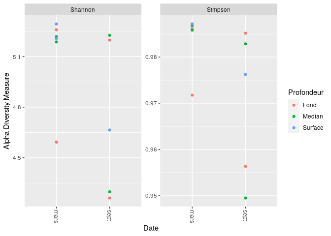
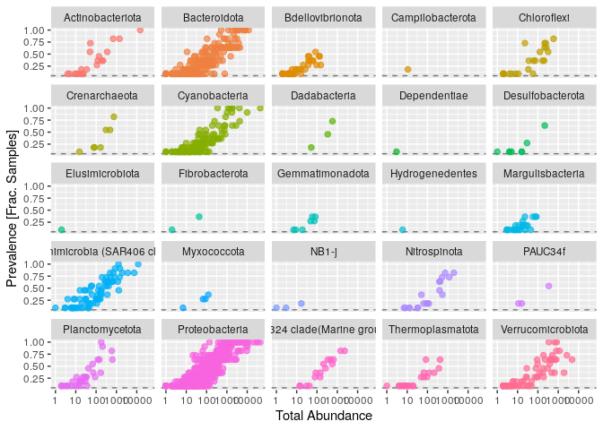
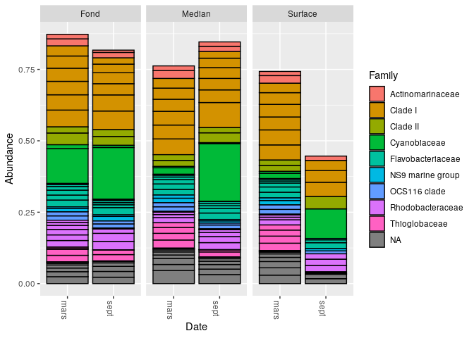
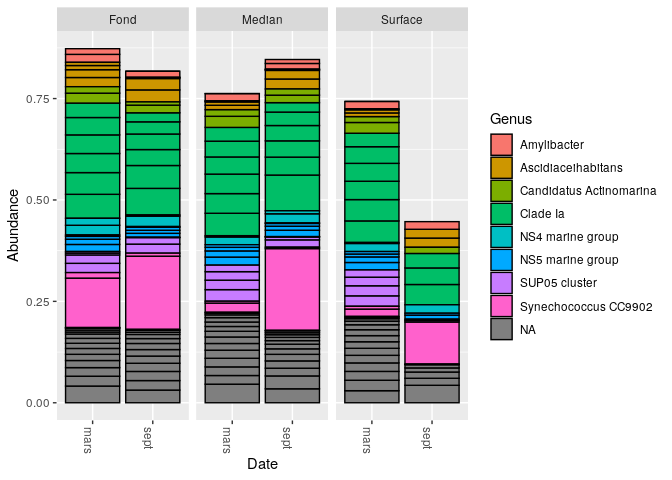

---
output:
  pdf_document: default
  html_document: default
---
R Notebook
================

  - [Analyse des données de la rade de Brest avec
    Phyloseq](#analyse-des-données-de-la-rade-de-brest-avec-phyloseq)
      - [Appel des packages](#appel-des-packages)
      - [Construction d’un échantillon data.frame à partir des
        données](#construction-dun-échantillon-data.frame-à-partir-des-données)
      - [Création d’un fichier csv afin d’ordonner les paramètres (mois,
        profondeur)](#création-dun-fichier-csv-afin-dordonner-les-paramètres-mois-profondeur)
      - [Création de l’objet samdf](#création-de-lobjet-samdf)
      - [Indices d’alpha diversité](#indices-dalpha-diversité)
      - [Filtration de taxonomie](#filtration-de-taxonomie)
      - [Histogrammes des abondances](#histogrammes-des-abondances)

# Analyse des données de la rade de Brest avec Phyloseq

Questions :

1/ quelles sont les influences relatives de la profondeur et de la
saison sur la structure des communautes planctoniques de la rade de
Brest

2/ Quels sont les biomarqueurs de saison (hiver et ete) ?

``` r
load("cc2_data-analysis-with-DADA2")
```

## Appel des packages

``` r
library(phyloseq)
library(ggplot2)
```

## Construction d’un échantillon data.frame à partir des données

``` r
samples.out <- rownames(seqtab.nochim)
profondeur <- sapply(strsplit(samples.out, "D"), `[`, 1)
date <- substr(profondeur,0,11)
samdf <- data.frame(Profondeur=profondeur, Date=date)
samdf$Profondeur[samdf$Date>11] <- c("Fond","Median","Surface")
```

    ## Warning in samdf$Profondeur[samdf$Date > 11] <- c("Fond", "Median", "Surface"):
    ## number of items to replace is not a multiple of replacement length

``` r
samdf$Date[samdf$Profondeur>11] <- c("mars","sept")
```

    ## Warning in samdf$Date[samdf$Profondeur > 11] <- c("mars", "sept"): number of
    ## items to replace is not a multiple of replacement length

``` r
rownames(samdf) <- samples.out
```

## Création d’un fichier csv afin d’ordonner les paramètres (mois, profondeur)

``` r
write.csv(samdf,"samdf.csv")
```

## Création de l’objet samdf

``` r
samdf <-read.table('~/ecog2_cc2/samdf.csv', sep=',', header=TRUE, row.names=1)
```

On importe notre jeu de métadonnées que l’on a construit précédement
dans l’objet samdf. Ce fichier regroupe les différentes informations sur
les échantillons, ce qui va permettre de les discriminer au niveau de la
date et de la profondeur d’échantillonnage.

``` r
ps <- phyloseq(otu_table(seqtab.nochim, taxa_are_rows=FALSE), 
               sample_data(samdf), 
               tax_table(taxa))
ps
```

    ## phyloseq-class experiment-level object
    ## otu_table()   OTU Table:         [ 1578 taxa and 11 samples ]
    ## sample_data() Sample Data:       [ 11 samples by 2 sample variables ]
    ## tax_table()   Taxonomy Table:    [ 1578 taxa by 6 taxonomic ranks ]

Ensuite, on regroupe dans un objet ps l’ensemble des objets précédents
(taxtab,samdf et seqtab) afin de pouvoir réaliser l’assignation
taxonomique de chaque séquence du jeu de données. On peut voir les 1578
taxons sont répartis en 11 échantillons et parmi ces échantillons il y a
2 variables.

## Indices d’alpha diversité

``` r
plot_richness(ps, x="Date", measures=c("Shannon", "Simpson"), color="Profondeur",)
```

<!-- -->
L’indice de Shannon va donner des informations sur la structure et la
richesse d’une communauté. L’indice de Simpson prend également en compte
la richesse et la régularité.

On peut en conclure que pour la période de mars l’alpha diversité est
importante pour le fond et la surface c’est-à-dire que les communautés
sont diversifiées. En septembre, il semble y avoir une corrélation entre
la profondeur et la richesse. En effet on peut voir que les communautés
bactériennes sont beaucoup plus diversifiées dans les fonds comparé à la
surface.

## Filtration de taxonomie

``` r
rank_names(ps)
```

    ## [1] "Kingdom" "Phylum"  "Class"   "Order"   "Family"  "Genus"

L’objet ps possède comme paramètres : “Kingdom” “Phylum” “Class” “Order”
“Family” “Genus”.

``` r
table(tax_table(ps)[, "Phylum"], exclude = NULL)
```

    ## 
    ##              Actinobacteriota                  Bacteroidota 
    ##                            21                           239 
    ##              Bdellovibrionota              Campilobacterota 
    ##                            35                             1 
    ##                   Chloroflexi                 Crenarchaeota 
    ##                            23                             7 
    ##                 Cyanobacteria                  Dadabacteria 
    ##                           142                             3 
    ##                  Dependentiae              Desulfobacterota 
    ##                             1                             8 
    ##               Elusimicrobiota                Fibrobacterota 
    ##                             1                             2 
    ##               Gemmatimonadota               Hydrogenedentes 
    ##                             7                             1 
    ##              Margulisbacteria Marinimicrobia (SAR406 clade) 
    ##                            24                            80 
    ##                   Myxococcota                         NB1-j 
    ##                             4                             3 
    ##                  Nitrospinota                       PAUC34f 
    ##                            19                             3 
    ##               Planctomycetota                Proteobacteria 
    ##                            33                           798 
    ##  SAR324 clade(Marine group B)              Thermoplasmatota 
    ##                            16                            21 
    ##             Verrucomicrobiota                          <NA> 
    ##                            72                            14

Ce tableau représente les différents phylas et leur abondances de
l’objet ps. On peut constater que les Proteobacteria (798) sont les
plus abondantes suivis des Bacteroidota (239) et des Cyanobacteria
(142).

``` r
ps <- subset_taxa(ps, !is.na(Phylum) & !Phylum %in% c("", "uncharacterized"))
```

Dans l’objet ps on va filter tous les phylas qui ne sont pas
caractérisés (NA).

``` r
# Compute prevalence of each feature, store as data.frame
prevdf = apply(X = otu_table(ps),
               MARGIN = ifelse(taxa_are_rows(ps), yes = 1, no = 2),
               FUN = function(x){sum(x > 0)})
# Add taxonomy and total read counts to this data.frame
prevdf = data.frame(Prevalence = prevdf,
                    TotalAbundance = taxa_sums(ps),
                    tax_table(ps))
```

Nous avons estimé la prévalence des taxons ainsi que le filtrage qualité
(le nombre d’échantillons dans lequel un taxa apparaît au moins une
fois). Tout ceci sera placé dans un data.frame, puis l’annotation
taxonomique et le nombre total de reads sont ajoutés.

``` r
plyr::ddply(prevdf, "Phylum", function(df1){cbind(mean(df1$Prevalence),sum(df1$Prevalence))})
```

    ##                           Phylum        1    2
    ## 1               Actinobacteriota 3.857143   81
    ## 2                   Bacteroidota 3.991632  954
    ## 3               Bdellovibrionota 2.342857   82
    ## 4               Campilobacterota 2.000000    2
    ## 5                    Chloroflexi 3.913043   90
    ## 6                  Crenarchaeota 4.000000   28
    ## 7                  Cyanobacteria 3.225352  458
    ## 8                   Dadabacteria 5.000000   15
    ## 9                   Dependentiae 1.000000    1
    ## 10              Desulfobacterota 2.000000   16
    ## 11               Elusimicrobiota 1.000000    1
    ## 12                Fibrobacterota 2.500000    5
    ## 13               Gemmatimonadota 2.428571   17
    ## 14               Hydrogenedentes 1.000000    1
    ## 15              Margulisbacteria 1.833333   44
    ## 16 Marinimicrobia (SAR406 clade) 4.475000  358
    ## 17                   Myxococcota 2.750000   11
    ## 18                         NB1-j 1.333333    4
    ## 19                  Nitrospinota 3.947368   75
    ## 20                       PAUC34f 3.333333   10
    ## 21               Planctomycetota 3.363636  111
    ## 22                Proteobacteria 4.214286 3363
    ## 23  SAR324 clade(Marine group B) 4.625000   74
    ## 24              Thermoplasmatota 2.476190   52
    ## 25             Verrucomicrobiota 3.750000  270

Dans ce tableau, on peut observer l’estimation des abondances de chaque
phylas. Cela confirme les résultats précédents : Proteobacteria,
Bacteroidota et Cyanobacteria sont les phylas les plus abondants. La
fonction plyr permet de séparer l’abondance des phylas.

``` r
prevdf1 = subset(prevdf, Phylum %in% get_taxa_unique(ps, "Phylum"))
ggplot(prevdf1, aes(TotalAbundance, Prevalence / nsamples(ps),color=Phylum)) +
  # Include a guess for parameter
  geom_hline(yintercept = 0.05, alpha = 0.5, linetype = 2) +  geom_point(size = 2, alpha = 0.7) +
  scale_x_log10() +  xlab("Total Abundance") + ylab("Prevalence [Frac. Samples]") +
  facet_wrap(~Phylum) + theme(legend.position="none")
```

<!-- -->

Ces graphiques représentent la prévalence de chaque phyla en fonction de
l’abondance totale des phylas. Comme constaté précédemment, les
Proteobacteria, les Bacteroidota et les Cyanobacteria sont les phylas
les plus abondants.

Toutefois ces résultats ne montrent pas l’abondance des différents
phylas en fonction de la saison (mars ou septembre) et de la profondeur
d’échantillonnage.

Par la suite, nous allons réaliser une pCoA afin avec la distance de
Bray-Curtis qui permet d’évaluer la dissimilarité entre les taxons sur
deux paramètres qui sont la date et la profondeur d’échantillonnage.

``` r
pslog <- transform_sample_counts(ps, function(x) log(1 + x))
out.wuf.log <- ordinate(pslog, method = "PCoA", distance = "bray")
```

La fonction TransformSampleCount permet de transformer le nombre
d’échantillons d’une matrice d’abondance de taxons avec une fonction
fournie par l’utilisateur. Les comptages de chaque échantillon seront
transformés individuellement. Aucune interaction/comparaison
échantillon-échantillon n’est possible par cette méthode.

``` r
evals <- out.wuf.log$values$Eigenvalues
plot_ordination(pslog, out.wuf.log, color = "Profondeur", shape="Date") +
  labs(col = "Profondeur",shape= "Date")
```

<!-- -->

Sur ce graphique représentant la pCoA, les saisons sont représentées en
triangles (septembre, été) et en rond (mars, hiver). La profondeur
d’échantillonnage est représentée par trois couleurs : surface
(bleu), median (vert) et fond (rouge). Les axes représentent les
variances, traduisant la dispersion de la population au sein des
échantillons. L’axe 1 traduit la distribution de la population entre
les deux saisons et l’axe 2 traduit la distribution de la population au
sein de la même saison en fonction de la profondeur d’échantillonnage.

Tout d’abord, on peut voir que la distribution des saisons est bien
séparée, ce qui suppose une différence des populations entre ces deux
périodes de l’année. De plus, au sein de la même saison, l’été (en
septembre), on peut voir au niveau de la répartition de la profondeur
d’échantillonnage que l’échantillonnage au fond est bien à part
comparé à l’échantillonnage à la surface et en médian. Ainsi, la
population est différente également entre les niveaux de profondeur
d’échantillonnage mais de façon moindre comparé aux populations entre
les deux saisons. En hiver (mars), on peut voir que les populations sont
similaires, même quand la profondeur d’échantillonnage est modifiée.

On peut conclure qu’il n’y a pas de cohabitation entre les communautés
bactériennes en septembre et en mars. On peut également dire que la
saison influe de façon plus importante sur la structure de la communauté
bactérienne par rapport à la profondeur d’échantillonnage qui influe,
mais de façon moindre.

## Histogrammes des abondances

### Histogramme des abondances des familles de communautés bactériennes

``` r
top20 <- names(sort(taxa_sums(ps), decreasing=TRUE))[1:20]
ps.top20 <- transform_sample_counts(ps, function(OTU) OTU/sum(OTU))
ps.top20 <- prune_taxa(top20, ps.top20)
plot_bar(ps.top20, x="Date", fill="Family") + facet_wrap(~Profondeur, scales="free_x")
```

<!-- -->

Cet histogramme représente les abondances des familles bactériennes
(avec différentes couleurs) en fonction de la date et de la profondeur
d’échantillonnage.

On peut constater que la famille de la Clade I prédomine dans les
différentes conditions (dates et profondeurs d’échantillonnage). De
plus, la famille des Cyanobiaceae sont aussi présentes en forte
abondance pour les profondeurs d’échantillonnage median et surface en
septembre.

On peut en conclure que la profondeur d’échantillonnage et la saison
influent sur la diversité, la structure et l’abondance bactérienne. En
effet, l’abondance totale de la communauté bactérienne est à chaque fois
moindre en période hivernale (mars) pour chaque profondeur
d’échantillonnage.

### Histogramme des abondances des genres bactériens

``` r
top20 <- names(sort(taxa_sums(ps), decreasing=TRUE))[1:20]
ps.top20 <- transform_sample_counts(ps, function(OTU) OTU/sum(OTU))
ps.top20 <- prune_taxa(top20, ps.top20)
plot_bar(ps.top20, x="Date", fill="Genus") + facet_wrap(~Profondeur, scales="free_x")
```

<!-- -->

Cet histogramme représente les abondances des genres bactériens (avec
différentes couleurs) en fonction de la date et de la profondeur
d’échantillonnage. Cela va permettre de préciser le type de
biomarqueur qui pourra être utilisé.

On peut constater que le genre Clade Ia prédomine dans toutes les
conditions à l’exception de la profondeur d’échantillonnage en surface
en septembre. De plus, à la profondeur d’échantillonnage en surface en
septembre, on peut constater que le genre Synechococcus CC9902 est le
plus abondant parmi la communauté.

On peut en conclure comme précédemment que la saison et la profondeur
d’échantillonnage influent sur la diversité, la structure et
l’abondance bactérienne.

Enfin, on peut dire que le genre Synechococcus CC9902 pourrait être
utilisé comme biomarqueurs pour la saison estivale à des conditions de
profondeurs d’échantillonnage en médian et en surface. On ne peut pas
conclure sur l’utilisation d’un biomarqueur pour la période hivernale
puisque aucun genre bactérien ne se démarque en cette période.
